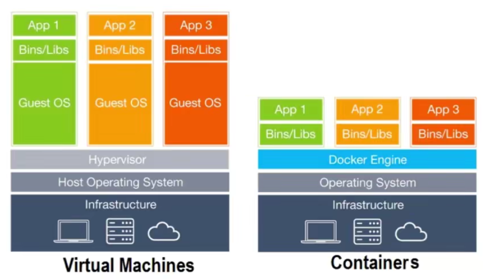
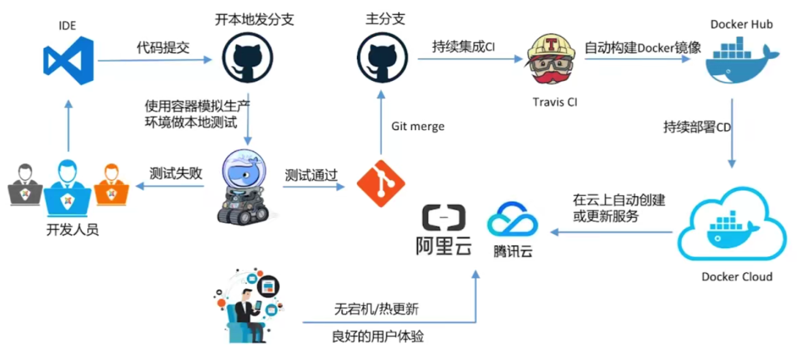

# Docker

虚拟机技术与容器技术的对比：

- 
- 容器技术是 APP 层面的隔离
- 虚拟化技术是物理资源层面的隔离

Docker 能干什么：

- 简化配置
- 整合服务器
- 代码流水线管理
- 调试能力
- 提高开发效率
- 多租户
- 隔离应用
- 快速部署

开发流程：

什么是容器？

- 对软件和其依赖的标准打包
- 应用之间相互隔离
- 共享同一个 OS Kernel (系统核心)
- 可以运行在很多主流操作系统上

 

## 安装

到 [官网](https://docs.docker.com/) 可以查看介绍以及下载。对于 [Mac](https://docs.docker.com/docker-for-mac/install/) 和 [Windows](https://docs.docker.com/docker-for-windows/install/) ，都是点击 "Download from Docker Hub" 按钮即可下载。

需要注意的是， Windows 的安装需求有点苛刻，详细请看官网。底层原理是利用虚拟技术，创建一个"小型Linux"系统，用于运行 Docker 。

之后，在控制台输入 `docker version` 即可验证 Docker 是否安装成功。

 

 

 

 

 

 

 

 

 

 

