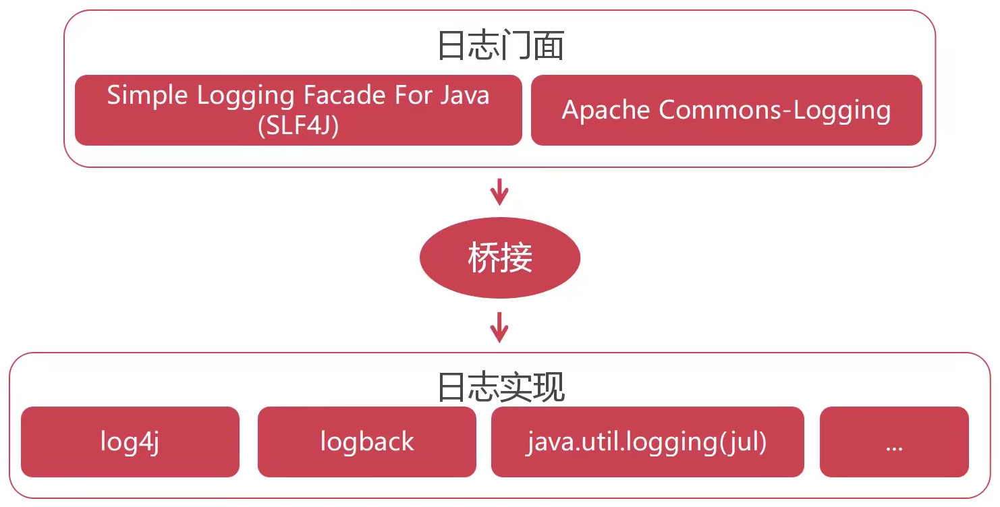

SSM 开发框架

- Spring: 对象容器框架。职责是对项目中各个对象有效的管理。是框架的框架，即其他所有的框架都要继续它开发。
- Spring MVC: 帮助我们的进行 Web 程序的分层，让我们的程序有效解耦。是替代 servlet ，更好的进行 Web 开发。
- MyBatis: 简化与数据库的交互。


# MyBatis

ORM 框架

MyBatis 是优秀的持久层框架。所谓的"持久"，就是将内存中的数据保存到数据库中，以访重启后的数据丢失。

MyBatis 使用 XML 将 SQL 与程序解耦，便于维护。

MyBatis 学习简单，执行搞笑，是 JDBC 的延申。

[官网地址](https://mybatis.org/mybatis-3/zh/index.html)。

demo 说明： [mybatis_demo](./mybatis_demo) 和 [mybatis_annotation_demo](./mybatis_annotation_demo) 都是相关的 demo 。其中 mybatis_demo 包含了测试用的 sql 数据库导入文件，先导入后再执行测试用例。

</br>
</br>

## MyBatis 开发流程

1. 引入 MyBatis 依赖（使用 Maven ）

2. 创建核心配置文件

3. 创建实体类(Entity)。
    - 底层数据表和 Java 类一一对应，表中的每个字段与类的属性都有对应关系。
    - 与底层数据表对应的类，被称为实体类。
    - 实体类的名字并非固定，只是我们约定俗成，也可能被称为 POJO 等名字。

4. 创建 Mapper 映射文件
    - 把实体和数据表映射的关键所在

5. 初始化 SessionFactory(会话工厂)
    - 作用包括：读取配置文件，加载Mapper映射，为后续处理做好准备

6. 利用 SqlSession 对象操作数据
    - 每个 SqlSession 都由 SessionFactory 创建
    - 我们可以形象的理解为每个 SessionFactory 就是一个数据库连接

</br>
</br>

## MyBatis 环境配置

默认的配置文件名是 `mybatis-config.xml` 。

1. 在项目目录的 `pom.xml` 文件中指定依赖：

    ``` xml
    <dependencies>
      <!-- MyBatis -->
      <dependency>
        <groupId>org.mybatis</groupId>
        <artifactId>mybatis</artifactId>
        <version>3.5.5</version>
      </dependency>
      <!-- MySQL 驱动 -->
      <dependency>
        <groupId>mysql</groupId>
        <artifactId>mysql-connector-java</artifactId>
        <version>8.0.21</version>
      </dependency>
    </dependencies>
    ```

2. 在项目的 `src/main.resources` 文件夹下创建 `mybatis-config.xml` 。

3. 在 文件中填写如下内容：（关于数据库的信息需要修改）

    ``` xml
    <?xml version="1.0" encoding="UTF-8"?> <!-- 上面是说明 XML 的版本和编码格式 -->
    <!-- 描述文档类型 （从官网拷贝即可） -->
    <!DOCTYPE configuration
            PUBLIC "-//mybatis.org//DTD Config 3.0//EN"
            "http://mybatis.org/dtd/mybatis-3-config.dtd">
    <!-- 配置内容 -->
    <configuration>
      <!-- 针对不同的环境使用不同的配置，以 id 区分。下面是默认使用 dev 的环境配置 -->
      <environments default="dev">
        <environment id="dev">
          <!-- 采用 JDBC 方式对数据库事务进行 commit/rollback -->
          <transactionManager type="JDBC"/>
          <!-- POOLED 采用连接池方式管理数据库连接 -->
          <dataSource type="POOLED">
            <!-- 指定驱动包 -->
            <property name="driver" value="com.mysql.cj.jdbc.Driver"/>
            <!-- 数据库地址（babytun是数据库名） （"&"符号需要换成"&amp;",因为"&"在XML中是有意义的） -->
            <property name="url" value="jdbc:mysql:///babytun?useUnicode=true&amp;characterEncoding=UTF-8"/>
            <!-- 登陆的用户名和密码 -->
            <property name="username" value="root"/>
            <property name="password" value="root"/>
          </dataSource>
        </environment>
        <!-- 针对生产的配置 -->
        <!-- <environment id="prod">......</environment> -->
      </environments>
    </configuration>
    ```

</br>
</br>

## SqlSessionFactory与SqlSession

**SqlSessionFactory** 是 MyBatis 的核心对象，用于初始化 MyBatis ，创建 SqlSession 对象。需要保证 SqlSessionFactory 在应用中全局唯一。

**SqlSession** 是 MyBatis 操作数据库的核心对象，使用 JDBC 方式与数据库交互，提供了数据表 CRUD 对应方法。

下面给出简单例子：

``` java
@Test
public void testSqlSessionFactory() throws IOException {
  // 利用 Reader 加载 classpath 下的 mybatis-config.xml 核心配置文件
  Reader reader = Resources.getResourceAsReader("mybatis-config.xml");
  // 初始化 SqlSessionFactory 对象，同时解析 mybatis-config.xml 文件
  SqlSessionFactory ssf = new SqlSessionFactoryBuilder().build(reader);
  System.out.println("SqlSessionFactory 加载成功");
  SqlSession ss = null;
  try {
    // 创建 SqlSession 对象， SqlSession 是 JDBC 的扩展类，用于与数据库交互
    ss = ssf.openSession();
    // 这不是必须的，只是用来展示，正常开发时，创建连接是 MyBatis 自动完成的。正常也不会有 "java.sql" 包的导入。
    Connection conn = ss.getConnection();
    System.out.println(conn);
  } catch (Exception e) {
    e.printStackTrace();
  } finally {
    if (ss != null) {
      // 针对配置文件 mybatis-config.xml 的 <dataSource> 标签的 type
      // 如果 type="POOLED" ，代表使用连接池， close 则是将连接回收到连接池中
      // 如果 type="UNPOOLED" ，代表直连， close 则会调用 JDBC 的 Connection.close() 方法关闭连接
      ss.close();
    }
    System.out.println("结束");
  }
}
```

</br>
</br>

## 创建我们的 MyBatisUtils

初始化工具类

由于 SqlSessionFactory 实例对象在应用中应该全局唯一，我们创建一个工具类，实现工厂模式。代码如下：

``` java
public class MyBatisUtils {
  // 静态工厂模型
  public static SqlSessionFactory ssf = null;
  // 静态代码块，在初始化类时实例化 SqlSessionFactory
  static {
    try {
      Reader reader = Resources.getResourceAsReader("mybatis-config.xml");
      SqlSessionFactory ssf = new SqlSessionFactoryBuilder().build(reader);
    } catch (IOException e) {
      e.printStackTrace();
      // 初始化错误是，通过抛出异常 ExceptionInInitializerError 通知调用者
      throw new ExceptionInInitializerError(e);
    }
  }
  // 注意使用 static 修饰符，因为此工具类无需实例化
  /**
   * 创建一个新的 SqlSession 对象
   * @return SqlSession
   */
  public static SqlSession openSession() {
    return ssf.openSession();
  }
  /**
   * 释放一个有效的 SqlSession 对象
   * @param ss
   */
  public static void closeSession(SqlSession ss) {
    if (ss != null) {
      ss.close();
    }
  }
}
```

`MyBatisUtils` 类会静态创建唯一的 `SqlSessionFactory` 实例对象，使用者可以通过调用类的静态方法 `openSession` 和 `closeSession` 实现创建和关闭会话。

下面是测试用例的代码：

``` java
@Test
public void testMyBatisUtils() {
  System.out.println("测试开始");
  // 创建 SqlSession
  SqlSession ss = MyBatisUtils.openSession();
  Connection conn = ss.getConnection();
  System.out.println(conn);
  // 关闭 SqlSession
  MyBatisUtils.closeSession(ss);
  System.out.println("测试结束");
}
```

</br>
</br>

## 查询数据

### 基础查询

1. 创建实体类(Entity)：
    - 创建 `entity` 包用于存放所有实体类
    - 创建实体类 `Goods` ，其代码如下：

      ``` java
      public class Goods {
        // Java 的变量命名必须是驼峰式命名
        private Integer goodsId;
        private String title;
        private Float discount;
        // 自动生成 Getter 和 Setter ....(略)
      }
      ```

2. 创建 Mapper XML ：
    - 在 `src/resources` 目录下创建 `mappers` 文件夹
    - 在 `mappers` 文件夹下创建与实体类 `Goods` 对应的 `goods.xml` 文件
    - 该 XML 文件用于描述**实体类的属性**与**数据表的字段**的对应关系

3. 编写 `<select>` SQL 标签：
    - 在上一步创建的 `goods.xml` 文件内，填写如下内容：

      ``` xml
      <?xml version="1.0" encoding="UTF-8" ?> <!-- 同样的，第一行是 XML 描述信息 -->
      <!-- 文档描述，注意，这部分与 mybatis-config,xml 不同 -->
      <!DOCTYPE mapper
              PUBLIC "-//mybatis.org//DTD Mapper 3.0//EN"
              "http://mybatis.org/dtd/mybatis-3-mapper.dtd">
      <!-- 主体部分 -->
      <!-- namespace 是命名空间，作用是区分同名的查询名称 -->
      <mapper namespace="goods">
      <!-- id 等同于这段 SQL 查询的名称，用于说明功能。 resultType 则指定存放数据的实体类 -->
        <select id="selectAll" resultType="my.demo.entity.Goods">
          SELECT * FROM t_goods ORDER BY goods_id DESC LIMIT 10;
        </select>
      </mapper>
      ```

4. 新增 `<mapper>` ：
    - 为了让 MyBatis 感知 `goods.xml` 的存在，需要在配置文件中说明
    - 在 `mybatis-config.xml` 的 `<configuration>` 标签下，创建 `<mappers>` 标签
    - 在 `<mappers>` 标签下添加 `<mapper resource="mappers/mybatis-config.xml"/>`
    - 总代码如下：

      ``` xml
      <mappers>
        <mapper resource="mappers/mybatis-config.xml"/>
      </mappers>
      ```

5. 开启驼峰命名映射
    - 由于 Java 必须遵循"驼峰式命名"，而数据库是以下划线(`_`)分割单词
    - 在 `mybatis-config.xml` 文件中的 `<configuration>` 标签内的**最上面**添加如下代码：

      ``` xml
      <settings>
        <setting name="mapUnderscoreToCamelCase" value="true"/>
      </settings>
      ```

6. SqlSession 执行 select 语句
    - 主要使用 SqlSession 对象的 `selectList` 方法，参数是字符串 `"命名空间.查询语句Id"`
    - 完整的测试用例：

      ``` java
      @Test
      public void testSelectAll() throws Exception {
        SqlSession ss = null;
        try {
          ss = MyBatisUtils.openSession();
          // 将查询的每条结果都放入 Goods 类中， selectList 参数是"命名空间.查询语句Id" ，返回结果是 List<?>
          List<Goods> goodsList = ss.selectList("goods.selectAll");
          // 输出结果
          for (Goods goods : goodsList) {
            System.out.println(goods);
          }
        } catch (Exception e) {
          throw e;
        } finally {
          if (ss != null) {
            MyBatisUtils.closeSession(ss);
          }
        }
      }
      ```

    - 也是可以使用 `selectOne` 查询单个，具体看文档介绍。

</br>

### SQL 传参

对于需要动态传入数据所谓查询条件的，被称为 SQL 传参。

有了[上面](#查询数据)的基础，下面就提供关键性代码了。

同样的，我们需要在查询配置的 `goods.xml` 文件中的 `<mapper>` 标签中编写查询语句：

``` xml
<!-- 带一个参数的， parameterType 指定该参数的类型 -->
<select id="selectById" resultType="my.demo.entity.Goods" parameterType="Integer">
  SELECT * FROM t_goods WHERE
  # 查询特定 id 的数据
  goods_id = #{value}
</select>

<!-- 带多个参数， parameterType 为 Map 对象 -->
<select id="selectByPriceRange" resultType="my.demo.entity.Goods" parameterType="java.util.Map">
  SELECT * FROM t_goods WHERE
  # 查询特定价格范围的数据
  current_price BETWEEN #{min} AND #{max}
  # 截取数据的前若干条
  LIMIT 0, #{limit}
</select>
```

上面包含了两种情况：

- 一种是只需要传入一个参数，只需要在 `parameterType` 指定参数的类型即可；
- 另一种是需要传入多个参数，但 `parameterType` 只能传入一种参数类型，我们可以换个思路，传入一个 `Map` 对象，包含所有参数的键值对。

使用的方法也很简单，在 `selectList` 或 `selectOne` 方法中传入第二个参数。关键代码如下：

``` java
// 单参数查询
Goods goods = ss.selectOne("goods.selectById", 1111);

// 多参数查询
Map param = new HashMap();
param.put("min", 0);
param.put("max", 1000);
param.put("limit", 10);
List<Goods> goodsList = ss.selectList("goods.selectByPriceRange", param);
```

</br>

### 不指定实体类的查询

**此情况常用于多表联查**。

在我们实际生产中，未必会像上面的 `Goods` 一样，预先知道需要什么字段的数据，查询的字段可能会是变化的，甚至需要查询所有字段的数据。

我们可以在 SQL 配置文件(`*.xml`) 中指定 `parameterType` 的值为 `java.util.Map` 或 `java.util.LinkedHashMap` 。

这样，我们就可以存放查询到的所有字段的键值对。

示例代码：

``` xml
<!-- 当字段名不确定，不能创建对应的实体类时，可以使用 Map 对象。它可以存放所有查询到的键值对 -->
<!-- 需要注意的是， Map 是"无序"的，如果想按照表格的字段顺序获取结果，应该把 Map 改成 LinkedHashMap 类型 -->
<!-- 优点：易于扩展，易于使用 -->
<!-- 缺点：太过灵活，无法进行编译时检查 -->
<select id="selectGoodsMap" resultType="java.util.Map">
  SELECT * FROM t_goods AS g, t_category AS c
  WHERE g.category_id = c.category_id
  LIMIT 0, 20
</select>
```

测试用例部分代码：

``` java
List<Map> list = ss.selectList("goods.selectGoodsMap");
```

`Map` 和 `LinkedHashMap` 的区别在于，前者查询到的键值对是**无序的**，后者则是有序的。

所谓的顺序，是针对数据表中"列"的顺序。

</br>

### 使用 resultMap

ResultMap 可以将查询结果映射为复杂类型的 Java 对象，非常适用于 Java 对象保存多表联查的结果，它支持对象关联查询等高级特性。

使用场景是，原有的实体类的字段不能满足我们的需求，或者我们需要在原有实体类的基础上增加额外字段，例如需要联查其他数据表，以获取更多信息。但缺点是，需要写大量映射。

以 `Goods` 实体类为例，我们需要创建对应的 DTO(data transfer object, 数据传输对象) 对象 `GoodsDto` 。

思路是，在 DTO 对象内创建私有对象，该对象是实体类的对象(可以有多个)，然后再定义其他私有属性。

代码如下：

``` java
// 这种类是针对实体类的扩展
public class GoodsDto {
  // 创建实体类的对象
  private Goods goods = new Goods();
  // 其他扩展的属性
  private Boolean isFreedDelivery;
  private String categoryName;  // 从 t_category 表中获取
  @Override
  public String toString() {
    return goods.toString() + "_" + isFreedDelivery + "_" + categoryName;
  }
  // 快捷生成 Getter 和 Setter ....
}
```

在实体类映射表中新增如下内容：

``` xml
<!-- 使用 resultMap -->
<!-- 创建结果映射。其中， id 是该 resultMap 的名字， type 指定映射的 DTO 类 -->
<resultMap id="resMapGoods" type="my.demo.dto.GoodsDto">
  <!-- 下面标签的属性中， property 是 DTO 类中的属性名， column 是数据表中的字段名 -->
  <!-- id 标签为 主键 -->
  <id property="goods.goodsId" column="goods_id"/>
  <!-- result 标签为 非主键字段 -->
  <result property="goods.title" column="title"/>
  <result property="goods.discount" column="discount"/>
  <result property="isFreedDelivery" column="is_free_delivery"/>
  <result property="categoryName" column="category_name"/>
</resultMap>
<!-- 直接使用和上面一样的查询条件。 resultMap 的值为上面定义的 resultMap 的 id -->
<select id="selectGoodsDto" resultMap="resMapGoods">
  SELECT * FROM t_goods AS g, t_category AS c
  WHERE g.category_id = c.category_id
  LIMIT 0, 20
</select>
```

测试用例部分代码如下：

``` java
List<GoodsDto> list = ss.selectList("goods.selectGoodsDto");
```

</br>
</br>

## 增/删/改数据

**数据库事务**是保证数据操作完整性的基础。

简单描述事务就是，我们修改数据库时，很常见的情况是需要操作多条记录，这多条记录必须都成功才能保证数据的一致性。而我们修改数据库数据，并非直接把数据写到数据库，而是先写道**事务日志**，由事务日志统一提交，一旦其中一条失败，全部回滚。

### 插入数据

关键方法是 `insert` 方法。

下面以 `t_category` 表为例，向里面插入数据。

首先我们创建对应的实体类：

``` java

public class Category {
  private Integer categoryId;
  private String category_name;
  private InternalError parent_id;
  private Integer category_level;
  private Integer category_order;
  // 快捷生成 Getter 和 Setter .....
}
```

和查询类似，在 `*.xml` 文件中添加标签：

``` xml
<!-- 插入数据 -->
<insert id="categoryInsert" parameterType="my.demo.entity.Category">
  # 第一个字段是 categoryId ,属性为 AUTO_INCREMENT ,所以我们不传
  INSERT t_category VALUES (null, #{categoryName}, #{parentId}, #{categoryLevel}, #{categoryOrder})

  # resultType 表示内部查询语句结果的值类型
  # keyProperty 表示查询结果填入对应的实体类的哪个字段
  # order 表示 selectKey 标签内的语句在上面主体内容的之前/之后执行
  <selectKey resultType="Integer" keyProperty="categoryId" order="AFTER">
    SELECT last_insert_id(); # 查询最后一次插入后, 主键 id 的值
  </selectKey>
</insert>
```

测试用例代码：

``` java
@Test
public void testInsertCategory() throws Exception {
  SqlSession ss = null;
  try {
    ss = MyBatisUtils.openSession();
    // 创建实体类对象
    Category cg = new Category();
    cg.setCategoryLevel(1);
    cg.setCategoryName("我的自定义分类");
    cg.setCategoryOrder(0);
    // 使用 insert 方法
    int sucCount = ss.insert("category.categoryInsert", cg);
    // 提交事务
    ss.commit();
    System.out.println("成功插入：" + sucCount + "条");
    // categoryId 的值由 <resultKey> 标签提供
    System.out.println("最后的 AUTO_INCREMENT 的值：" + cg.getCategoryId());
  } catch (Exception e) {
    // 若发生错误，回滚事务
    if (ss != null) {
      ss.rollback();
    }
    throw e;
  } finally {
    if (ss != null) {
      MyBatisUtils.closeSession(ss);
    }
  }
}
```

测试用例中，要留意 **`commit`** 和 **`rollback`** 方法，分别是对**事务的提交**和**事务的回滚**。

</br>

### 更新数据

关键方法是 `update` 方法。和 `insert` 方法的使用类似，同样需要注意事务的提交和回滚。

示例的思路是，先根据 id 查询原有数据，然后在更新数据：

``` xml
<!-- 更新数据 -->
<update id="categoryUpdate" parameterType="my.demo.entity.Category">
  UPDATE t_category SET
  category_name = #{categoryName},
  parent_id = #{parentId},
  category_level = #{categoryLevel},
  category_order = #{categoryOrder}
  WHERE category_id = ${categoryId}
</update>
```

``` java
// 首先我们需要把原有的值查询，放入到实体类对象中
Category cg = ss.selectOne("category.categorySearchById", 60);
// 修改实体类对象
cg.setCategoryName("被修改的分类");
// 将实体类对象的值更新到数据库
int updateCount = ss.update("category.categoryUpdate", cg);
// .... (提交事务或事务回滚)
```

</br>

### 删除数据

删除最简单，传入查询条件，把查询结果删除即可。下面以 id 查询条件为例：

``` xml
<!-- 删除数据 -->
<delete id="categoryDelete" parameterType="Integer">
  DELETE FROM t_category WHERE category_id = ${categoryId}
</delete>
```

``` java
int delCount = ss.update("category.categoryUpdate", 59);
```

</br>
</br>

## 动态 SQL

动态 SQL 是指，根据参数数据的不同，动态组织 SQL 的技术。

``` xml
<!-- 动态 SQL -->
<select id="dynamicSql" parameterType="my.demo.entity.Goods">
  SELECT * FROM t_goods
  # where 标签的作用是, 如果里面的语句中, 使用了多余的 AND 或 OR ,会自动省略
  <where>
    # test 的作用是, 测试里面的条件, 符合则执行标签内的语句
    <if test="categoryId != null">
      AND category_id = #{categoryId}
    </if>
    <if test="discount != null">
      # ">" 必须使用转义字符 "&gt;"
      AND discount &gt; #{discount}
    </if>
  </where>
</select>
```

</br>
</br>

## 联表查询

### 1 对 n

下面以一个 `Goods` 对应多个 `GoodsDetail` 为例：

首先我们需要创建实体类及其 mapper 。实体类的创建很简单，就不再列出。

作为 "n" 的 `GoodsDetail` 需要创建一个以 `goods_id` 为查询条件的查询标签：

``` xml
<mapper namespace="goodsDetail">
  <select id="selectByGoodsId" parameterType="Integer" resultType="my.demo.entity.GoodsDetail">
    SELECT * FROM t_goods_detail WHERE goods_id = #{value}
  </select>
</mapper>
```

作为 "1" 的 `Goods` 需要在结果映射标签中指定 `goodsDetail.selectByGoodsId` ，代码如下：

``` xml
<mapper namespace="goods">
  <!-- .... -->

  <!-- 说明一对多的关系 -->
  <resultMap id="resMapGoods2" type="my.demo.entity.Goods">
    <id column="goods_id" property="goodsId"/>
    <!-- 重点是 select 属性，值为"命名空间.语句id" -->
    <!-- 例子中表示，当查询 Goods 时，得到的结果中，遍历所有 goods_id ，并代入到 "goodDetail.selectByGoodsId" 命名空间，其结果赋值给 goodsDetails List对象 -->
    <collection select="goodsDetail.selectByGoodsId" column="goods_id" property="goodsDetails"/>
  </resultMap>
  <select id="selectOneToMany" resultMap="resMapGoods2">
    SELECT * FROM t_goods LIMIT 0,10
  </select>
</mapper>
```

测试用例也跟之前一样，不再赘述。

</br>

### n 对 1

同样以 `Goods` 与 `GoodsDetail` 为例，现在需要查询 `GoodsDetail` ，其实体类对象中包含 `Goods` 的实例对象即可。

下面简单给出两者的 mapper ：

``` xml
<mapper namespace="goods">
  <!-- .... -->

  <!-- 需要提供一个根据关联字段的查询条件 -->
  <select id="selectOneByGoodsId" parameterType="Integer" reslutType="my.demo.entity.Goods">
    SELECT * FROM t_goods WHERE goods_id = #{value}
  </select>
</mapper>
```

``` xml
<mapper namespace="goodsDetail">
  <!-- .... -->

  <!-- 说明多对一的关系 -->
  <resultMap id="resMapGoodsDetail" type="my.demo.entity.GoodsDetail">
    <id column="gd_id" property="gdId"/>
    <!-- 当 goods_id 作为查询映射被使用，那实体类中的 goodsId 就不会被赋值，我们可以手动指定映射关系 -->
    <result column="goods_id" property="goodsId"/>
    <!-- 例子表示，对每条查询结果，使用其 goods_id 调用 "goodDetail.selectByGoodsId" ，得到的结果放入 GoodsDetail 实体类的 goods 属性中  -->
    <association select="goods.selectOneByGoodsId" column="goods_id" property="goods"/>
  </resultMap>
  <select id="selectOneToMany" resultMap="resMapGoodsDetail">
    SELECT * FROM t_goodsDetail LIMIT 0,10
  </select>
</mapper>
```

</br>
</br>

## `#{}` 与 `${}`

在上面已经看到 `#{}` 的用途了，就是进行文本替换。

其实， `#{}` 还做了预编译，对敏感字符进行转移，可以防止 SQL 注入。

与之类似的， `${}` 也是文本替换，但不同的是，它不会做任何处理，会将内容原封不动放到该位置。

在某些复杂的场景，可以使用 `${}` 组合语句，但绝对不能交由前端输入。

</br>
</br>

## 日志管理



日志的实现各不相同，日志门面屏蔽了底层复杂的实现，我们不需要关心底层是怎么实现的。

日志门面提供了统一的调用接口。

logback([中文文档](http://www.logback.cn/)|[英文官网](http://logback.qos.ch/)) 是目前的主流。

### 添加 logback 依赖

在 `pom.xml` 文件中，添加如下依赖：

``` xml
<dependency>
  <groupId>ch.qos.logback</groupId>
  <!-- 经典版本，包含了常用组件。除了 logback 相关的包，还会自动引入 SLF4J 的依赖 -->
  <artifactId>logback-classic</artifactId>
  <version>1.2.3</version>
</dependency>
```

依赖安装后，会自动使用。

### 自定义日志

首先，需要在 `src/main/resources` 目录下新建 **`logback.xml`** 文件。

在 `logback.xml` 写入如下内容：

``` xml
<?xml version="1.0" encoding="UTF-8" ?>
<!-- 配置项 -->
<configuration>
  <!-- 输出器(也叫追加器)。说明在什么地方输出日志。 -->
  <!-- name 指定输出器的名字； class 指定输入的目标类，ConsoleAppender是输出到控制台 -->
  <appender name="myConsole" class="ch.qos.logback.core.ConsoleAppender">
    <!-- 编码 -->
    <encoder>
      <!-- 规定日志输入的格式 -->
      <!-- %d{HH:mm:ss.SSS} 输出日期，并规定日期格式 -->
      <!-- %thread 线程名 -->
      <!-- %-5level 日志的等级，"-5" 表示保留前五个字符 -->
      <!-- %logger{36} 产生 log 的类，最多保留 36 个字符，若超长，则会简写路径名 -->
      <!-- %msg 日志的内容 -->
      <!-- 输出示例： "10:23:40.825 [main] DEBUG o.a.i.t.jdbc.JdbcTransaction - PooledDataSource forcefully closed/removed all connections." -->
      <pattern>%d{HH:mm:ss.SSS} [%thread] %-5level %logger{36} - %msg \r\n</pattern>
    </encoder>
  </appender>
  <!-- 日志打印的根标签
    日志的输出级别：（优先级高到低）
    error: 错误，系统的故障日志
    warn: 警告，存在风险或使用不当的日志
    info: 一般消息  （生产环境下的最低建议）
    debug: 程序内部用于调试的信息 （开发环境下的最低建议）
    trace: 程序运行的跟踪信息
   -->
  <root level="debug">
    <!-- 表示只要符合父标签的 "level" ，都会使用 myConsole 格式输出日志 -->
    <appender-ref ref="myConsole"/>
  </root>
</configuration>
```

完成上述步骤后，控制台的输出就会有所变化。

</br>
</br>

## 批处理

对于插入或删除多条记录，建议使用"批处理"，好处是减少查询的事件。

下面给出部分代码：

``` xml
<insert id="batchInsert" parameterType="java.util.List">
  INSERT t_category VALUES
  <foreach collection="list" item="item" separator=",">
    (null, #{item.categoryName}, #{item.parentId}, #{item.categoryLevel}, #{item.categoryOrder})
  </foreach>
</insert>
<delete id="batchDelete" parameterType="java.util.List">
  DELETE FROM t_category WHERE
  gd_id IN
  # 这里的 collection 是强制要求的, 必须是 list
  # item 指定列循环中的当前项的变量名
  # index 指定循环中的索引值的变量名
  # separator 指定分割器, 即列表项用什么符号拼接成完整的语句
  # open 表示生成的整条语句开始的符号
  # close 表示生成的整条语句结束的符号
  <foreach collection="list" item="item" index="index" open="(" close=")" separator=",">
    #{item}
  </foreach>
</delete>
```

批量插入数据的局限：

- 无法获取插入数据的 id
- 批量生成的 SQL 太长，可能会被服务器拒绝

批量查询的写法也是类似的，不再赘述。

</br>
</br>

## 二级缓存

**一级缓存**是默认开启，缓存范围是单个 SqlSession 会话。也就是在 SqlSession 对象被释放前，该缓存会一直存在，直到 SqlSession 对象被释放。

**二级缓存**需要手动开启，缓存范围是 Mapper Namespace ，该命名空间下的 SqlSession 查询都会被缓存。

二级缓存开启后，默认对所有的查询**都使用缓存**。

为了保证查询数据的准确性，当调用 Session 对象的 **`commit`** 方法提交事务后，会对该 namespace **缓存强制清空**。

在命名空间中的查改标签，若配置了 `userCache=false` ，可以不使用缓存；配置了 `flushCache=true` 代表执行该查改标签时强制清空缓存。

使用二级缓存也很简单，在 `*.xml` 的 `<mapper>` 标签内配置 **`<cache>`** 标签即可：

``` xml
<mapper namespace="goods">

  <!-- 二级缓存配置
    eviction 缓存清除策略，当缓存对象数量达到上限后，自动触发对应算法对缓存对象清除。可选参数：
      1. LRU:  (推荐)最近最少使用的。就是从所有的缓存对象值，找出使用最少的清除掉。
      2. FIFO: 先进先出。移除最早插入的缓存对象。
      3. SOFT: 软引用。移除基于(JVM)垃圾回收器状态和软引用规则的对象。
      4. WEAK: 弱引用。更积极地移除基于(JVM)垃圾回收器状态和弱引用规则的对象。
    flushInterval 缓存刷新的时间。单位毫秒。清除是针对所有缓存的。
    size 缓存对象的个数。
    readOnly 是否只读。两个布尔值的含义：
      1. true:  代表返回只读缓存，每次从缓存中取出的是缓存对象本身。特点，执行效率高。
      2. false: 代表每次取出的是缓存对象的"副本"，每一次取出的对象在内存中的指向是不同的。特点，安全性高。
   -->
  <cache eviction="LRU" flushInterval="600000" size="512" readOnly="true"/>
  
  <!-- 查询标签中跟二级缓存相关的属性
    useCache 默认是true。表示该查询结果会被放入缓存。
    flushCache 默认是false。表示执行该SQL后马上清空缓存。注意，对于当前的查询结果，同样不会被缓存。
   -->
  <select id="useSecLevCache" useCache="false" flushCache="true">#......</select>

  <!-- ...................... -->
</mapper>
```

</br>
</br>

## PageHelper

[PageHelper](https://pagehelper.github.io/) 是 MyBatis 最方便使用的分页插件。

使用步骤如下:

1. 在 Maven 引入 PageHelper 与 jsqlparser(非必须) 依赖：

    ``` xml
    <!-- PageHelper -->
    <dependency>
      <groupId>com.github.pagehelper</groupId>
      <artifactId>pagehelper</artifactId>
      <version>5.1.11</version>
    </dependency>
    ```

    ``` xml
    <!-- jsqlparser -->
    <dependency>
      <groupId>com.github.jsqlparser</groupId>
      <artifactId>jsqlparser</artifactId>
      <!-- PageHelper@5.1.0 以上必须使用 jsqlparser@2.0 以上 -->
      <version>2.0</version>
    </dependency>
    ```

2. 在 `mybatis-config.xml` 的 `<configuration>` 标签中，增加 Plugin 配置：

    ``` xml
    <plugins>
      <!-- 使用 PageHelper 插件 -->
      <plugin interceptor="com.github.pagehelper.PageInterceptor">
        <!-- 会根据选择的数据库，自动生成相应的分页命令 -->
        <property name="helperDialect" value="mysql"/>
        <!-- 开启"分页合理化"参数。即页数小于0或大于最大页数，自动给出合理值。如果是默认的false，会直接根据参数查询 -->
        <property name="reasonable" value="true"/>
        <!-- 除了上面的配置项，更多配置请查阅官方文档 -->
      </plugin>
    </plugins>
    ```

3. 测试用例：

    ``` java
    // 配置分页的起始页(由1开始)和大小。
    PageHelper.startPage(1, 10);
    // 与之前不同，经过 PageHelper 处理后，返回的是一个 Page 对象。
    Page<Goods> page = (Page) ss.selectList("goods.selectAll");
    // 读取数据
    System.out.println("总页数：" + page.getPages());
    System.out.println("总记录数：" + page.getTotal());
    System.out.println("开始行号：" + page.getStartRow());
    System.out.println("结束行号：" + page.getEndRow());
    System.out.println("当前页码：" + page.getPageNum());
    // 读取查询到的数据
    List<Goods> goodsList = page.getResult();
    for (Goods goods : goodsList) {
      System.out.println(goods);
    }
    ```

其底层原理是， PageHelper 会先发一个查询所有的语句，使用 `count(0)` 统计总数量，然后再发起一个分页的查询。

不同数据库下， PageHelper 的实现原理：

- MySQL: 很简单，只是在语句的末尾加上 `limit n,m` 。

  ``` sql
  SELECT * FROM tab_name limit 10,20;
  ```

- Oracle: 需要三层嵌套，其中 `rownum` 和 `row_num` 都是"伪列"，提供了行号。

  ``` sql
  # 对内层查询结果，筛选第 11 条之后的
  SELECT t3.* FROM (
    # 对内层查询结果，筛选前 20 条
    SELECT t2.*, rownum AS row_num FROM (
      # 未被分页的数据
      SELECT * FROM tab_name ORDER BY id ASC;
    ) AS t2 WHERE rownum <= 20
  ) AS t3 WHERE t2.row_num > 11
  ```

- SQL Server 2000: (包括该版本之前)

  ``` sql
  # 然后剔除 20 条数据的前 10 条数据，就是查询 11~20 的数据
  SELECT TOP 10 * FROM tab_name
  WHERE
    # 先查询前 20 条数据
    id NOT IN
    (SELECT TOP 20 id FROM tab_name)
  ```

- SQL Server 2012+:

  ``` sql
  SELECT * FROM tab_name ORDER BY id
    # 起始行号是 4+1 ，然后查询 5 行数据
    offset 4 rows fetch next 5 rows only
  ```

</br>
</br>

## 配置 C3P0 连接池

1. 在 `pom.xml` 添加 C3P0 的依赖：

    ``` xml
    <dependency>
      <groupId>com.mchange</groupId>
      <artifactId>c3p0</artifactId>
      <version>0.9.5.4</version>
    </dependency>
    ```

2. 创建一个包，名为 `datasource` ，在其中创建 `C3P0DatasourceFactory` 类：

    ``` java
    // 这个类是 C3P0 与 MyBatis 兼容使用的数据源工厂类
    // 需要继承 UnpooledDataSourceFactory ，实现 C3P0 的迁入工作
    public class C3P0DatasourceFactory extends UnpooledDataSourceFactory {
      // 构造函数
      public C3P0DatasourceFactory() {
        // this.dataSource 是由 UnpooledDataSourceFactory 提供
        // ComboPooledDataSource 由 C3P0 提供
        // 表示数据源由 C3P0 创建。如果之后需要使用其他数据源，只需要修改等号右边的内容即可。
        this.dataSource = new ComboPooledDataSource();
      }
    }
    ```

3. 在 `mybatis-config.xml` 中修改如下内容：(`<environments>`->`<environment>`内)

    ``` xml
    <environment id="dev">
        <!-- ...... -->

    -   <dataSource type="POOLED">
    -     <property name="driver" value="com.mysql.cj.jdbc.Driver"/>
    -     <property name="url" value="jdbc:mysql:///babytun?useUnicode=true&amp;characterEncoding=UTF-8&amp;serverTimezone=UTC"/>
    -     <property name="username" value="root"/>
    -     <property name="password" value="root"/>
    -   </dataSource>

    <!-- 替换成如下配置 -->
    +   <dataSource type="my.demo.datasource.C3P0DatasourceFactory">
    +     <!-- 注意字段名 driverClass jdbcUrl user -->
    +     <property name="driverClass" value="com.mysql.cj.jdbc.Driver"/>
    +     <property name="jdbcUrl" value="jdbc:mysql:///babytun?useUnicode=true&amp;characterEncoding=UTF-8&amp;serverTimezone=UTC"/>
    +     <property name="user" value="root"/>
    +     <property name="password" value="root"/>
    +     <property name="initialPoolSize" value="5"/><!-- 初始化连接池管理数量(与最少连接池管理数量相等即可) -->
    +     <property name="minPoolSize" value="5"/><!-- 最少连接池管理数量 -->
    +     <property name="maxPoolSize" value="20"/><!-- 最大连接池管理数量 -->
    +     <!-- ...... -->
    +   </dataSource>
    </environment>
    ```

</br>
</br>

## 注解

使用注解，可以省略我们配置 XML 的过程，极大简化了我们的开发过程。

常用注解：

|    主节     |     对应 XML      |   说明   |
|:-----------:|:-----------------:|:--------:|
|  `@Insert`  |    `<insert>`     | 新增 SQL |
|  `@Update`  |    `<update>`     | 更新 SQL |
|  `@Delete`  |    `<delete>`     | 删除 SQL |
|  `@Select`  |    `<select>`     | 查询 SQL |
|  `@Param`   |         /         | 参数映射 |
| `@Resultes` |   `<resultMap>`   | 结果映射 |
| `@Resulte`  | `<id>` `<result>` | 字段映射 |

代码可以查看 [demo](./mybatis_annotation_demo) 。

在 demo 中，同样配置了 `mybatis` 、 `mysql-connector-java` 、 `logback-classic` 、 `junit` 依赖；同样的创建配置文件 `mybatis-config.xml` 和 `logback.xml` ；同样的创建 `MyBatisUtils` 工具类；同样的创建实体类 `Goods` 。

与之前不同的是，**不需要写 mapper 的 XML 文件**，取而代之的是创建 DAO 的**接口**。

所谓 DAO(Data Access Object, 数据访问对象) ，是一个面向对象的数据库接口。其内部声明多个方法，用于说明如何增删改查，也可以是其中一种或多种。

在目录下创建名为 `dao` 的目录，用于存放相应的文件。

然后创建 `GoodsDAO` 类：

``` java
// 注意！这里是接口类型！
public interface GoodsDAO {
  // @Select() 注解参数内，与我们之前在 XML 文件写的查询语句是一摸一样的
  // 查询方法的参数中，需要用注解 @Param() 的参数中，说明与查询语句中的哪个字段对应。例子中用 "_" 区分，实际开发中使用同名即可。
  // 方法中也已经能说明查询的返回类型，例子中就是 List<Goods> 。
  @Select("SELECT * FROM t_goods WHERE current_price BETWEEN #{min_} AND #{max_} ORDER BY current_price LIMIT 0,#{limit_}")
  public List<Goods> selectByPriceRange(
          @Param("min_") Float min,
          @Param("max_") Float max,
          @Param("limit_") Integer limit
  );
}
```

下一步就是让 MyBatis 知道它的存在。在 `mybatis-config.xml` 中的 `<configuration>` 标签中配置：

``` xml
<!-- 引入 DAO -->
<mappers>
  <!-- 整个目录引入(建议) -->
  <package name="my.demo.dao"/>
  <!-- 单个引入的 DAO 文件 -->
  <!-- <mapper class="my.demo.dao.GoodsDAO"/> -->
</mappers>
```

然后就是使用了，下面是测试用例的部分代码：

``` java
// 获取 Mapper
GoodsDAO goodsDAO = ss.getMapper(GoodsDAO.class);
// 使用 DAO 的查询方法
List<Goods> result = goodsDAO.selectByPriceRange(100f, 500f, 20);
```

下面简单列出插入和映射的示例代码：

``` java
// 插入的例子
@Insert("INSERT t_goods VALUES(null, #{title}, #{subTitle}, #{originalCost}, #{currentPrice}, #{discount}, #{isFreeDelivery}, #{categoryId})")
// 等同于 XML 中内嵌的 <selectKey>
@SelectKey(statement = "SELECT last_insert_id()", before = false, keyProperty = "goodId", resultType = Integer.class)
public int insertOneGoods(Goods goods);
/**
 * 上述接口等效于如下 XML ：
 * <insert id="????" parameterType="my.demo.entity.Goods">
 *  INSERT t_goods VALUES(null, #{title}, #{subTitle}, #{originalCost}, #{currentPrice}, #{discount}, #{isFreeDelivery}, #{categoryId})
 *  <selectKey resultType="Integer" keyProperty="categoryId" order="AFTER">
 *    SELECT last_insert_id();
 *  </selectKey>
 * </insert>
 */
```

``` java
// 映射的例子
@Select("SELECT * FROM t_goods")
@Results({
        @Result(column = "goods_id", property = "goodsId", id = true),
        @Result(column = "title", property = "title"),
        @Result(column = "sub_title", property = "subTitle")
})
public List<GoodsDto> selectGoodsDtoAll();
/**  上面接口等效于如下 XML :
 * <resultMap id="******" type="my.demo.entity.GoodsDto">
 *   <id property="goodsId" column="goods_id"/>
 *   <result property="title" column="title"/>
 *   <result property="subTitle" column="sub_title"/>
 * </resultMap>
 * <select id="????" resultMap="******">
 *   SELECT * FROM t_goods
 * </select>
 */
```
