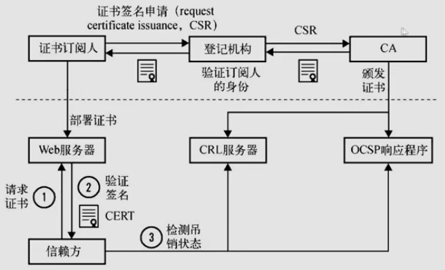
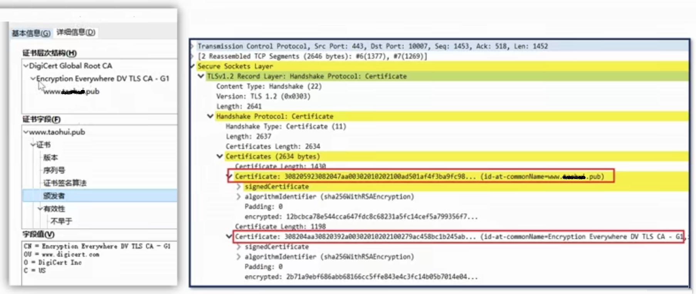
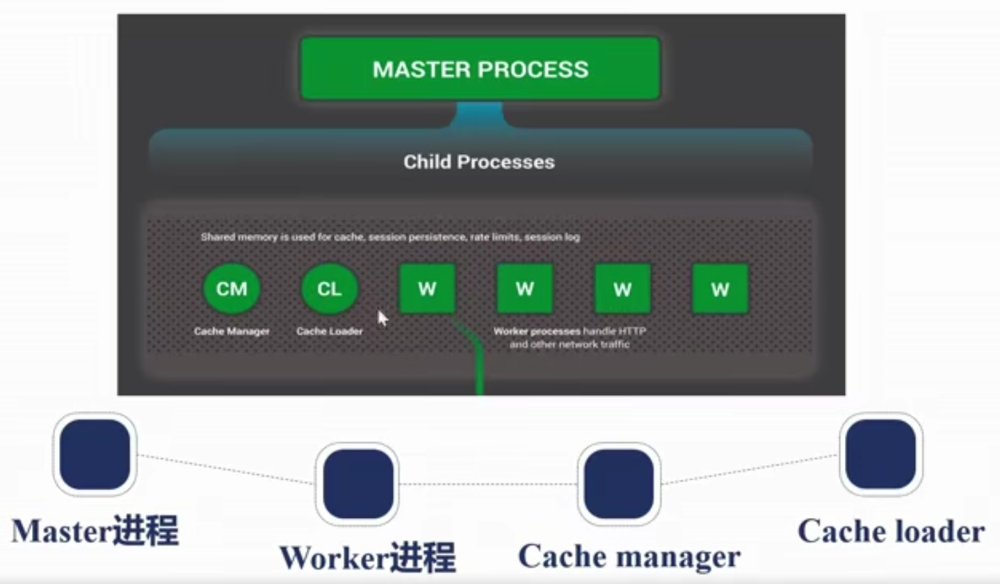
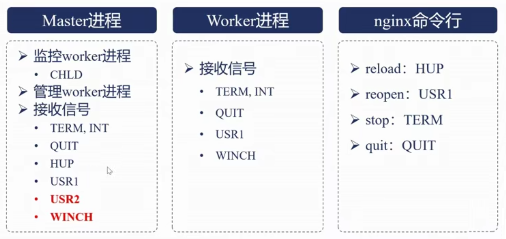
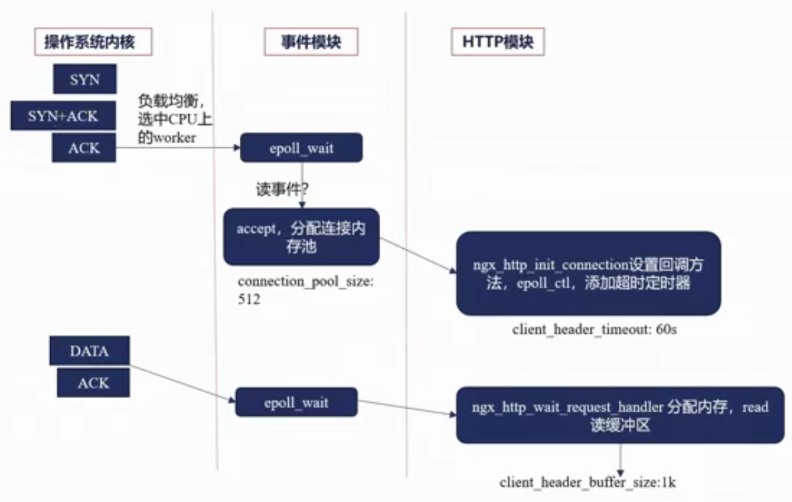
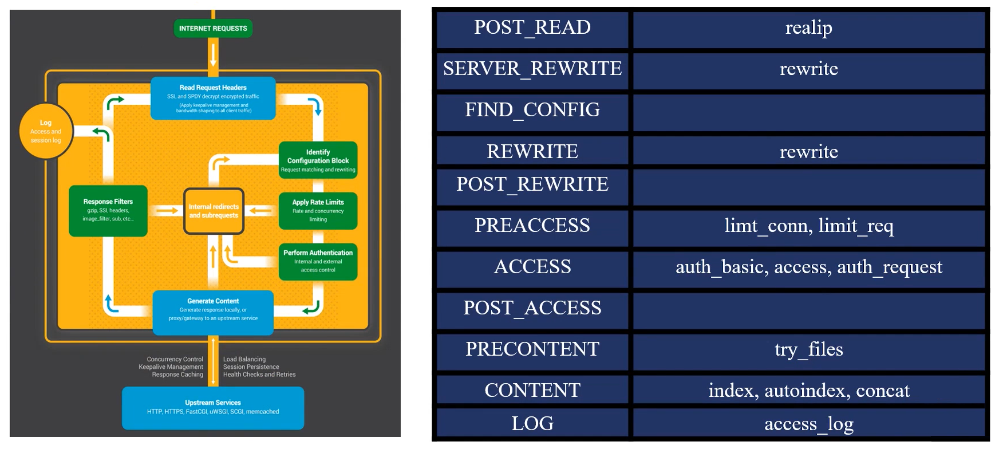
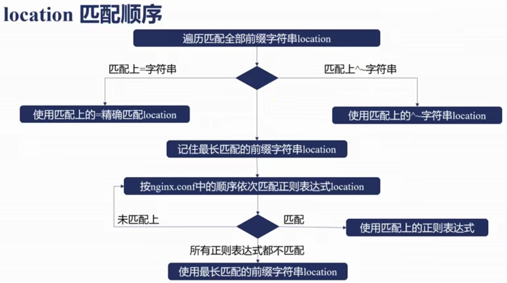
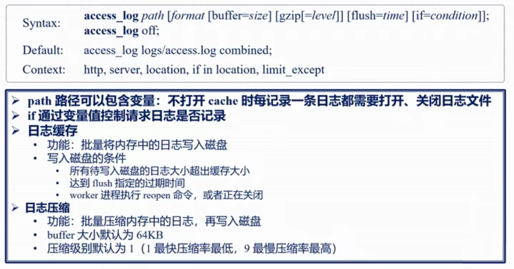
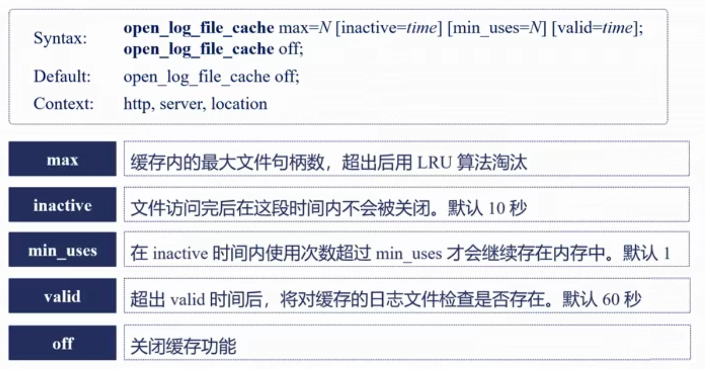
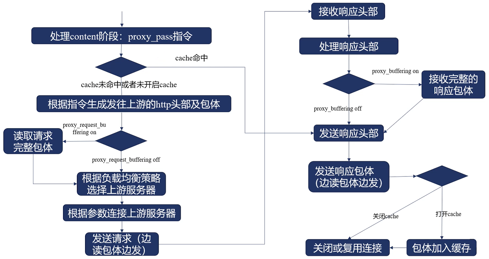

# 简介

。。。。

官网： http://nginx.org/

支持 Linux 系统和 window 系统


## 安装

下面针对 Linux 的安装：

1. **下载**：

    在官方的[下载界面](http://nginx.org/en/download.html)中选择主线版本下载。

    使用 `tar -xzf nginx-1.14.0.tar.gz` 命令可以解压包。解压后的文件夹下，有如下目录：

    ``` txt
    auto        //
      cc  // 用于编译
    CHANGES     // 每个版本的特性
    CHANGES.ru  // 俄罗斯语言的 CHANGES
    conf        // 示例文件，方便运维配置
    configure   // 生成中间文件的必备动作
    contrib     // 包含编辑器，提供语法高亮
                // （通过将vim目录下的文件拷贝到当前主机的vim目录下： cp -r ./contrib/vim/* ~/.vim/）
    html        // 里面有两个html文件，分别用于显示 50* 错误时的界面和正常的欢迎界面
    man         // 帮助文件
    src         // 源代码
    README
    LICENSE
    ```

2. 在解压后的目录下，**生成配置文件**：

    生成配置文件使用的就是当前目录下的 `configure` ，可以通过 `./configure --help` 查看帮助。

    `configure` 的参数，分为三大类：

    - 指定路径：例如模块的路径，一般只需要指定 `--prefix` 的路径即可，其他路径会在该路径下创建相应的文件夹。
    - 指定模块：在帮助文件中看到以 `--with-*` 开头的参数，说明该模块默认是不会指定进来的；同样，以 `--without-*` 开头的就是默认编译进来的。如果我们需要修改，添加特定参数即可。
    - 其他：例如打印日志、优化参数、第三方模块等。

    默认使用 `./configure --prefix=<path>` 执行完成后，会生成**中间文件**。

    中间文件都会放在与 `configure` 同目录下的 `objs` 文件夹下。

    （注意，若提示 `nginx c compiler cc is not found` ，需要先安装gcc： `yum -y install gcc-c++` 。期间如果还有其他模块没找到，对应安装即可。）

    在 `objs` 目录里，最重要的是 `ngx_modules.c` 文件，它指定了需要编译进 nginx 的模块。

3. 编译**生成安装文件**：

    在当前目录(`configure`所在的目录)下执行 `make` 命令进行编译。(自动使用 `objs` 下的文件)

    命令执行完后，会在 `objs/src` 里生成一些文件。

4. **安装** Niginx ：

    还是在当前目录下(`configure`所在的目录)执行 `make install` 命令进行安装。

    安装的地址就是前面 `--prefix` 指定的路径。如前面给出的参数是 `--prefix=/root/nginx` 那就会在 `/root/nginx` 安装。该目录下有如下文件：

    ``` txt
    sbin    // 存放二进制执行文件
    conf    // 存放决定功能的配置
    logs    // 存放日志文件
    ......
    ```

## 配置语法

1. 配置文件由指令与指令块构成
2. 每条指令以 `;` 分号结尾，指令与参数之间以空格符号分隔，多个参数也是以空格分隔
3. 指令块以 `{}` 花括号将多条指令组织在一起
4. `include` 语句允许组合多个配置文件以提升可维护性
5. 使用 `#` 符号添加注释
6. 使用 `$` 符号声明变量
7. 部分指令的参数支持正则表达式
8. 时间单位有 `ms`、`s`、`m`、`h`、`d`、`w`、`M`、`y` ，分别表示 毫秒、秒、分钟、小时、天、周、月、年 。
9. 空间单位有 `(不带单位)`、`k`或`K`、`m`或`M`、`g`或`G` 分别表示 b、Kb、Mb、Gb 。

## 命令行

使用的格式： `nginx -s reload` ，常用的命令如下：

1. 帮助： `-?` `-h`
2. 使用指定的配置文件： `-c`
3. 指定配置指令： `-g`
4. 指定运行目录： `-p`
5. 发送信号： `-s` ，参数如下：
    - 立刻停止服务： `stop`
    - 优雅的停止服务： `quit`
    - 重载配置文件： `reload`
    - 重新开始记录日志文件： `reopen`
6. 测试配置文件是否有语法错误： `-t` `-T`
7. 打印 nginx 的版本信息、编译信息等： `-v` `-V`

## Web 静态服务器常用配置说明

``` nginx.config
http {
    ......

    # 定义日志记录时的格式。其中 "main" 是格式的名字；后面带 "$" 的都是可用变量名
    log_format  main  '$remote_addr - $remote_user [$time_local] "$request" '
                      '$status $body_bytes_sent "$http_referer" '
                      '"$http_user_agent" "$http_x_forwarded_for"';
    # 开启访问日志记录。参数分别是路径和格式。
    access_log  logs/access.log  main;

    gzip  off;  # gzip 压缩
    gzip_min_length 1;  # 压缩级别
    gzip_comp_level 2;  # 低于该大小的文件不压缩
    gzip_type: text/plain application/x-javascript text/css image/png;  # 针对哪些类型文件压缩

    server {
        ......

        listen       80;  # 监听的端口号

        location / {
            ......

            alias   html/;  # 指定目录作为根路径  （可选的还有 root 指令）
            autoindex on; # 当我们访问的路径以"/"结尾时，给用户显示改文件夹下的所有文件 （静态资源访问）
            set $limit_rate 100k; # 限制每个用户每个文件的最大速度
        }
    }
}
```

## GoAccess

使用 GoAccess 可以动态生成一个页面，用图标的形式展示 log 文件。可用于监控性能等。

## SSL

## 关于对称加密与非对称加密


## 关于 SSL 证书



证书类型：

- 域名验证证书(DV, demain validated)：只验证域名是否正确。申请时效快。
- 组织验证证书(OV, organization validated)：需要验证填写的组织或企业的信息。申请需要等待审核，价格也远高于 DV 。
- 扩展验证证书(EV, extended validated)：比 OV 的验证更严格。

浏览器验证书链：



如上图所示，都是由三个证书构成的。对于根证书，审核是非常谨慎的，不会短时间内更新。

一般发起通信时，会发送三级和二级证书。

## 实操

对于 centos 系统，可以安装 `yum install python2-certbot-nginx` 这个工具。

该工具安装完成后，就可以使用命令 `certbot --nginx --nginx-server-root=~/nginx/conf -d www.abc.com` 申请证书，并配置到我们的 nginx 配置文件中。其中， `~/nginx/conf` 就是 nginx 配置文件的目录； `www.abc.com` 就是我们申请证书的域名。

执行成功后，我们查看 nginx 配置文件会发现多出几行。

</br>
</br>

# Nginx 架构基础

Nginx 请求处理流程：


Nginx 进程结构：（Nginx 会有一个主进程和多个 worker 进程，尽可能利用多核性能。除了主进程，其他的进程都由主进程创建和管理。）



Nginx 进程管理：（红色信号表示只能对进程发送,不能使用nginx的命令行发送命令）



`nginx -s reload` 的内部流程：

1. 向 master 进程发送 HUP 信号
2. master 进程校验配置语法是否正确
3. master 进程打开新的监听端口
4. master 进程用新的配置启动新的 worker 进程
    - 注意，此时旧的 worker 进程依然正常工作，直到被关闭或超时
5. master 进程向老 worker 进程发送 QUIT 信号
6. 老 worker 进程关闭监听句柄，处理完当前连接后结束进程

热升级的流程：

1. 将就 nginx 文件替换成新的 nginx 文件 （注意备份）
2. 向 master 进程发送 USR2 信号
3. master 进程修改 pid 文件名，加后缀 `.lodbin`
4. master 进程用新的 nginx 文件启动新的 master 进程 （新主进程是由旧主进程创建的）
5. 向老 master 进程发送 QUIT 信号，关闭老 master 进程 （老 master 进程会保留下来，方便回滚）
6. 若需要回滚：向老 master 发送 HUP 信号，向新 master 发送 QUIT 信号

worker 进程优雅关闭的内部流程：

1. 设置定时器(`worker_shutdown_timeout`)：保证定时器结束后必定关闭。
2. 关闭监听句柄：保证不会再处理新的请求。
3. 关闭空闲连接。（在正常状态下，nginx 为了资源最大化，会保留一些空闲的连接没有断开，方便该处理重复请求）
4. 在循环中等待全部连接关闭。
5. 退出进程。

Nginx 模块：


Nginx 模块分类：


Nginx 连接池：（连接池越大，初始化的时间越长，需要的内存越多，默认是 512）


</br>
</br>

# 详解 HTTP 模块

接收请求事件模块：



接收请求 HTTP 模块：


HTTP 请求处理时的 11 个阶段：



## postread 阶段

### realip 模块

假设网络中存在许多反向代理，我们必须拿到用户真实 IP 地址才能对其针对性操作，如限速。

一般我们通过 HTTP 头部的 `X-Forwarded-For` 和 `X-Real-IP` 的值获取。

- `X-Forwarded-For` 可能会有多个值，每经过一个反向代理就会在最后添加一个地址。
- `X-Real-IP` 是用户真实的 IP 地址，只有一个值。

默认情况下，此模块不会编译进 Nginx ，需要通过 `--with-http_realip_module` 启用功能。

模块的变量：

- `realip_remote_addr`
- `realip_remote_port`

模块的指令：（作用的上下文都是`http`、`server`、`loaction`）

- `set_real_ip_from`
- `real_ip_header`
- `real_ip_recursive`

模块功能是用于**修改客户端地址**。

### rewrite 模块

关于重定向：

- `301`: 永久重定向。会被浏览器缓存，每次访问该网址都会自动重定向到另外的地址。
- `302`: 临时重定向。浏览器不会缓存。
- `303`: 临时重定向。允许改变方法，禁止被缓存。
- `307`: 临时重定向。不允许改变方法，禁止被缓存。
- `308`: 永久重定向。不允许改变方法。

指令：

- `return`:
  - 作用上下文：`server`、`location`、`if`
  - 示例： `return 302 https://www.baidu.com/;` 。重定向到百度，状态码是 302 。
  - 除了常规的状态码之外，还有 `444` ，表示关闭连接，不会被客户端接收到。

- `error_page`:
  - 作用的上下文：`http`、`server`、`location`、`if`
  - 针对错误状态码(如404)返回特定的页面。
  - 示例： `error_page 404 /404.html;`

- `rewirte`:
  - 作用上下文：`server`、`location`、`if`
  - 可以把用户的 URL 替换成你指定的 URL 。能够使用正则表达式。

- `if`:
  - 作用上下文：`server`、`location`
  - `if(condition){ ... }`
  - `condition`的值：
    - 直接使用变量，当变量为空或0时，表示false
    - 变量与字符串比对，使用 `=` 或 `!=`
    - 变量与正则表达式匹配，使用 `~` / `!~` / `~*` / `!~*`
      - `~` 、 `!~` 分别表示大小写敏感的匹配和不匹配
      - `~*` 、 `!~*` 分别表示大小写不敏感的匹配和不匹配
    - 检查文件是否存在，使用 `-f` 或 `!-f`
    - 检查目录是否存在，使用 `-d` 或 `!-d`
    - 检查文件、目录、软链是否存在，使用 `-e` 或 `!-e`
    - 检查是否为可执行文件，使用 `-x` 或 `!-x`
  - 示例：
    - `if($http_user_agent ~ MSIE){ ... }`
    - `if($http_cookie ~* "id=([^;]+)(?:;|$)"){ ... }`
    - `if($request_method = POST){ ... }`
    - `if($slow){ ... }`

## find_cofig 阶段

指令 `location`:

- 作用上下文：`server`、`location` (即`location`可以嵌套)
- 合并连续的符号： `merge_slashes on;`
- 匹配规则：
  - 前缀字符串：
    - 字符串常量，路径的前缀匹配上也算匹配上。如 `localhost/p1/p2` 能匹配到 `localhost /p1 { ... }` 。
    - `=`: 精确匹配。必须完全相同的路径才会匹配上。
    - `^~`: 匹配上后则不再进行其他正则表达式匹配。
  - 正则表达式：
    - `~`: 大小写敏感的正则匹配
    - `~*`: 大小写不敏感的正则匹配
  - `@`: 用于跳转被明明的 location
- 

## preaccess 阶段

`http_limit_req_module` 在 `http_limit_conn_module` 之前，若两个模块都同时开启，前者会先生效，后者就不需要处理了。

### limit_conn 模块

`http_limit_conn_module` 默认是编译进 Nginx 的。

生效范围：

- 全部 worker 进程 （基于共享内存）
- 进入 preaccess 阶段前不生效
- 限制的有孝心取决于 key 的设计：依赖 prstread 阶段的 realip 模块取到真实 ip

指令：

- `limit_conn_zone`: 定义共享内存，如大小、 key 关键字
  - 作用上下文： `http`
  - `limit_conn_zone key zone=name:size;`

- `limit_conn`: 限制并发连接数
  - 作用上下文： `http` 、 `server` 、 `location`
  - `limit_conn zone number;`

- `limit_conn_log_level`: 限制发生时的日志级别
  - 作用上下文： `http` 、 `server` 、 `location`
  - `limit_conn_log_level info|notice|warn|error;`，默认`error`。

- `limit_conn_status`: 限制发生时向客户端返回的错误码
  - 作用上下文： `http` 、 `server` 、 `location`
  - `limit_conn_status code;`，默认`503`。

### limit_req 模块

`http_limit_req_module` 默认是编译进 Nginx 的。

使用 `leaky bucket` 算法。用于应对突发流量，使系统处理恒定数量的请求。简单理解就是"节流"。

生效范围：

- 全部 worker 进程 （基于共享内存）
- 进入 preaccess 阶段前不生效

- `limit_req_zone`: 定义共享内存，如大小、 key 关键字、限制速率
  - 作用上下文： `http`
  - `limit_req_zone key zone=name:size rate=rate;`
    - `rate` 单位是 `r/s` 或 `r/m`

- `limit_req`: 限制并发连接数
  - 作用上下文： `http` 、 `server` 、 `location`
  - `limit_req zone=name [burst=number] [nobolay];`
    - `burst` 默认为 0 ，表示能容纳多少个请求
    - `nodelay` 对 `burst` 中的请求不再采用延时处理的做法，而是立即处理

- `limit_req_log_level`: 限制发生时的日志级别
  - 作用上下文： `http` 、 `server` 、 `location`
  - `limit_req_log_level info|notice|warn|error;`，默认`error`。

- `limit_req_status`: 限制发生时向客户端返回的错误码
  - 作用上下文： `http` 、 `server` 、 `location`
  - `limit_req_status code;`，默认`503`。

## access 阶段

控制请求是否可以继续向下访问。

### access 模块

`http_access_module` 默认编译进 Nginx 。在进入 access 阶段前此模块不生效。

指令：

- `allow`: 指定允许访问的地址
  - 作用上下文： `http` 、 `server` 、 `location` 、 `limit_except`

- `deny`: 与 `allow` 相反，是指定不能访问的地址
  - 作用上下文： `http` 、 `server` 、 `location` 、 `limit_except`

示例：

``` nginx
location / {
  deny 192.168.1.1;     # IPV4
  allow 192.168.1.0/24; # 子网掩码
  allow 2001:0db8::32;  # IPV6
  deny all;
  # 上面指令是按顺序执行，满足第一条就不会往下执行
}
```

### auth_basic 模块

`http_auth_basic_module` 默认编译进 Nginx 。

是基于 HTTP Basic Authutication 协议进行用户名密码的认证。

指令：

- `auth_base`: 默认不开启。
  - 作用上下文： `http` 、 `server` 、 `location` 、 `limit_except`

- `auth_basic_user_file`: 指定用户名密码保存的文件
  - 作用上下文： `http` 、 `server` 、 `location` 、 `limit_except`

### auth_request 模块

`http_auth_request_module` 默认是没有编译进 Nginx 的。

该模块实现的功能是，向上游服务器转发请求，若上游服务返回的响应码是 2xx ，则继续执行；若上游服务返回的是 401 或 403 ，则将响应返回给客户端。

模块的原理是，当收到请求后，生成子请求，通过反向代理把请求转发给上游服务。

指令：

- `auth_request uri`: uri 是上游服务的地址
  - 作用上下文： `http` 、 `server` 、 `location`

- `auth_request_set $variable value`: 用于处理完成后添加特定的变量
  - 作用上下文： `http` 、 `server` 、 `location`

### satisfy 指令

`satisfy all|any;` 默认是 all ，表示前面提到的三个模块都必须放行才能放行；若是 any 则是其中一个放行即可。

作用上下文： `http` 、 `server` 、 `location`

## precontent 阶段

### try_files 模块

`ngx_http_try_files_module` 模块是默认编译进 Nginx ，且不能移除。

只提供了一个指令：

`try_files`: 用于依次尝试返回指定文件，若所有文件都不存在，则返回最后一个，最后一个可以是 `code` 也可以是 `uri` 。

作用上下文： `server` 、 `location`

### mirror 模块

`ngx_http_mirror_module` 模块默认编译进 Nginx 。

此模块的作用是，处理请求时，生成子请求访问其他服务，但对子请求的返回值不做处理。可以做流量拷贝。

指令：

- `mirror uri`: 设置镜像转发的目标地址
  - 作用上下文： `http` 、 `server` 、 `location`

- `mirror_request_body on|off`: 是否把请求的 body 也镜像转发
  - 作用上下文： `http` 、 `server` 、 `location`

## content 阶段

### static 模块

该模块默认编译进 Nginx ，且不能移除。

设置静态资源目录的指令：（都是讲 url 映射为文件路径，以返回静态文件内容）

- `root path`: 将完整 url 映射进文件路径中
  - 作用上下文： `http` 、 `server` 、 `location` 、 `if`
  - 例如，访问 `location /p1 { root /p2 }` 时，会到 `./p2/p1/` 目录中寻找文件

- `alias path`: 只会将 location 后的 url 映射到文件路径中
  - 作用上下文： `location`
  - 例如，访问 `location /p1 { alias /p2 }` 时，会到 `./p2/` 目录中寻找文件

关于静态文件的指令：

- `types { ... }`: 指定可以返回的文件的类型
  - 作用上下文： `http` 、 `server` 、 `location`

- `default_type mime-type`: 当返回未知类型文件时，指定的文件类型
  - 作用上下文： `http` 、 `server` 、 `location`

- `log_not_found on|off`: 当找不到文件时，是否记录到日志
  - 作用上下文： `http` 、 `server` 、 `location`

变量：

- `$request_filename`: 带访问文件的完整路径。

- `$document_root`: 有 url 和 `root`/`alias` 规则生成的文件夹路径

- `$realpath_root`: 将 `document_root` 中的软链接等换成真实路径

### index 和 autoindex 模块

当访问地址以 `/` 结尾时：

- 对于 `index` 模块，就会访问该目录下 `index` 文件。

- 对于 `autoindex` 模块，就会尝试以 `html`/`xml`/`json`/`jsonp` 等格式返回特定目录下的目录结构。

`ngx_http_index_module` 先于 `ngx_http_autoindex_module` 模块。

指令：（作用上下文： `http` 、 `server` 、 `location`）

- `index file ...;`: 指定作为 index 的文件。

- `autoindex off|on`: 开启或关闭 autoindex 功能。

- `autoindex_exact_size on|off;`: 是否显示文件大小。

- `autoindex_format html|xml|json|jsonp;`: 返回的格式。

- `autoindex_localtime on|off;`: 是否以本地时间的格式。

### concat 模块

`ngx_http_concat_module` 由阿里巴巴提供的，其作用是，把多个小文件合并到一次 http 响应中返回，以提升性能。

如何添加：

- 下载： [地址](https://github.com/alibaba/nginx-http-concat)
- 添加： `--add-module=../nginx-http-concat`

如何使用：

- 在 uri 后加上 `??` ，通过多个 `,` 逗号分隔文件名。
- 例如： `https://abc.def.com/??path1/path2/1.js,p1/p2/2.js`

指令：（作用上下文： `http` 、 `server` 、 `location`）

- `concat`: 是否开启功能。

- `concat_delimiter`: 指定分隔符。即文件内容之间的间隔符号。

- `concat_types`: 对哪些类型的文件进行合并。

- `concat_unique`: 是否只对一种文件进行合并。

- `concat_ignore_file_error`: 是否忽略文件错误。

- `concat_max_files`: 最大合并的文件数量。

## log 阶段

`ngx_http_log_module` 是默认编译进 Nginx ，且不能移除。

指令：

- `log_format`: 定义 log 的格式
  - 作用上下文： `http`

- 

- 

</br>

## HTTP 过滤模块

HTTP 过滤模块的名字都有相同的关键字： `http_*_filter_module` 。

### sub 模块

`ngx_http_sub_filter_module` 模块默认不编译进 Nginx 。

其作用是，将响应体中指定的字符串替换成新的字符串。

指令：（作用上下文都是 `http`、`serve`、`location`）

- `sub_filter`: 指定替换规则

- `sub_filter_last_modified`: 是否返回 `last modified`(文件最后修改时间) 响应头。默认关闭，即返回原来的值。

- `sub_filter_once`: 是否只替换一次。默认 `on` ，即把 body 的所有内容都替换。

- `sub_filter_types`: 针对哪些 MIME 类型进行操作。

### addition 模块

`ngx_http_addition_filter_module` 模块默认不编译进 Nginx 。

其作用是，在响应前/后增加内容，而增加内容的方式是通过新增子请求的响应完成。

指令：（作用上下文都是 `http`、`serve`、`location`）

- `add_before_body uri`: 在 body 之前添加内容，其内容是向 uri 请求得到的响应的内容。

- `add_before_body uri`: 在 body 之后添加内容，其内容是向 uri 请求得到的响应的内容。

- `addition_types`: 针对哪些 MIME 类型进行操作。

## 防盗链

### referer 模块

`ngx_http_referer_module` 默认是编译进 Nginx 的。

此模块是简单有效的防盗链手段，通过检测 HTTP 请求头的 `referer` 字段实现，因为浏览器在跳转链接时，会携带上当前页面的 URL 。

缺点是真能针对浏览器，如果攻击者手动修改 `referer` 的值就没办法了。

指令：（作用上下文都是 `http`、`serve`）

- `valid_referers`: 指定合法的 url 匹配规则。

- `referer_hash_bucket_size`: 存储相关变量的哈希表参数。

- `referer_hash_max_size`: 存储相关变量的哈希表参数。

### secure_link 模块

`ngx_http_secure_link_module` 默认是不编译进 Nginx 的。

此模块的目的也是为了防盗链，但安全性比前者更高。原理大概是利用时间戳、密钥、资源位置、用户信息等，生成一个哈希值，或者 md5 生成的值。

变量：

- `secure_link`: 是否通过验证。（空表示不通过；0表示过期；1表示有效）
- `secure_link_expires`: 获取时间戳的值。

指令：（作用上下文：`secure_link_secret`只有 `location` ；其他都是 `http`、`serve`、`location`）

- `secure_link`
- `secure_link_md5`
- `secure_link_secret`

## map 模块

`ngx_http_map_module` 默认是编译进 Nginx 的。类似于高级语言的 `switch...case...default` ，根据某个变量的值返回新的变量。

指令：（作用上下文：`http`）

- `map`: 基础设置。
- `map_hash_bucket_size`: 存储相关变量的哈希表参数。
- `map_hash_max_size`: 存储相关变量的哈希表参数。

## split_clients 模块

`ngx_http_split_clients_module` 默认是编译进 Nginx 的。

此模块用于实现 AB 测试，所谓的 AB 测试，就是对于某些不太确定的功能，开发了两套，让特定百分比的用户使用 A 版本，其他则使用 B 版本，最后看大家反馈决定使用哪个版本。

指令只有 `split_clients` ，其作用上下文是 `http` 。

语法用法和 map 模块类似，设置特定范围的百分比落入到哪个 `case` 。

## geo 模块

`ngx_http_geo_module` 默认是编译进 Nginx 的。作用是，根据 IP 地址创建新的变量。

命令只有 `geo` ，其作用上下文是 `http` 。语法也是和 map 或 split_clients 模块类似。

## geoip 模块

`ngx_http_geoip_module` 默认是不编译进 Nginx 的。

此模块是根据 IP 地址创建新的变量，基于 MaxMind 数据库从客户端地址获取变量(如地理位置)。

需要注意，必须先下载安装 [MaxMind 里 geoip 的 C 开发库](https://dev.maxmind.com/geoip/legacy/downloadable/)，把模块编译进 Nginx 。

模块提供了大量变量，具体略...

## keepalive

多个 HTTP 请求通过复用 TCP 连接，实现：

- 减少握手次数
- 通过减少并发连接数，减少了服务器资源的消耗
- 降低 TCP 拥塞控制的影响

关注两个 HTTP 头部字段：

- `Connection` ：
  - 取值为 `close` ：表示请求处理完立即关闭连接
  - 取值为 `keepalive` ：表示复用连接处理下一条请求
- `Keep-Alive` ：
  - 值为 `timeout=n` 表示连接至少保留 n 秒。 

指令：（作用上下文都是 `http`、`serve`、`location`）

- `keepalive_disable`: 指定某些浏览器不使用 keepalive 。

- `keepalive_requests`: 表示在一个 TCP 连接上最多建立多少个 HTTP 连接。

- `keepalive_timeout`: 设置超时时间，可以设置等待多久没有新连接就关闭和连接的超时时间。

</br>
</br>

# 反向代理与负载均衡

## 负载均衡

Nginx 在 AKF 扩展立方体上的应用：


指定上游服务地址使用的是 `upstream` 和 `server` 指令。

负载均衡使用的是 **Round-Robin 算法**：

- "Round" 表示轮询，即以**加权**轮询的方式访问上游服务
- 此算法是继承在 Nginx 的 upstream 框架中，不能移除
- 相关的指令：
  - `weight`: 服务访问的权重，默认是 1 .
  - `max_conns`: server 的最大并发链接数，仅作用于单 worker 进程。默认是 0 ，表示没有限制。
  - `max_fails`: 在 `fail_timeout` 时间内，最大的失败次数。当到达最大失败时，会在 `fail_timeout` 秒内禁用此台 server 。
  - `fail_timeout`: 单位是秒，默认是 10 秒。

对上游服务使用 keepalive 长连接：

- 使用 `ngx_http_upstream_keepalive_module` ，它默认编译进 Nginx 。
- 在上下文 `upstream` 中使用 `keepalive` 指令配置。

相关模块简单介绍：

- upstream_ip_hash ：基于客户端 IP 地址的 Hash 算法实现负载均衡。
- upstream_hash ：基于任意关键字实现 Hash 算法的负载均衡。
- upstream_least_conn ：从上游服务器中找出当前并发数最少的一个，将请求转发到它。
- upstream_zone ：使用共享内存是负载均衡策略对所有 worker 进程生效。

upstream 模块提供的变量(不含cache)：

- upstream_addr ：上游服务器的 IP 地址。
- upstream_connect_time ：与上游服务建立连接消耗的时间，单位是秒，精确到毫秒。
- upstream_header_time ：接收上游服务发回响应中 HTTP 头部所消耗的时间，单位是秒，精确到毫秒。
- upstream_response_time ：接收完整的上游服务响应所消耗的时间，单位是秒，精确到毫秒。
- upstream_http_名称 ：从上游服务返回的响应头部的值。
- upstream_bytes_received ：从上游服务接收到的响应长度，单位是字节。
- upstream_resopnse_length ：从上游服务返回的响应包体长度，单位是字节。
- upstream_status ：上游服务返回的 HTTP 响应的状态码。若为连上，则是 502 。
- upstream_cookie_名称 ：从上游服务发回的响应头 Set-Cookie 的值。
- upstream_trailer_名称 ：从上游服务的相应尾部取到的值。

## 反向代理

HTTP反向代理流程：



proxy 模块：对上游服务使用 http/https 协议进行反向代理。


</br>
</br>

</br>
</br>

</br>
</br>

TODO: 90

82-119 反向代理与负载均衡

120-137 Nginx 的系统层性能优化

138-155 Nginx 的系统层性能优化
