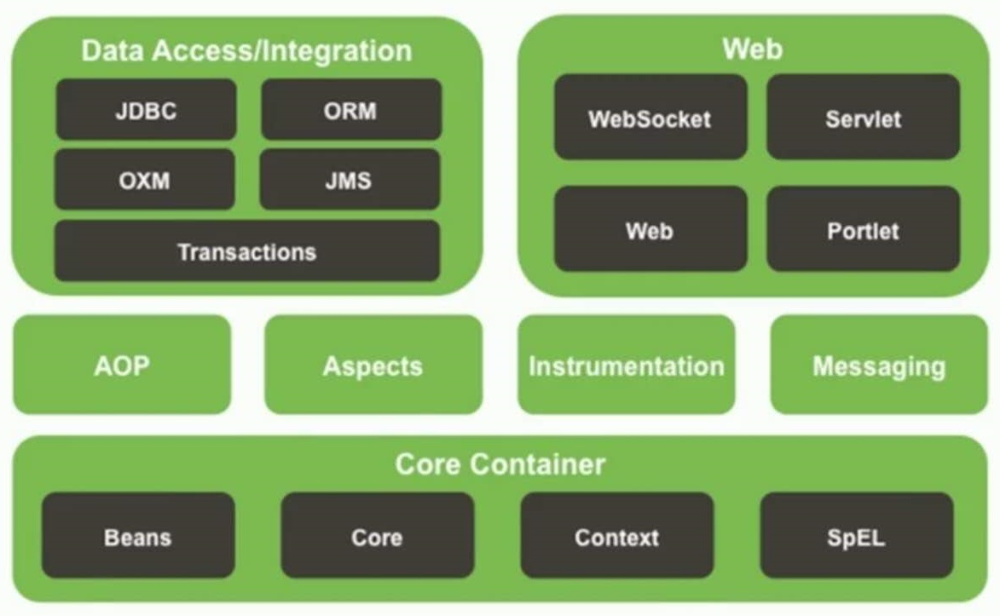
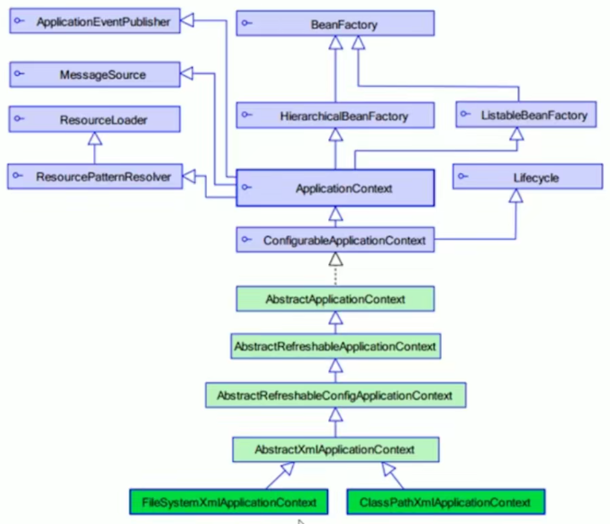

# 简介

Spring 是一个开源框架，为简化企业级应用开发而生。使用 Spring 可以使简单的 JavaBean 实现以前只有 EJB 才能实现的功能。它使 JavaSE/EE 的一站式框架。

什么是 SSM ？

- Spring: 对象容器框架。职责是对项目中各个对象有效的管理。是框架的框架，即其他所有的框架都要继续它开发。
- Spring MVC: 帮助我们的进行 Web 程序的分层，让我们的程序有效解耦。是替代 servlet ，更好的进行 Web 开发。
- MyBatis: 简化与数据库的交互。

Spring 的优点有：

- 方便解耦，简化开发
  - Spring 就是一个大工厂，可以将 所有对象创建和依赖关系维护 交给 Spring 管理
- AOP 变成的支持：
  - Spring 提供面向切面编程，可以方便的实现对程序进行权限拦截、运行监控等功能
- 声明式事务的支持：
  - 只需要通过配置，就可以完成对事务的管理，而无需手动编程
- 方便程序测试：
  - Spring 对 Junit4 支持，可以通过注解，很方便的测试 Spring 程序
- 方便集成各种优秀框架：
  - Spring 不排斥各种优秀的开源框架，气内部提供了对各种优秀框架的直接支持
  - 如， Struts 、 Hibernate 、 MyBatis 等
- 降低 JavaSS API 的使用难度
  - Spring 对 JavaEE 开发中非常难用的一些 API 都提供了封装
  - 如， JDBC 、 JavaMail 、 远程调用 等

简单概括就是， **工厂模式** + 反射 + 配置文件 。

Spring 的模块：



Spring 的工厂类：



[Spring 开发包下载地址](https://repo.spring.io/libs-release-local/org/springframework/spring/)。

在上面的下载地址中选取合适的版本下载，解压后的目录结构大致如下：

``` txt
doc     // api 文档和开发规范
libs    // 开发需要的 jar 包 (源码)
schema  // 开发需要的 schema 文件
license.txt
notice.txt
readme.txt
```

</br>

## Spring IOC

[内容](./Spring_IOC.md)

</br>

## Spring AOP

[内容](./Spring_AOP.md)。其中包含[AspectJ](./AspectJ.md)。

</br>

## Spring JDBC Template

[内容](./Spring_JDBC_Template.md)

</br>

## Spring 事务管理

[内容](./Spring_transaction.md)

</br>

## Spring MVC

[内容](./Spring_MVC.md)

</br>

## Spring Boot

[内容](./Spring_Boot.md)

</br>
