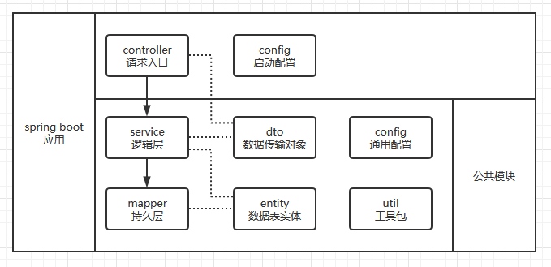

# _

使用 spring initializr 创建 spring cloud 项目

https://spring.io/projects/spring-cloud


## 从零开始搭建简单项目

在 Spring Cloud 项目中，大概的目录结构如下：

``` txt
父项目
├─ Eureka 注册中心
├─ gateway 路由管理
│
├─ 服务1
├─ 服务2
├─ 服务3
├─ .......
├─ 服务n
```

简单说明上面的内容：

- 父项目，里面没有逻辑代码，最重要的是 `pom.xml` 的 `<dependencyManagement>` 标签，用于管理子模块依赖模块的版本号相同。
- 注册中心，是为服务提供"注册"的地方，包括路由管理。
- 路由管理，对外只会暴露此服务，然后特定的路径会转发到特定的服务。
- 其他服务，就是提供服务的，处理各种请求，服务是可以有若干个的。

服务模块结构：



实操说明：

1. 在 [spring initializr](https://start.spring.io/) 可以创建一个**初始化项目**。
    - 除了设置项目相关的信息，还能在 `Dependencies` 中配置默认安装的依赖。（这里选上 Eureka Server ）
    - 配置选项中， Spring Boot 版本不要选择 `SNAPSHOT` 版本的。
    - 配置完成后，能生成一个压缩包，下载后解压，就可以用 IDE 打开项目了。
    - 初次打开项目，可能需要花点时间等待下载依赖包。

2. 在 IEDA 中直接启动项目。
    - 初次启动项目，会提示 `Cannot execute request on any known server` 的错误。原因是 eureka server 自己连自己导致。
    - 此问题在"第4步"解决。

3. 把单个的 spring boot **项目改造**成多个 maven 子项目。
    - 在父项目的目录下，右键 -> "New"选项 -> "Module"选项 -> 选择 Maven 项目创建。
    - 这里创建一个名为 `eureka` 的子项目，它是作为**注册中心**。
    - 然后把父项目的 `pom.xml` 的 `<dependencies>` 标签中的 `org.springframework.cloud` 该部分配置移动到刚创建的子项目的依赖中。
    - （此时，可以把 `<dependencies>` 的依赖都删了，因为改造后的父项目不再是 spring boot 项目，不再需要 spring boot 的依赖，子项目才需要）
    - 同样的，把父项目中的 入口文件(`*Application`) 移动到刚创建的子项目中。注意，创建相同的包结构。
    - 然后就可以把父项目中的 `src` 文件夹删除。
    - 其实父项目就是一个"框架"，只需要 `pom.xml` 引入公用的依赖；子项目才是正常的 Maven 项目。

4. 配置**注册中心**。
    - 在 `eureka` 子项目的 `resources` 目录下创建 `application.properties` 文件，项目默认会读取该文件。
    - （ `application.properties` 文件也可以包含在`resources/config/`目录下。它本质是 `yuml` 文件）
    - 在 `application.properties` 文件填入如下内容：

      ``` yml
      # 应用名
      spring.application.name=eureka
      # 端口号
      server.port=8888
      # 是否获取注册中心 (此应用就是注册中心,所以设为false,默认是true)
      eureka.client.fetch-registry=false
      # 是否注册到注册中心 (同理,此应用就是注册中心,所以设为false,默认是true)
      eureka.client.register-with-eureka=false
      ```

    - 然后在 入口文件(`*Application`) 的类上，添加上 `@EnableEurekaServer` 注解，表示它是注册中心服务，即：

      ``` java
      @SpringBootApplication
      @EnableEurekaServer
      public class EurekaApplication {
        public static void main(String[] args) {
          SpringApplication.run(EurekaApplication.class, args);
        }
      }
      ```

    - 完成上面的两步，就解决了上面"第2步"的问题，可以正常启动了。当时报错的原因是，默认把服务注册到注册中心，导致"自己注册自己"。

5. **美化输出日志**。
    - spring boot 默认集成 SLF4J 框架，它定义了一些日志接口，规范日志输出。真正的实现是 logback 或 log4j 。
    - 具体使用请参考 [另一个笔记](./Spring_MVC.md#logback配合，记录访问日志) 。

6. **新建服务**。
    - 根上面的步骤类似，创建一个子模块。
    - 在 `pom.xml` 添加依赖:

      ``` xml
      <!-- 此项目是服务，索引引入 eureka-client -->
      <dependency>
        <groupId>org.springframework.cloud</groupId>
        <artifactId>spring-cloud-starter-netflix-eureka-client</artifactId>
      </dependency>
      <!-- 此项目是 spring boot 的 web 项目，引入对应依赖 -->
      <dependency>
        <groupId>org.springframework.boot</groupId>
        <artifactId>spring-boot-starter-web</artifactId>
      </dependency>
      ```

    - 创建 `application.properties` 配置文件。注意，因为它是服务，配置跟注册中心是不同的，包含**指向注册中心**的地址：

      ``` yml
      # 应用名
      spring.application.name=my_server_1
      # 服务的端口号一般是 9*** （但这不是强制,看公司约定）
      server.port=9001
      # 指向注册中心的地址
      eureka.client.service-url.defaultZone=http://localhost:8888/eureka/
      ```

    - 创建包和入口文件：

      ``` java
      @SpringBootApplication
      // 注意，这里的注解不是 @EnableEurekaServer ，而是 @EnableEurekaClient ，因为它是服务，不是注册中心
      @EnableEurekaClient
      public class MyServer1 {
        public static void main(String[] args) {
          SpringApplication.run(MyServer1.class, args);
        }
      }
      ```

    - 创建第一个 Controller 。注意先创建 `controller` 包用于存放：

      ``` java
      // 代码的意思不多介绍了，是 Spring MVC 的内容
      @RestController
      public class FirstTestController {
        @RequestMapping(value = "/test", method = RequestMethod.GET)
        public String test() {
          return "success";
        }
      }
      ```

    - 在浏览器输入 `http://localhost:9001/test` 即可看到效果。

7. 这里先说一下如何指定**模块间的关系**。
    - 在父项目的 `pom.xml` 中的 `<modules>` 标签中，可以看到子模块，刚才我们新建的子项目都会在这里。
    - 在子项目的 `pom.xml` 中的 `<parent>` 标签中，描述了父模块的信息，也是在新建子项目的时候会自动指定。

8. 把**服务注册**到注册中心。其实内容在"第6步"已经包含了，这里单独说明。
    - 在服务的入口类中添加 `@EnableEurekaClient` ，表明它是注册到 Eureka 的服务。
    - 在服务的 `application.properties` 文件中配置添加 `eureka.client.service-url.defaultZone=http://localhost:8888/eureka/` ，说明注册中心的地址。

</br>

## 路由模块(gateway)

Spring Cloud 的网关组件可以用 gateway 或 zuul ，在早期使用的是 zuul ，后面 spring 自己除了 gateway 。

网关的主要功能：

- 限流（流量控制）
- 重试（请求失败是重试，慎用）
- 跨域
- 路由（转发请求）
- 鉴权（登录校验，签名校验）
- ......

搭建路由模块：

1. 同样在父项目中，新建一个子项目。

2. 在 `pom.xml` 添加依赖：

    ``` xml
    <!-- 网关的依赖 -->
    <dependency>
      <groupId>org.springframework.cloud</groupId>
      <artifactId>spring-cloud-starter-gateway</artifactId>
    </dependency>
    <!-- 同样需要引入 eureka-client ，它同样是一个服务 -->
    <dependency>
      <groupId>org.springframework.cloud</groupId>
      <artifactId>spring-cloud-starter-netflix-eureka-client</artifactId>
    </dependency>
    ```

3. 创建入口类，写法与其他服务相同，不赘述。

4. 创建 `application.properties` 文件，部分配置与普通服务相同：

    ``` yml
    # 应用名
    spring.application.name=gateway
    # 路由服务的端口一般以 9000 （非强制）
    server.port=9000
    # 指向注册中心的地址
    eureka.client.service-url.defaultZone=http://localhost:8888/eureka/

    # 【路由转发配置】
    # 转发路由的名字
    spring.cloud.gateway.routes[0].id=my_server_1
    # 转发路由的服务的目标地址
    spring.cloud.gateway.routes[0].uri=http://localhost:9001
    # 表示以路径作为转发规则。当符合路径 /server1/** 都会被转发到目标地址。
    spring.cloud.gateway.routes[0].predicates[0].name=Path
    spring.cloud.gateway.routes[0].predicates[0].args[0]=/server1/**
    ```

5. 这里先简单说一下效果。
    - 当我们访问 `http://localhost:9000/server1/test` 时，请求会被转发到 `http://localhost:9001/server1/test` 。
    - 但以目前的代码， `http://localhost:9001/server1/test` 是没有内容的。下面处理这个问题。

6. 设置普通**服务的上下文**。
    - 在普通服务的 `application.properties` 文件中，增加一行配置：

      ``` yml
      # 设置服务的上下文地址
      server.servlet.context-path=/server1
      ```

    - 之前根路径下的 `/test` 可以直接访问，增加了上面的配置后，需要加上 `/server1` 作为根路径才能访问。
    - 这也就解决了"第5步"的问题了。

7. 到生产环境，会对 `9001` 的端口进行拦截，不允许外网的访问，只留下 `9000` 的路由给外部访问。

</br>

## 集成 Mybatis 持久层框架

在进行下面操作前，需要先安装 MySQL 数据库，然后创建数据库 `spring_cloud_test` 作为测试用。

创建数据库选择字符集时，建议使用 `utf8mb4` 。因为在 MySQL 中， `utf8` 最大只支持 3 字节长度的字符；而 `utf8mb4` 才是真正的"UTF8"，最大支持 4 字节长度的字符。

### 手动创建

1. 在父项目的 `pom.xml` 文件的 `<dependencyManagement>` 标签下的 `<dependencies>` 标签内添加如下依赖：

    ``` xml
    <!-- 集成 Mybatis -->
    <dependency>
      <groupId>org.mybatis.spring.boot</groupId>
      <artifactId>mybatis-spring-boot-starter</artifactId>
      <version>1.3.2</version>
    </dependency>
    <dependency>
      <groupId>mysql</groupId>
      <artifactId>mysql-connector-java</artifactId>
      <version>8.0.21</version>
    </dependency>
    ```

    这里需要说明一下 `<dependencyManagement>` 的作用：
      - `<dependencyManagement>` 的作用是，让子项目中引用与其内部描述相同的依赖时，不用列出版本号。
      - 简单说就是，为子项目提供统一的依赖版本管理。
      - 所以，父项目的 `<dependencyManagement>` 指定的依赖必须带版本号；
      - 子项目的 `<dependencies>` 是不需要带版本号的。

2. 在子项目的 `application.properties` 中添加数据库连接的配置：

    ``` yml
    # 配置数据库连接
    spring.datasource.url=jdbc:mysql:///spring_cloud_test?characterEncoding=UTF8&autoReconnect=true
    spring.datasource.username=root
    spring.datasource.password=root
    spring.datasource.driver-class-name=com.mysql.cj.jdbc.Driver
    ```

3. 创建**实体类**：
    - 作用：实体类与查询的数据字段一一对应。
    - 在子项目中创建 `entity` 包，用于存放实体类。

4. 创建 **mapper** ，即**持久层**，包括两部分：
    - 作用： mapper 将实体类与数据库查询结果关联起来。即，解决"把查询好的数据放到哪个对象上"的问题。
    - 在子项目中创建 `mapper` 包，用于存放 mapper 接口。示例如下：

      ``` java
      public interface PersonMapper {
        public List<Person> getAllPerson();
      }
      ```

    - 在服务的入口类中，设置需要扫描包，以提供 mapper 接口给 spring ：

      ``` java
      @SpringBootApplication
      @EnableEurekaClient
      // 扫描指定的包，把其中的文件作为 mapper 提供给 spring
      @MapperScan("com.example.spring_cloud_demo.my_server_1.mapper")
      public class MyServer1Application {
        public static void main(String[] args) {
          SpringApplication.run(MyServer1Application.class, args);
        }
      }
      ```

    - 在 `resources` 目录下，创建 `mapper` 目录，存放与 sql 语句相关的 `.xml` 文件。示例如下：

      ``` xml
      <?xml version="1.0" encoding="UTF-8" ?>
      <!DOCTYPE mapper PUBLIC "-//mybatis.org//DTD Mapper 3.0//EN" "http://mybatis.org/dtd/mybatis-3-mapper.dtd" >
      <!-- namespace 与 mapper 接口 对应 -->
      <mapper namespace="com.example.spring_cloud_demo.my_server_1.mapper.PersonMapper">
        <!-- id 与 mapper 类中的 方法名 对应。 resultType 与 实体类 对应 -->
        <select id="getAllPerson" resultType="com.example.spring_cloud_demo.my_server_1.entity.Person">
          SELECT * FROM person
        </select>
      </mapper>
      ```

    - 还需要一步，让 spring 知道 "`mapper.xml`" 的存在。在 `application.properties` 中添加如下配置：

    ``` yml
    # 指定读取 mapper 的 xml 的位置
    mybatis.mapper-locations=classpath:/mapper/*.xml
    ```

    - 当然了，可以使用注解开发，把前两步都省了。
      - 即不需要 `.xml` ，也不需要增加 `application.properties` 的配置。
      - 使用注解 `@Select("...")` 。示例如下：

      ``` java
      public interface PersonMapper {
        @Select("SELECT * FROM person")
        public List<Person> getAllPerson();
      }
      ```

5. 创建 **`service`** ，即**逻辑层**：
    - 作用：在 service 中，可以对查询的数据再加工，或者是写业务上的逻辑。
    - 在子项目中创建 `service` 包，用于存放相应的类文件。在这里需要指定使用的 mapper 接口，还有提供给 controller 的方法：

      ``` java
      // 注意， @Service 注解是必须的
      @Service
      public class PersonService {
        // spring 的数据注入
        @Resource
        private PersonMapper personMapper;
        // 该方法提供给 controller 使用
        public List<Person> getAllPerson() {
          return personMapper.getAllPerson();
        }
      }
      ```

6. 创建 `controller` ，
    - 作用： controller 用于定义请求的入口，需要用到 service 提供逻辑。
    - 在子项目中创建 `controller` 包，用于存放相应的类文件。示例如下：

      ``` java
      // @RestController 表示是 RESTful 风格的接口
      @RestController
      public class PersonController {
        @Resource
        private PersonService personService;
        @GetMapping("/getAllPerson")
        public List<Person> getAllPerson() {
          return personService.getAllPerson();
        }
      }
      ```

### 使用 mybatis generator

mybatis generator 只是一个工具，用于生成 MyBatis 的代码，而且是针对**单表**的。

使用介绍：

1. **创建**用于存放生成文件的**包或目录**。与下面第 2 步的配置相对应。
    - 在子项目的根包下创建 `entity` 和 `mapper` 包。
    - 在子项目的 `resources` 目录下创建 `mapper` 目录。

2. 在需要使用 mybatis generator 的子项目的 `resources` 目录下，创建 `generator/generatorConfig.xml` 文件：

    ``` xml
    <?xml version="1.0" encoding="UTF-8"?>
    <!DOCTYPE generatorConfiguration
            PUBLIC "-//mybatis.org//DTD MyBatis Generator Configuration 1.0//EN"
            "http://mybatis.org/dtd/mybatis-generator-config_1_0.dtd">

    <generatorConfiguration>
      <context id="Mysql" targetRuntime="MyBatis3" defaultModelType="flat">

        <!-- 对表字段名自动用"反引号"包裹 -->
        <property name="autoDelimitKeywords" value="true"/>
        <property name="beginningDelimiter" value="`"/>
        <property name="endingDelimiter" value="`"/>

        <!-- 用于覆盖生成 XML 文件 （只有1.3.7及以上版本才有） -->
        <plugin type="org.mybatis.generator.plugins.UnmergeableXmlMappersPlugin"/>
        <!-- 生成的实体类添加 toString() 方法，一般用于调试时控制台的打印 -->
        <plugin type="org.mybatis.generator.plugins.ToStringPlugin"/>

        <!-- 不生成注释 -->
        <commentGenerator>
          <property name="suppressAllComments" value="true"/>
        </commentGenerator>

        <!-- 数据库连接配置 （修改为自己的数据库） -->
        <jdbcConnection driverClass="com.mysql.jdbc.Driver"
                        connectionURL="jdbc:mysql:///spring_cloud_test?serverTimezone=UTC"
                        userId="root"
                        password="root">
        </jdbcConnection>

        <!-- 下面三个用于指定 "生成文件" 保存的位置 -->
        <!-- 实体类 的位置 -->
        <javaModelGenerator targetProject="src/main/java"
                            targetPackage="com.example.spring_cloud_demo.server_common.entity"/>
        <!-- mapper 的 xml 的位置 -->
        <sqlMapGenerator targetProject="src/main/resources"
                        targetPackage="mapper"/>
        <!-- mapper类 的位置。  type 的值可以有三种： -->
        <!--    ANNOTATEDMAPPER: 生成的SQL以注解的方式在Java代码中。 -->
        <!--    MIXEDMAPPER: SQL部分在XML中。 -->
        <!--    XMLMAPPER: 生成的SQL全部都在XML中，与Java代码隔离。推荐使用。 -->
        <javaClientGenerator targetProject="src/main/java"
                            targetPackage="com.example.spring_cloud_demo.server_common.mapper"
                            type="XMLMAPPER"/>

        <!-- 指定数据表所生成的 实体类的名字 （有几个配几个） -->
        <table tableName="person" domainObjectName="Person"/>
      </context>
    </generatorConfiguration>
    ```

3. 在父项目的 `pom.xml` 的 `<build>` 的 `<plugins>` 内增加 `mybatis-generator` 插件。同时配置上第1步的配置文件的路径：

    ``` xml
    <!-- mybatis-generator 自动生成代码插件 （使用1.3.7以上） -->
    <plugin>
      <groupId>org.mybatis.generator</groupId>
      <artifactId>mybatis-generator-maven-plugin</artifactId>
      <version>1.3.7</version>
      <configuration>
        <!-- 重要！指定配置文件的路径 -->
        <configurationFile>src/main/resources/generator/generatorConfig.xml</configurationFile>
        <!-- 重复生成时会覆盖之前的文件 -->
        <overwrite>true</overwrite>
        <!-- 在控制台打印执行日志 -->
        <verbose>true</verbose>
      </configuration>
      <dependencies>
        <!-- 因为需要连数据库获取表结构，所以需要引入该依赖 -->
        <dependency>
          <groupId>mysql</groupId>
          <artifactId>mysql-connector-java</artifactId>
          <!-- 版本不要漏了，否则会报错 -->
          <version>8.0.21</version>
        </dependency>
      </dependencies>
    </plugin>
    ```

4. 在 IDEA 中配置启动项。
    - 在 IDEA 顶部的 "启动按钮" 的左侧下拉列表，选择 "Edit Configurations..." 。
    - 在打开的面板的左上角，点击加号("+")，选择 Maven 。
    - 在 "Working directory" 中选择此子模块。
    - 在 "Command line" 中配置 `mybatis-generator:generate -e` 。
    - 完成。

5. 之后就可以使用该启动项，可生成 MyBatis 相关文件。

注意：

- 在上面第 2 步的配置中，我们使用了 `UnmergeableXmlMappersPlugin` 插件，它用于覆盖生成新的文件。
- 所以不要手动修改 `java/../entity` 、 `java/../mapper`、 `resources/mapper` 下的文件。下次使用 mybatis-generator 会覆盖你的内容。
- 在 `java/../entity` 中，除了生成实体类，还会有一个与实体类对应的 `*Example` 的类。对于单表查询，使用它是很方便的。

</br>

## 提取服务的公共模块

有时候，多个服务之间使用相同的表，即对应相同的实体类，若我们对表结构进行修改，即修改了字段属性或个数，我们就需要对每个服务进行修改，不利于维护。

针对这个问题，可以把实体类抽出来，放到一个公共模块中。公共模块不是服务，但会把它打成 jar 包给其他服务模块使用。

大概步骤：

1. 同样创建一个子模块。

2. 将 实体类、mapper、service 都移动到该子项目中。或者是创建相应的文件和目录。

3. 在父项目的 `pom.xml` 的 `</dependencyManagement>` 的 `</dependencies>` 中，指定公共模块的版本：

    ``` xml
    <!-- 自定义的 公共模块 -->
    <dependency>
      <groupId>com.example</groupId>
      <artifactId>server_common</artifactId>
      <version>0.0.1-SNAPSHOT</version>
    </dependency>
    ```

4. 在其他需要用到公共模块的子模块中的 `pom.xml` 的 `</dependencies>` 中，添加依赖：

    ``` xml
    <dependency>
      <groupId>com.example</groupId>
      <artifactId>server_common</artifactId>
    </dependency>
    ```

注意：

- 由于公共模块提供了 mapper 与 实体类 ，其他子项目就可以删除对应的包或目录。
- 子项目引用 mapper 时，需要指定公共模块的，不要引用错了。

</br>

## 开启 spring 热部署

使用热部署的好处是，当我们停止修改代码若干秒后， IDEA 会自动帮我们重新编译代码，编译的代码只会

1. 在子项目中增加依赖：

    ``` xml
    <!-- 热部署 DevTools -->
    <dependency>
      <groupId>org.springframework.boot</groupId>
      <artifactId>spring-boot-devtools</artifactId>
    </dependency>
    ```

2. 在 IDEA 的 "Setting" 面板中设置：
    - 搜索 "Compiler"
    - 在该面板中，勾选 "Build project automatically"

3. 如果还需要自动检测修改，自动编译，可以在 IDEA 中设置：
    - 连续按两下键盘的 "shift" 键
    - 搜索 "Registry" ，打开对应的面板
    - 勾选 "compiler.automake.allow.when.app.running"

</br>

## 集成MyBatis分页插件pagehelper

1. 在父项目的 `pom.xml` 的 `</dependencyManagement>` 的 `</dependencies>` 中....

``` xml
com.github.pagehelper
pagehelper-spring-boot-starter

```

2. 在 service 中

``` java
public List<Dto> list(){
  PageHelper.startPage(pageNum, pageSize)
  // 正常调用 Example ，生成 Dto 的代码
}
```

插件分页语句规则：调用 startPage 方法之后，执行的第一个 select 语句会进行分页。

当传入的分页参数不合法时，例如 (0,0) ，程序不会报错，而是查全部记录，分页不生效。


</br>


</br>


</br>


</br>


</br>


</br>


