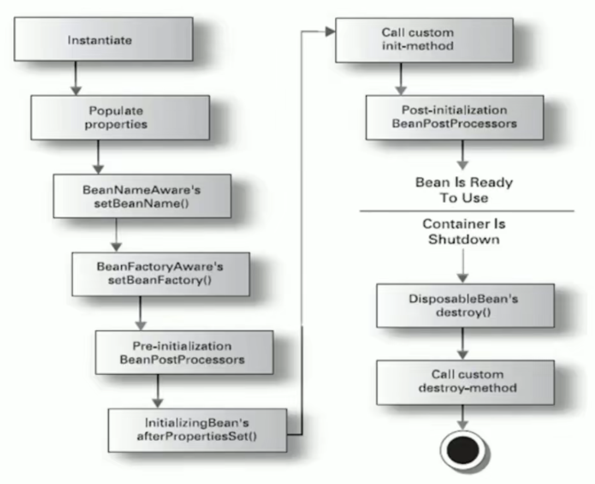

# Spring IOC

什么是 IOC ？

- **IOC(Inverse of Control), 反转控制**。就是将原本在程序中手动创建的对象的控制权，交由 Spring 框架管理。

什么是 DI ？

- **DI(Dependency Injection), 依赖注入**。就是在 Spring 创建这个对象的过程中，将这个对象所依赖的属性注入进去。

此部分的实例代码都在 [spring_ioc_demo](./spring_ioc_demo) 中。

</br>

## 入门示例

此部分示例代码在 demo_1 包中。

下面简单讲解。

现在我们有一个类 `UserService` ，为了简单演示，它只有一个简单的方法：

``` java
public interface IUserService {
  public void sayHello();
}
// ------------------------------------------------
public class UserService implements IUserService {
  public void sayHello() {
    System.out.println("Hello Spring");
  }
}
```

在传统的开发中，我们需要通过 `new` 实例化一个对象使用，这样做的问题是，代码之间存在耦合。如下：

``` java
@Test
// 对于传统的开发方式，是直接 new 一个对象，然后使用它
public void tradition() {
  IUserService userService = new UserService();
  userService.sayHello();
}
```

解决上面的问题，我们可以通过 Spring 的工厂，将创建类的步骤交给 Spring ，我们提供配置文件。当我们需要使用实例对象时，可以在"工厂"获取。

首先，我们需要在 `resources` 文件夹下创建配置文件 `applicationContext.xml` (文件名非强制性,IDEA有快捷生成Spring配置文件的选项) ：

``` xml
<?xml version="1.0" encoding="UTF-8"?>
<beans xmlns="http://www.springframework.org/schema/beans"
       xmlns:xsi="http://www.w3.org/2001/XMLSchema-instance"
       xsi:schemaLocation="http://www.springframework.org/schema/beans http://www.springframework.org/schema/beans/spring-beans.xsd">

  <!-- 将 UserService 的创建权交给了 Spring -->
  <!-- id 是标签的名字; class 指定类的全路径 -->
  <bean id="userService" class="demo_1.UserService"></bean>

</beans>
```

然后我们就可以通过 Spring 工厂获取实例对象：

``` java
@Test
// 使用 Spring 的方式
public void useSpring() {
  // 指定配置文件,创建 Spring 的工厂
  ApplicationContext ac = new ClassPathXmlApplicationContext("applicationContext.xml");
  // 通过工厂获取类
  IUserService userService = (IUserService) ac.getBean("userService");
  userService.sayHello();
}
```

最后，我们说一下**DI(依赖注入)**：

接着上面的例子， `UserService` 除了实现 `IUserService` 接口的内容，还有自己的属性 `name` ：

``` java
public class UserService implements IUserService {
  // ....

+ // 类自己的属性(一定要提供Setter,否则配置文件无法注入依赖)
+ private String name;
+ public void setName(String name) {
+   this.name = name;
+ }
}
```

为了方便演示， `UserService` 的 `sayHello` 方法也稍作修改：

``` java
public void sayHello() {
-   System.out.println("Hello Spring");
+   String str = "Hello Spring! ";
+   if (name != null) str += name;
+   System.out.println(str);
}
```

但我们不希望修改代码，就可以把 `name` 的值设置上。可以在 `applicationContext.xml` 的 `<bean>` 标签内，添加 `<property>` ：

``` xml
<bean id="userService" class="demo_1.UserService">
+   <property name="name" value="myName"/>
</bean>
```

</br>

## Bean 实例化的三种方式

此部分示例代码在 demo_2 包中。

测试类：

``` java
// 普通的类，调用其构造函数实例化
public class ExampleObj1 {
  public ExampleObj1() {
    System.out.println("ExampleObj1 实例化成功！");
  }
}
```

``` java
public class ExampleObj2StaticFactory {
  static ExampleObj2 exampleObj2;
  static {
    exampleObj2 = new ExampleObj2();
  }
  // 静态方法，访问静态实例对象
  public static ExampleObj2 getExampleObj2() {
    return exampleObj2;
  }
}
class ExampleObj2 {
  public ExampleObj2() {
    System.out.println("ExampleObj2 实例化成功！");
  }
}
```

``` java
public class ExampleObje3InstanceFactory {
  public ExampleObj3 exampleObj3;
  public ExampleObje3InstanceFactory() {
    exampleObj3 = new ExampleObj3();
  }
  // 需要实例化之后才能调用该方法，然后才能获取到实例对象
  public ExampleObj3 getExampleObj3() {
    return exampleObj3;
  }
}
class ExampleObj3 {
  public ExampleObj3() {
    System.out.println("ExampleObj3 实例化成功！");
  }
}
```

配置：

``` xml
<!-- 第一种方式：无参构造 -->
<bean id="bean_demo_1" class="demo_2.ExampleObj1"/>
<!-- 第二种方式：静态工厂 （静态工厂只需要提供静态方法即可） -->
<bean id="bean_demo_2" class="demo_2.ExampleObj2StaticFactory" factory-method="getExampleObj2"/>
<!-- 第三种方式：实例工厂 （思路：先实例化工厂，然后调用工厂的方法获取目标对象） -->
<bean id="bean_demo_3_factory_instance" class="demo_2.ExampleObje3InstanceFactory"/>
<bean id="bean_demo_3" factory-bean="bean_demo_3_factory_instance" factory-method="getExampleObj3"/>
```

测试代码：

``` java
ApplicationContext ac = new ClassPathXmlApplicationContext("applicationContext.xml");
// 需要注意的是，在上一步导入配置文件的时候，已经把配置文件中指定的类实例化，即使把下面的代码注释掉
ExampleObj1 exampleObj1 = (ExampleObj1) ac.getBean("bean_demo_1");
ExampleObj2 exampleObj2 = (ExampleObj2) ac.getBean("bean_demo_2");
ExampleObj3 exampleObj3 = (ExampleObj3) ac.getBean("bean_demo_3");
```

</br>

## Bean 常用配置

**`id`** 和 **`name`** 属性：

- `<bean>` 必须指定 **`id`** 属性，与之类似的是 **`name`** 。
- `id` 属性再 IOC 容器中必须是唯一的。
- `name` 虽然没有规定必须唯一，但我们使用它也必须唯一。
- 两者的区别是， `id` 不能用特殊字符，而 `name` 可以，如 `/` 等。

**`class`** 属性：

- 用于设置一个类的路径，主要作用是 IOC 容器生成类的实例。

**`scope`** 属性：

- 用于设置 **Bean 的作用域**。可选值如下：

| 类别            | 说明                                                                                                            |
|:----------------|:----------------------------------------------------------------------------------------------------------------|
| **`singleton`** | （**默认值**）在 SpringIOC 容器中仅存在一个 Bean 实例， Bean 以**单例**的方式存在                               |
| **`prototype`** | 每次调用 `getBean()` 时都会返回一个**新的实例**                                                                 |
| `request`       | 每次 HTTP 请求都会创建一个**新的 Bean** 。适用于 WebApplicationContext 环境                                     |
| `session`       | 同一个 HTTP Session 共享一个 Bean ，**不同的 HTTP Session 使用不同的 Bean** 。适用于 WebApplicationContext 环境 |

</br>

## Spring 容器中 Bean 的生命周期

此部分示例代码在 demo_3 包中。

Bean 提供了两个声明周期方法，本别对应 Bean 初始化和销毁时。

也是在 XML 配置文件中 `<bean>` 标签的属性中指定即可：

``` xml
<!-- 当 Bean 被载入到容器时，调用 init-method 的方法。 -->
<!-- 当 Bean 从容器中被删除时，调用 destroy-method 的方法。仅在 scope="singleton" 有效。 -->
<bean id="bean_live_hook" class="demo_3.ExampObjFactory" init-method="beanInit" destroy-method="beanDestory"/>
```

测试代码：

``` java
// 创建 ClassPathXmlApplicationContext 的实现，因为 ApplicationContext 接口没有 close 方法
ClassPathXmlApplicationContext cpxac = new ClassPathXmlApplicationContext("applicationContext.xml");
ExampleObj exampleObj = (ExampleObj) cpxac.getBean("bean_live_hook");
// 销毁 Bean
cpxac.close();
```

Spring 容器中 Bean 完整的生命周期（此部分示例代码在 demo_4 包中）：



1. 对象实例化
2. populate properties 封装属性
3. 若类实现了 `BeanNameAware` 接口，则执行 `setBeanName` 方法
4. 若类实现了 `BeanFactoryAware` 接口，则执行 `setBeanFactory` 设置工厂；或实现了 `ApplicationContextAware` 接口，则执行 `setApplicationContext` 设置上下文对象
5. 若存在一个类，其实现了 `BeanPostProcessor` 接口，则执行 `postProcessBeforeInitializetion` 方法
6. 若类实现了 `InitializingBean` 接口，则执行 `afterPropertiesSet` 方法
7. 调用 `<bean>` 标签的 `init-method` 属性指定的方法
8. 若存在一个类，其实现了 `BeanPostProcessor` 接口，则执行 `postProcessAfterInitialization` 方法
9. 执行业务代码
10. 若类实现了 `DisposableBean` 接口，则星星 `destory` 方法
11. 调用 `<bean>` 标签的 `destroy-method` 属性指定的方法

注意：

- 第 3 、 4 步都是为了让类了解自己在容器中的信息。
- 第 4 步中， `setBeanFactory` 早于 `setApplicationContext` 执行。
- `BeanPostProcessor` 作为类的代理，可以对类中的方法进行增强。
- `BeanPostProcessor` 的实现类可以是一个单独的类，作为代理所有的 bean 。

</br>

## 利用 BeanPostProcessor 对方法增强

此部分示例代码在 demo_5 包中。

关键在于 `postProcessAfterInitialization` 方法中，创建代理对象：

``` java
// 在这里可以对特定对象的特定方法进行增强
public Object postProcessAfterInitialization(final Object bean, String beanName) throws BeansException {
  // 如果不是目标对象，不代理
  if (!"my_bean".equals(beanName)) return bean;
  // 创建调用控制器 （直接创建实现InvocationHandler接口的匿名类）
  InvocationHandler invocationHandler = new InvocationHandler() {
    public Object invoke(Object proxy, Method method, Object[] args) throws Throwable {
      // 如果不是目标方法，不做校验
      if ("insert".equals(method.getName())) System.out.println("======= 正在权限校验 =======");
      return method.invoke(bean, args);
    }
  };
  // 创建一个代理对象 （传入：类的加载器、类的接口、调用控制器）
  Object proxy = Proxy.newProxyInstance(bean.getClass().getClassLoader(), bean.getClass().getInterfaces(), invocationHandler);
  return proxy;
}
```

还有需要注意的是，对 `getBean` 的对象强转时，必须指定目标类的接口类型：

``` java
// 注意！这里转换的类型必须是接口！
IUserService userService = (IUserService) cpxac.getBean("my_bean");
```

</br>

## 属性注入的所有写法（XML）

请看示例代码的 demo_6 包，不单独赘述。

</br>

## 使用注解

此部分示例代码在 demo_7 包中。

``` xml
<beans xmlns="http://www.springframework.org/schema/beans"
       xmlns:p="http://www.springframework.org/schema/p"
       xmlns:xsi="http://www.w3.org/2001/XMLSchema-instance"
       xmlns:context="http://www.springframework.org/schema/context"
       xsi:schemaLocation="http://www.springframework.org/schema/beans http://www.springframework.org/schema/beans/spring-beans.xsd http://www.springframework.org/schema/context http://www.springframework.org/schema/context/spring-context.xsd">

  <!-- 注意！必须在外层 beans 标签中的属性 -->
  <!-- 添加 xmlns:context="http://www.springframework.org/schema/context" -->
  <!-- 修改 xsi:schemaLocation="http://www.springframework.org/schema/beans http://www.springframework.org/schema/beans/spring-beans.xsd http://www.springframework.org/schema/context http://www.springframework.org/schema/context/spring-context.xsd" -->

  <!-- 开启注解扫描 （指定被扫描的包） -->
  <context:component-scan base-package="demo_7"/>

</beans>
```

``` java
/**
 * @Component 表示此类会被 Spring 扫描到，参数中的字符串等效于 XML 的 id
 * 一般不建议直接使用 @Component ，因为缺少语义化。通常使用以下三种"增强型"的注解：
 * @Repository —— 针对 DAO 实现类
 * @Service ————— 针对 Service 实现类
 * @Controller —— 针对 Controller 实现类
 */
@Component("my_bean_name")
public class ExampleObj {
  // 注入普通属性 （不需要提供 Setter ）
  @Value("张三")
  private String name;
  // 注入实例对象 （@Autowired自动根据类型注入）
  @Autowired
  private SubObj1 subObj1;
  // 注入实例对象 （在@Autowired的基础上，再使用@Qualifier指定需要引入的Bean的名字）
  @Autowired
  @Qualifier("my_sub_obj_2")
  private SubObj2 subObj2;
  // 注入实例对象 （等效于 @Autowired +  @Qualifier ）
  @Resource(name = "my_sub_obj_3")
  private SubObj3 subObj3;
  // 等效于 XML 的 init-method 属性
  @PostConstruct
  public void initMethod() {
    System.out.println("init-method");
  }
  // 等效于 XML 的 destroy-method 属性
  @PreDestroy
  public void destroyMethod() {
    System.out.println("destroy-method");
  }
  public void sayHello() {
    String str = "Hello.";
    if (name != null) str += " I'm " + name + ".";
    if (subObj1 != null) str += " subObj1：" + subObj1;
    if (subObj2 != null) str += " subObj2：" + subObj2;
    if (subObj3 != null) str += " subObj3：" + subObj3;
    System.out.println(str);
  }
}

// 如果使用 @Autowired 自动注入，则可以不提供名字
@Component
class SubObj1 {
  @Override
  public String toString() {
    return "SubObj1";
  }
}
@Component("my_sub_obj_2")
class SubObj2 {
  @Override
  public String toString() {
    return "SubObj2";
  }
}
@Component("my_sub_obj_3")
class SubObj3 {
  @Override
  public String toString() {
    return "SubObj3";
  }
}
```

</br>

## 使用XML与注解的混合

由于 XML 的优点是，结构清晰，易于阅读；注解的优点是，开发便捷，属性注入方便。两者优点的结合，就是此模式。

即， XML 的配置负责类，注解负责属性输入。具体代码请看 demo_8 包。

在 `applicationContext.xml` 的配置上，与"包扫描"的区别仅在于：

``` xml
-  <context:component-scan base-package="demo_7"/>
+  <!-- 仅仅扫描属性注入部分 -->
+  <context:annotation-config/>
```

</br>
