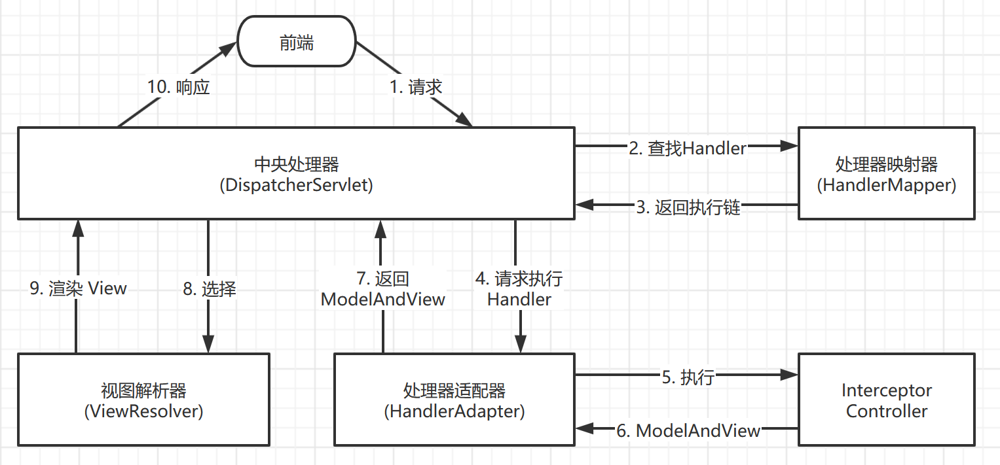

# Spring MVC

简介：

- Spring MVC 是 Spring 体系的轻量级 Web MVC 框架。
- Spring MVC 的核心是 Controler 控制器，用于处理请求，产生响应。
- Spring MVC 基于 Spring IOC 容器运行，所有对象被 IOC 管理。

Spring 5.x：

- 最低要求 JDK8 与 J2EE7(Servlet3.1/Tomcat8.5+)
- 支持 JDK8/9 ，可以使用新特性
- 支持响应式编程（基于事件）

此部分的示例代码在 [spring_mvc_demo](./spring_mvc_demo) 中。

</br>

## 从零开始的基础项目搭建

> 注意，之后使用 IDEA 创建的 webapp 项目，**不用按照下面介绍的每一步去操作**。
> 可以在创建项目时，勾选 `Create from archetype` ，然后选择 `maven-archetype-webapp` 模板创建。
> 下面手动创建只是为了加深学习理解。

1. 修改项目结构：
    - 菜单栏 `File` -> `Project Structure` 。
    - 选择 `Facets` -> `+`(加号) 添加，在添加列表中选择 `Web` ，弹框选中本项目即可(也只有本项目可选)。
    - 然后自动跳到 `Modules` 面板。
    - 在右侧的 `Deployment Descriptors` 面板中，点击"编辑"，用于修改 `web.xml` 配置文件的路径。
      - 把路径修改为 `~/spring_mvc_demo/src/main/webapp/WEB-INF/web.xml` ，同时注意 `Deployment descriptor version` 的版本要是 `3.1` 以上
    - 上面设置结束后，继续点击下面的 `Web Resource Directories` 面板的"编辑按钮"，修改 Web 文件存放的目录。
      - 把路径修改为 `~/spring_mvc_demo/src/main/webapp`
    - 上面配置结束后，该面板的最下面有一行 `'Web' Facet resources are not included in an artifact` 的警告，点击其右侧的 `Create Artifact` 按钮。
    - 然后自动跳到 `Artifact` 面板。但这里一般不用修改。直接点底下的 `OK` 按钮即可完成配置。

2. 在 `webapp` 目录下创建 `index.html` 文件，写入你想看到的内容。

3. 配置 Tomcat 模板：
    - 在 IDEA 主界面的右上方，点击 `Add Configuration` 按钮。
    - 在弹出的面板左侧，展开 `Templates` -> `Tomcat Server` -> `Local` ，面板右侧会有配置项显示。
    - 在 `Application server` 项中配置本地 Tomcat 的路径（注意版本需要8.5以上）。然后点击 `OK` 即可完成模板创建。

4. 配置 Tomcat 服务器：
    - 再次点击 `Add Configuration` 按钮。
    - 在弹出面板的左上角，点击 `+`(加号) 添加新的配置项。添加面板中选择 `Tomcat server` -> `Local` 后点击 即可。
    - 当前是在 `Server` Tab 页界面，可以修改 `On 'Update' action` 为 `Update classer and resources` ，表示代码更改时，自动更新页面内容，即"热部署"。
    - 点击 `Deployment` Tab 页，点击 `+`(加号) ，选择 `Archetype...` 即可。
    - 在上面界面的底下，还有一个 `Application context` 可以配置 HTML 页面的根路径，可以配置成 `/` 。
    - 点击面板底下的 `OK` 完成配置。

5. 在 IDEA 主界面最底下的 `Services` 面板，可以点击运行和调试。

6. 注意！假如已经配置安装好了依赖(即`pom.xml`的依赖)，还需要额外操作。
    - 在上面第 1 步的最后，跳到 `Artifact` 面板。在该面板的右边，会多出了 `Available Elements` 列表。
    - `Available Elements` 列表中包含了项目的依赖，全选它们，右键，选择 `Put into /WEB-INF/lib` 选项。

</br>

## 依赖配置

1. 在 `pom.xml` 配置依赖：

    （它包含了aop,beans,context,core,expression等）

    ``` xml
    <dependency>
      <groupId>org.springframework</groupId>
      <artifactId>spring-webmvc</artifactId>
      <version>5.1.9.RELEASE</version>
    </dependency>
    ```

2. 配置 `web.xml` 文件：

    ``` xml
    <?xml version="1.0" encoding="UTF-8"?>
    <web-app xmlns="http://xmlns.jcp.org/xml/ns/javaee"
            xmlns:xsi="http://www.w3.org/2001/XMLSchema-instance"
            xsi:schemaLocation="http://xmlns.jcp.org/xml/ns/javaee http://xmlns.jcp.org/xml/ns/javaee/web-app_4_0.xsd"
            version="4.0">
      <!-- servlet 配置 -->
      <servlet>
        <!-- servlet 的名字 -->
        <servlet-name>springmvc</servlet-name>
        <!-- DispatcherServlet 是 Spring MVC 最核心的对象 -->
        <!-- 它用于拦截 http 请求，并根据请求 URL ，调用与之对应的 Controller 方法来完成请求的处理 -->
        <servlet-class>org.springframework.web.servlet.DispatcherServlet</servlet-class>
        <init-param>
          <!-- 让 DispatcherServlet 知道 applicationContext.xml 的存在 -->
          <param-name>contextConfigLocation</param-name>
          <param-value>classpath:applicationContext.xml</param-value>
        </init-param>
        <!-- "0"表示服务启动时就自动创建 Spring IOC 容器，并初始化 DispatcherServlet -->
        <!-- 如果省略，就会在第一次请求的时候才会实现创建 Spring IOC 和初始化 DispatcherServlet 。为了提高程序相应速度，建议配置。 -->
        <load-on-startup>0</load-on-startup>
      </servlet>
      <!-- servlet 映射 -->
      <servlet-mapping>
        <!-- servlet-name 的值对应上面的配置 -->
        <servlet-name>springmvc</servlet-name>
        <!-- 拦截的模式 （"/"表示拦截所有请求） -->
        <url-pattern>/</url-pattern>
      </servlet-mapping>
    </web-app>
    ```

    其中， `<web-app>` 是自动创建的。这里事先指定了 Spring 的配置文件为 `applicationContext.xml` ，如有不同，需要针对性的修改。

3. 创建 `applicationContext.xml` 配置文件：

    ``` xml
    <?xml version="1.0" encoding="UTF-8"?>
    <!-- 注意加入了 mvc 的命名空间 -->
    <beans xmlns="http://www.springframework.org/schema/beans"
          xmlns:xsi="http://www.w3.org/2001/XMLSchema-instance"
          xmlns:mvc="http://www.springframework.org/schema/mvc"
          xmlns:context="http://www.springframework.org/schema/context"
          xsi:schemaLocation="
            http://www.springframework.org/schema/beans http://www.springframework.org/schema/beans/spring-beans-4.0.xsd
            http://www.springframework.org/schema/mvc http://www.springframework.org/schema/mvc/spring-mvc-4.0.xsd
            http://www.springframework.org/schema/context http://www.springframework.org/schema/context/spring-context-4.0.xsd
    ">
      <!-- 开启注解扫描 （指定被扫描的包） -->
      <context:component-scan base-package="demo"/>

      <!-- 启用 Spring MVC 的注解开发模式 -->
      <mvc:annotation-driven/>

      <!-- 将 图片/JS/CSS等 静态资源排除在(DispatcherServlet的处理)外，以提高执行效率 -->
      <mvc:default-servlet-handler/>
    </beans>
    ```

    其中，"开启注解扫描"是关于 [Spring IOC](./Spring_IOC.md) 的内容。

4. 写一个简单的 Get 方法的 Controller ：

    在编写控制器类前，需要创建 `controller` 包，用于存放控制器。

    ``` java
    // @Controller 表示它是一个控制器
    @Controller
    public class Controller1 {
      // @GetMapping 表示 Get 方法，并指定路径
      @GetMapping("/testget")
      // @ResponseBody 表示该方法的返回值作为响应体
      @ResponseBody
      public String testGet() {
        return "success response";
      }
    }
    ```

</br>

## URL Mapping 的简单示例

URM Mapping 是指，将 URL 与 Controller 方法绑定，通过将 URL 与方法绑定， Spring MVC 便可以通过 Tomcat 对外暴露服务。

``` java
@Controller
// @RequestMapping 一般用于"类"上，指定里面的方法的根路径，例如下面第一个GET方法的路径就是"/test1/get"
@RequestMapping("/test1")
public class Controller2 {
  // Get 方法的请求处理
  @GetMapping("/get")
  @ResponseBody
  public String myGet() {
    return "GET1";
  }
  // Get 方法的请求处理2 （这里使用了@RequestMapping，这种写法等效于直接写@GetMapping）
  @RequestMapping(value = "/get2", method = RequestMethod.GET)
  @ResponseBody
  public String myGet2() {
    return "GET2";
  }
  // Post 方法的请求处理
  @PostMapping("/post")
  @ResponseBody
  public String myPost() {
    return "POST";
  }
  // 通用的请求处理（不限定请求方法）
  @RequestMapping("/general")
  @ResponseBody
  public String myGeneral() {
    return "GENERAL";
  }
}
```

需要注意的是， `@RequestMapping` 可以用在两个地方：

- 用在"类"上，这事是最常见的用法，设定里面的方法的根路径。
- 用在方法上，如果没有指定请求方法类型，则可以处理任意方法的请求，但这是不推荐使用的。
- 用在方法上，可以指定请求方法，但效果与 `@GetMapping` 等注解效果相同，所以也不推荐使用。

</br>

## 接受请求参数的简单示例

``` java
@Controller
@RequestMapping("/test2")
public class Controller3 {
  @GetMapping("/get")
  @ResponseBody
  // 参数中与请求的参数对应 （数据类型会被自动转换，若类型转换失败，会响应400错误）
  public String myGet(String username, Long password) {
    System.out.println("username: " + username + "; password: " + password);
    return "get success";
  }
  // 默认只能获取 application/x-www-form-urlencoded 类型的参数
  @PostMapping("/post")
  @ResponseBody
  // 假如前端提供的参数与需要指定的字段不对应，可以手动设置映射关系。下示例是将 user_name 映射到 userName 变量中
  public String myPost(@RequestParam("user_name") String userName, String password) {
    System.out.println("userName: " + userName + "; password: " + password);
    return "post success";
  }
  // 如果是 application/json 必须使用 @RequestBody 接收
  @PostMapping(path = "/post2")
  public String myPost2(@RequestBody Post2RequestBody params) {
    System.out.println("userName: " + params.getUserName() + "; password: " + params.getPassword());
    return "post2 success";
  }
}
```

注意：

- `@PostMapping` 在方法参数(`@RequestParam`)中，只能获取 `application/x-www-form-urlencoded` 类型的参数。
- 如果需要接收 `application/json` 类型的数据，必须使用 **`@RequestBody`** 指定接收参数的实体类。
- 若前端提供的参数的字段名不合规，可以使用 `@RequestParam()` 设置参数映射。
- 默认是不能处理请求体中的中文，需要配置。请参考[下面的内容](#使用中文出现乱码)。

</br>

## 使用 Bean 接收请求参数

在 `entity` 文件夹下，创建实体类 `UserRequestParams` ，它包含可能会传入的参数：

``` java
public class UserRequestParams {
  private String userName;
  private String password;
  // Getter 和 Setter ....
}
```

然后就可以把它放在"参数接收"的位置：

``` java
  @GetMapping("/getuser")
  @ResponseBody
  // 同名变量会自动"塞"到类中的同名属性上，如 userName 会被赋值到 user.userName
  // 还有一点要注意， user.userName 和 userName 都会被赋值
  public String getUser(UserRequestParams user, String userName) {
    System.out.println(user.toString() + userName);
    return "get success";
  }
```

需要注意的是，如果 接收参数的类的属性 与 "单个字段" 同名，那么两者都会被赋值。

</br>

## 接收日期数据

对**单个方法**的日期参数处理，可以使用 `@DateTimeFormat(pattern="yyyy-MM-dd")` 注解：

``` java
  @GetMapping("/date")
  @ResponseBody
  public String testDate(@DateTimeFormat(pattern="yyyy-MM-dd") Date date) {
    System.out.println(date);
    return "get success";
  }
```

若项目可能有很多的日期参数需要处理，推荐使用**全局**的日志格式配置：

1. 在 `converter` 包中定义 `MyDateConverter` 类，需要实现 `Converter` 接口：

    ``` java
    public class MyDateConverter implements Converter<String, Date> {
      public Date convert(String s) {
        // 使用 SimpleDateFormat 将特定格式的字符串转化成日期对象
        SimpleDateFormat sdf = new SimpleDateFormat("yyyy-MM-dd HH:mm:ss");
        Date date = null;
        try {
          date = sdf.parse(s);
        } catch (ParseException e) {
          e.printStackTrace();
        }
        return date;
      }
    }
    ```

2. 在 `applicationContext.xml` 配置相关内容：

    ``` xml
    <!-- 指定日期格式化工厂类 -->
    <bean id="conversionService" class="org.springframework.format.support.FormattingConversionServiceFactoryBean">
      <property name="converters">
        <set>
          <bean class="demo.converter.MyDateConverter"/>
        </set>
      </property>
    </bean>
    ```

    然后在 `<mvc:annotation-driven>` 标签添加 `conversion-service="conversionService"` 属性，即：

    ``` xml
    <mvc:annotation-driven conversion-service="conversionService">
    ```

</br>

## 使用中文出现乱码

### POST 请求

默认情况下， **Post 请求体**的中文，传到后台后会编程"乱码"。我们可以创建**过滤器**解决这个问题。

在 `web.xml` 配置文件中， `<web-app>` 标签内添加如下内容：

``` xml
<!-- 定义过滤器 -->
<filter>
  <filter-name>characterFilter</filter-name>
  <!-- 指定过滤器使用的类 -->
  <filter-class>org.springframework.web.filter.CharacterEncodingFilter</filter-class>
  <!-- 参数 -->
  <init-param>
    <param-name>encoding</param-name>
    <param-value>UTF-8</param-value>
  </init-param>
</filter>
<!-- 设置过滤器映射 -->
<filter-mapping>
  <filter-name>characterFilter</filter-name>
  <url-pattern>/*</url-pattern>
</filter-mapping>
```

### 响应体数据

对于**响应**的数据，也需要在响应头中指定编码格式。

我们需要在 `applicationContext.xml` 配置文件中，修改 `<mvc:annotation-driven>` 标签的配置，如下：

``` xml
<mvc:annotation-driven>
  <!-- 创建消息转换器 -->
  <mvc:message-converters>
    <!-- 指定转换器使用的类 -->
    <bean class="org.springframework.http.converter.StringHttpMessageConverter">
      <!-- 设置支持的媒体类型 -->
      <property name="supportedMediaTypes">
        <list>
          <value>text/html;charset=utf-8</value>
          <value>application/json;charset=utf-8</value>
        </list>
      </property>
    </bean>
  </mvc:message-converters>
</mvc:annotation-driven>
```

</br>

## RESTful 风格

REST([Resource ]Representational State Transfer, 表现层状态转移) 就是，资源在网络中以某种表现形式进行状态转移。现在一般把主语 Resource 去掉。

简单说就是，被访问的 URL 只返回数据，不包含显示相关的内容，如只返回 JSON 格式的数据，访问者如果是小程序，就自己渲染小程序的页面，如果是浏览器，就渲染浏览器的页面。后端开发就可以专注于数据，而不用关心页面显示。其实就是"**前后端分离**"。

REST 仅仅是一种概念，没有具体实现。

RESTful 是基于 REST 理念的一套开发风格，是具体的开发规则。

RESTful 开发规范：

- 使用 URL 作为用户交互入口
- 明确的语义规范（GET|POST|PUT|DELETE）
- 只返回数据（JSON|XML），不包含任何展现

RESTful 命名要求示例：

| URI                    | 对/错 | 说明                       | 修改建议                                   |
|:-----------------------|:-----:|:---------------------------|:-------------------------------------------|
| GET /articles?au=lily  |   √   | -                          | -                                          |
| GET /a/1               |   ×   | URI 必须具有**语义化**     | GET /student/1                             |
| POST /createArticle/1  |   ×   | URI 必须使用**名词**       | POST /article/1                            |
| GET /articles/author/1 |   ×   | URI 扁平化，**不超过两级** | GET /articles/author?id=1                  |
| DELETE /articles/1     |   ×   | URI **名词区分单复数**     | DELETE /article/1 </br> GET /articles?id=1 |

</br>

## @RestController

在类上使用 `@RestController` 替代 `@Controller` ，里面的方法不用写 `@ResponseBody` ，默认都是以 RESTful 风格返回数据。

例如：

``` java
@RestController
@RequestMapping("/test")
public class Controller {
  @GetMapping("/get")
  public String myGet(String username, Long password) {
    return "{msg: \"success\"}";
  }
}
```

</br>

## 路径变量

路径变量是指，以 URL 路径的一部分作为参数，如 `/user/1` ，可以将 `/1` 的部分作为参数。

``` java
  // 路径参数 （${id}定义路径变量的名字）
  @GetMapping("/userId/${id}")
  // @PathVariable() 获取特定的路径变量，然后赋值给指定变量
  public String testPathVariable(@PathVariable("id") String uid) {
    System.out.println("userId" + uid);
    return "success";
  }
```

</br>

## 非简单请求

默认情况下，不能获取到"非简单请求"的参数，需要在 `web.xml` 添加如下过滤器配置：

``` xml
  <!-- 针对非简单请求，分析其 FORM 表单参数 -->
  <filter>
    <filter-name>formContentFilter</filter-name>
    <filter-class>org.springframework.web.filter.FormContentFilter</filter-class>
  </filter>
  <filter-mapping>
    <filter-name>formContentFilter</filter-name>
    <url-pattern>/**</url-pattern>
  </filter-mapping>
```

</br>

## JSON 序列化

JSON 序列化最常用的是 jackson-core 库。但要注意， jackson-core 在 2.9 之前的版本存在漏洞！在与 MySQL 同时使用的时候，漏洞会被黑客利用。

1. 在 `pom.xml` 添加依赖：

    ``` xml
    <dependency>
      <groupId>com.fasterxml.jackson.core</groupId>
      <artifactId>jackson-core</artifactId>
      <version>2.11.1</version>
    </dependency>
    <dependency>
      <groupId>com.fasterxml.jackson.core</groupId>
      <artifactId>jackson-databind</artifactId>
      <version>2.11.1</version>
    </dependency>
    <dependency>
      <groupId>com.fasterxml.jackson.core</groupId>
      <artifactId>jackson-annotations</artifactId>
      <version>2.11.1</version>
    </dependency>
    ```

2. 测试用例：

    先创建作为返回值的类：

    ``` java
    class ExampleObj {
      public String str = "abc";
      public Integer num1 = 456;
      public Double num2 = 3.1415926d;
      public Date date = new Date();
    }
    ```

    使用很简单，只需要指定返回的类即可：

    ``` java
    // JSON 序列化 （过程是自动的，被返回的对象会自动转化成 JSON 字符串）
    @GetMapping("/json")
    public ExampleObj getJson() {
      return new ExampleObj();
    }
    ```

    Spring 如果检测到 jackson-core 和 jackson-databind 的依赖，就会自动为我们提供 JSON 序列号，无需额外的配置。

3. 使用 jackson 还需要注意**日期类型**，默认只会转成数字。解决办法如下：

    上面例子可以测试出，自动 JSON 序列号，只会把日期类型的数据转成数字。

    可以通过在属性上添加 `@JsonFormat(pattern="yyyy-MM-dd", timezone="GMT+8")` 注解。之后日期会按指定的格式被输出。

    其中，时区默认是格林威治的时区，中国与其相差 8 小时，所以需要 `timezone="GMT+8"` 的参数。

    ``` java
    class ExampleObj {
        public String str = "abc";
        public Integer num1 = 456;
        public Double num2 = 3.1415926d;
    +   @JsonFormat(pattern="yyyy-MM-dd HH:mm", timezone="GMT+8")
        public Date date = new Date();
    }
    ```

</br>

## CORS(跨域资源共享)

只有浏览器存在同源策略。

### 局部设置

添加 `@CrossOrigin` 的注解就可以解决跨域请求的问题。以开放某个方法为例：

``` java
  @PostMapping("/cors")
  // @CrossOrigin 表示该请求可以跨域。
  // origins 指定可访问的域; maxAge 表示非简单请求的预检请求的有效时间(单位秒)。
  @CrossOrigin(origins = "*", maxAge = 3600)
  public String testCors() {
    return "{msg:\"success\"}";
  }
```

如果需要指定多个单独的域名，用逗号分隔： `@CrossOrigin(origins = "http://192.168.1.2:8080","http://192.168.1.3:8080"")` 。

对类使用该注解同样有效，表示类中所有方法都能跨域访问。

### 全局设置

在 `applicationContext.xml` 文件的 `<beans>` 内添加如下配置：

``` xml
<!-- 配置全局 CORS -->
<mvc:cors>
  <mvc:mapping path="/test2/cors2" allowed-origins="*" max-age="3600"/>
</mvc:cors>
```

参数含义不再赘述了，跟注解的类似。

</br>

## Interceptor(拦截器)

Interceptor 用于对 URL 请求进行前置/后置的拦截再处理。底层就是基于 Spring AOP 面向切面编程的实现。

### 创建拦截器

1. 在 `pom.xml` 文件中添加依赖：

    ``` xml
    <dependency>
      <groupId>javax.servlet</groupId>
      <artifactId>javax.servlet-api</artifactId>
      <version>4.0.1</version>
      <!-- 设置作用域。 "provided"表示只有在编译和测试环境使用，打包时被忽略 -->
      <scope>provided</scope>
    </dependency>
    ```

2. 创建实现 HandlerInterceptor 接口的类（存放在 `interceptor` 包中）：

    ``` java
    // HandlerInterceptor 接口有三个方法可以实现，但并非必须要实现
    public class MyInterceptor implements HandlerInterceptor {
      // 在"执行请求方法"之前。
      public boolean preHandle(HttpServletRequest request, HttpServletResponse response, Object handler) throws Exception {
        System.out.println("preHandle ....");
        System.out.println(response.getHeader("Content-Type")); // null
        System.out.println("------------------------------------------------");
        // 返回值表示是否可以继续执行。若返回 false ，请求就被终止。
        return true;
      }
      // 在此阶段，目标资源已被 Spring MVC 框架处理。
      // 执行时间：在"当请求方法有返回值"之后；在"产生响应体"之前。
      public void postHandle(HttpServletRequest request, HttpServletResponse response, Object handler, ModelAndView modelAndView) throws Exception {
        System.out.println("postHandle ....");
        System.out.println(response.getHeader("Content-Type")); // 有内容
        System.out.println("------------------------------------------------");
      }
      // 在此阶段，响应文本已经产生。
      // 执行时间：在"产生响应体"之后。
      public void afterCompletion(HttpServletRequest request, HttpServletResponse response, Object handler, Exception ex) throws Exception {
        System.out.println("afterCompletion ....");
        System.out.println(response.getHeader("Content-Type")); // 有内容
        System.out.println("------------------------------------------------");
      }
    }
    ```

3. 在 `applicationContext.xml` 的 `<beans>` 标签内配置拦截器：

    ``` xml
    <!-- 配置拦截器 -->
    <mvc:interceptors>
      <mvc:interceptor>
        <!-- 指定可以被拦截的路径 -->
        <mvc:mapping path="/test2/interceptor"/>
        <!-- 指定忽略的路径 -->
        <mvc:exclude-mapping path="**.ico"/>
        <mvc:exclude-mapping path="/resource/**"/>
        <!-- 指定我们创建的拦截器类 -->
        <bean class="demo.interceptor.MyInterceptor"/>
      </mvc:interceptor>
    </mvc:interceptors>
    ```

    注意，拦截器不受 `<mvc:default-servlet-handler/>`(忽略静态资源) 的影响，只要 URL 符合，都会被拦截器处理。

当多个拦截器生效时，执行顺序如下：

- `preHandle1` -> `preHandle2` -> `postHandle2` -> `postHandle1` -> `afterCompletion2` -> `afterCompletion1` 。

### logback 配合，记录访问日志

1. 在 `pom.xml` 中添加 `logback` 依赖：

    ``` xml
    <!-- 日志记录 -->
    <dependency>
      <groupId>ch.qos.logback</groupId>
      <artifactId>logback-classic</artifactId>
      <version>1.2.3</version>
    </dependency>
    ```

2. 创建拦截器，并创建 Logger 类用于记录日志：

    ``` java
    public class AccessHistoryInterceptor implements HandlerInterceptor {
      // 日志记录器 （类都属于org.slf4j包下）
      private Logger logger = LoggerFactory.getLogger(AccessHistoryInterceptor.class);
      // 只用到了前置拦截器
      public boolean preHandle(HttpServletRequest request, HttpServletResponse response, Object handler) throws Exception {
        StringBuffer log = new StringBuffer();
        // 获取特定信息
        log.append(request.getRemoteAddr() + "|");       // IP地址
        log.append(request.getRequestURL() + "|");       // 被访问的地址
        log.append(request.getHeader("user-agent"));     // 用户使用环境
        // 日志追加记录
        logger.info(log.toString());
        return true;
      }
    }
    ```

3. 创建 `logback.xml` 配置文件：

    ``` xml
    <?xml version="1.0" encoding="UTF-8"?>
    <configuration>
      <!-- 输出到控制台 -->
      <appender name="console" class="ch.qos.logback.core.ConsoleAppender">
        <encoder>
          <pattern>[%thread] %d %level %logger{10} - %msg%n</pattern>
        </encoder>
      </appender>
      <root level="debug">
        <appender-ref ref="console"/>
      </root>
      <!-- 输出到日志文件 -->
      <appender name="accessHistoryLog" class="ch.qos.logback.core.rolling.RollingFileAppender">
        <!-- 同一天的日志都放在一个文件内，文件名包含日期 -->
        <rollingPolicy class="ch.qos.logback.core.rolling.TimeBasedRollingPolicy">
          <fileNamePattern>C:/__testLogs/history.%d.log</fileNamePattern>
        </rollingPolicy>
        <encoder>
          <pattern>[%thread] %d %level %logger{10} - %msg%n</pattern>
        </encoder>
      </appender>
      <!-- 指定数据源为我们创建的拦截器 -->
      <!-- additivity 表示是否输出到控制台，如果设为 false ，那只会输出到指定文件中 -->
      <logger name="demo.interceptor.AccessHistoryInterceptor" level="INFO" additivity="false">
        <appender-ref ref="accessHistoryLog"/>
      </logger>
    </configuration>
    ```

4. 在 `applicationContext.xml` 的 `<mvc:interceptors>` 标签内配置拦截器：

``` xml
<!-- 日志拦截器 -->
<mvc:interceptor>
  <mvc:mapping path="/**"/>
  <mvc:exclude-mapping path="/resources/**"/>
  <bean class="demo.interceptor.AccessHistoryInterceptor"/>
</mvc:interceptor>
</mvc:interceptors>
```

</br>

## Spring MVC 处理流程



简单说明一下：

- 上图中的 "Handler" 是 Interceptor(拦截器) 和 Controller(处理器) 的统称。
- 第2步的"查找Handler"，就是查找该请求需要用到的拦截器。多个拦截器组成的执行顺序，被称为"**执行链**"。
- 第6步及之后的，都是针对模板引擎渲染的情况，即方法返回了 ModelAndView 对象。
- 对于普通的数据响应，就不会有关于视图渲染的部分了。

</br>

## ModelAndView

ModelAndView 对象顾名思义就是，"模型(数据)"与"视图(页面)"的对象。通过 ModelAndView 可将包含数据对象与模板引擎进行绑定。

Spring MVC 默认使用的 View 是 JSP ，也可以配置其他模板引擎。

使用模板渲染的简单例子：

1. 创建 JSP 模板文件（`view.jsp`）：

    ``` jsp
    <%-- "${}" 放入变量，其中 "u" 由 ModelAndView 提供 --%>
    <h1>My name is ${u.name}.I'm ${u.age} year ago.</h1>
    ```

2. 创建 ModelAndView 对象，并指定模板文件：

    ``` java
    @GetMapping("/view")
    public ModelAndView getView() {
      // 指定模板文件创建 ModelAndView 对象
      ModelAndView mav = new ModelAndView("/view.jsp");
      // 需要注意， User 中必须包含被使用的变量的 Getter
      User user = new User();
      user.setName("张三");
      user.setAge(18);
      // 这里的"u"就是模板中使用的变量
      mav.addObject("u", user);
      return mav;
    }
    ```

    创建 ModelAndView 对象时可以不传参，可以使用 `.setViewName()` 方法设置。

还有一种情况，我们需要重定向到另一个页面，可以在创建 ModelAndView 时参数带上 `redirect:` ，即：

``` java
ModelAndView mav = new ModelAndView("redirect:/view.jsp");
```

重定向是浏览器被通知需要访问另一个地址，浏览器会发起另一个请求，同时离开当前页面。

</br>

## Freemarker 模板引擎

TODO: 有空再补上吧....

</br>


