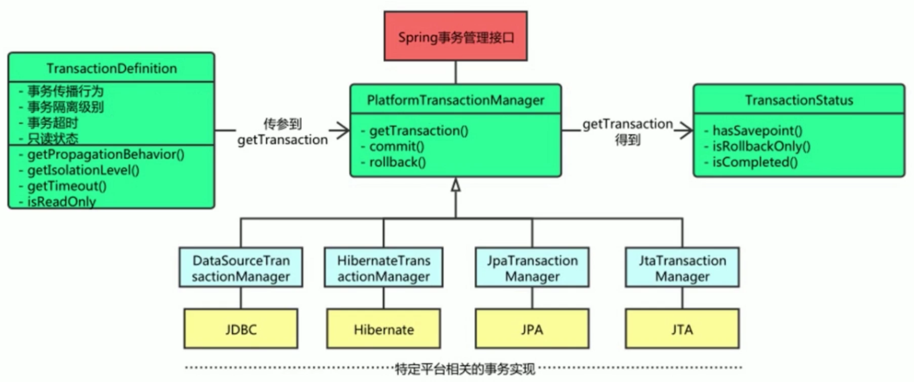

# Spring 事务管理

什么是**事务**？

- 事务是**正确执行**一系列的操作（或动作），使得数据库从一种状态转换成另一种状态，且保证操作**全部成功**，或**全部失败**。

事务的**原则**是什么？

- 必须服务 ISO/IEC 所定义的 ACID 原则。

**ACID** 原则是什么？

- 原子性(**A**tomicty): 即不可分割性，事务要么全部成功，要么全部不执行。
- 一致性(**C**onsistency): 事务的执行使得数据库从一种状态正确转换成另一种正确状态。
- 隔离性(**I**solation): 在事务正确提交之前，它可能的结果不应该显示给任何事务。
- 持久性(**D**urability): 事务正确提交后，其结果将永久保存在数据库中。

Java 事务的实现：通过 Java 代码来实现对数据库的事务性操作。

Java 事务类型：

| 类型                       | 描述                                           | 特点                                                 |
|:---------------------------|:-----------------------------------------------|:-----------------------------------------------------|
| JDBC 事务                  | 用 Connection 对象控制，包括手动模式和自动模式 | 控制的局限性在一个数据库连接内，但其使用简单         |
| JTA(Java Transaaction API) | 与实现无关，与协议无关的 API                   | 功能强大，可跨越多个数据库或多个 DAO ，使用比较复杂  |
| 容器事务                   | 应用服务器提供的，且大多数是基于 JTA 完成      | 主要指的是 J2EE 应用服务器提供的事务管理，局限于 EJB |
|                            | （通常基于 JNDI 的，相当复杂的 API 实现）      |                                                      |

读取类型：

- **脏读**：事务1没提交，事务2提前读取，导致事务2读取到的数据不是最新的。
- **不可重复读**：两次读取的数据不一致。如事务1两次读取，期间事务2修改了数据。
- **幻读**：事务不是独立执行时发生的一种非预期现象。如事务1批量查询后修改，在事务1提交前，事务2插入了数据，导致事务1的修改有问题。

</br>

## Spring 事务接口框架



</br>

## Spring 事务属性

事务属性的接口代码：

``` java
public interface TransactionDefinition {
  // 事务的传播行为。
  int getPropagetionBehavior();
  // 事务的隔离级别。事务管理器根据它来控制另一个事务可以看到本事务内的哪些数据。
  int getIsolationLevel();
  // 事务的超时时间。即事务必须在多少秒内完成。
  int getTimeout();
  // 事务的是否只读。事务管理器能够根据该方法返回值进行优化，确保事务是只读的。
  boolean isReadOnly();
}
```

事务属性的范围包括：

- 隔离规则
- 传播行为
- 是否只读
- 事务超时
- 回滚规则

### 隔离规则

它定义了一个事务可能受其他并发事务影响的程度。

| 隔离级别                   | 含义                                                             | 防止发生               | 可能发生               |
|:---------------------------|:-----------------------------------------------------------------|------------------------|------------------------|
| ISOLATION_DEFAULT          | 使用后端数据库默认的隔离级别。                                   | /                      | /                      |
| ISOLATION_READ_UNCOMMITTED | 最低的隔离级别。允许读取尚未提交的数据变更。                     | /                      | 脏读、幻读、不可重复读 |
| ISOLATION_READ_COMMITTED   | 允许读取并发事务已经提交的数据。                                 | 脏读                   | 幻读、不可重复读       |
| ISOLATION_REPEATABLE_READ  | 对同一字段的多次读取结果都一致，除非数据本身事务自己修改。       | 脏读、不可重复读       | 幻读                   |
| ISOLATION_SERIALIZABLE     | 最高的隔离级别，也是最慢的。它通常是锁定事务相关的数据库来实现。 | 脏读、幻读、不可重复读 | /                      |

### 传播行为

当事务方法被另一个事务方法调用时，必须指定事务应该如何传播。

| 传播行为                  | 含义                                                                                           |
|:--------------------------|:-----------------------------------------------------------------------------------------------|
| PROPAGATION_REQUIRED      | 表示当前方法必须运行在事务中。若当前事务存在，方法将在该事务中运行；否则，会启动一个新的事务。 |
| PROPAGATION_SUPPORTS      | 表示当前方法不需要事务上下文。若存在当前事务，该方法会在该事务中运行。                         |
| PROPAGATION_MANDATORY     | 表示该方法必须在事务中运行。若当前事务不存在，则抛出异常。                                     |
| PROPAGATION_REQUIRED_NEW  | 表示当前方法必须运行在它自己的事务中。若存在当前事务，在该方法执行期间，当前事务会被挂起。     |
|                           | 若使用 JTATransactionManager ，则需要访问 TransactionManager 。                                |
| PROPAGATION_NOT_SUPPORTED | 表示该方法不应该运行在事务中。若存在当前事务，在该方法运行期间，当前事务被挂挂起。             |
|                           | 若使用 JTATransactionManager ，则需要访问 TransactionManager 。                                |
| PROPAGATION_NEVER         | 表示当前方法不应该运行在事务上下文中。若当前征友一个事务正在运行，则会抛出异常。               |
| PROPAGATION_NESTED        | 表示如果当前已经存在一个事务，那么该方法将会嵌套事务中运行。                                   |
|                           | 嵌套的事务可以独立于当前事务进行单独的提交或回滚。                                             |
|                           | 若当前事务不存在，那么其行为与 PROPAGATION_REQUIRED 相同。                                     |
|                           | 注意各厂商对这种传播行为的支持是有所差异的，可以参考资源管理器文档来确认他们是否支持嵌套事务。 |

### 是否只读

利用数据库事务的"只读"属性，进行特定优化处理。

需要注意的是，不同的数据库厂商支持是不同的。如，

- Oracle 的 "readOnly" 不起作用，不影响其增删改查；
- MySQL 的 "readOnly" 为 true 时，只能查，增删改则出异常。

### 事务超时

它就是一个定时器，在特定时间内事务如果没有执行完毕，那么就会回滚，而不是一直等待。

设计事务要点是，超时时间不能设置太长，因为事务可能涉及对后端数据库的锁定，长时间的事务会占用不必要的数据库资源。

### 回滚规则

- 默认情况下：
  - 事务只有遇到运行期异常时才会回滚，而在遇到检查型异常时不会回滚。

- 自定义回滚策略：
  - 声明事务在遇到特定的检查型异常时像遇到运行期异常那样回滚；
  - 声明事务遇到特定的异常不会滚，即使这些异常时运行期异常。

</br>

## Spring 事务状态

事务状态的接口代码：

``` java
public interface TransactionStatus {
  boolean isNewTransaction(); // 是否为新的事务
  boolean hasSavepoint();     // 是否有恢复点
  void setRollbackOnly();     // 设置为只回滚
  boolean isRollbackOnly();   // 是否为只回滚
  boolean isCompleted;        // 是否已完成
}
```

</br>

## 编程式与声明式的事务管理

两种事务的选择建议：

- 小型应用、事务操作少：
  - 建议使用编程式事务管理实现
  - 好处是，简单、显示操作、直观明显、可设置事务名称
- 大型应用，事务操作量大：
  - 建议使用声明式事务管理实现
  - 因为其业务复杂度高、关联性紧密
  - 关注点可以聚焦到业务层面，实现业务和事务的解耦

### 编程式事务管理

编程式事务允许用户在代码中精确定义事务的边界。

实现方式：

- 事务管理器(Platform Transaction Manager)方式
  - 类似应用 JTA UserTransaction API 方式，但异常处理更简洁；
  - 核心类为： Spring 事务管理的三个接口类以及 JdbcTemplate 类。

- 模板事务(Transaction Template)方式
  - 这是 Spring 官方团队推荐的编程式事务管理方式；
  - 主要工具为 JdbcTemplate 类

### 声明式事务管理

声明式事务有助于用户将操作与事务规则进行解耦。

其原理是，基于 AOP 模式机制，对方法前后进行拦截。

实现的方式有：独立代理、共享代理、拦截器、**tx拦截器**、**注解**。（前三类在Spring2.0后不推荐使用）
