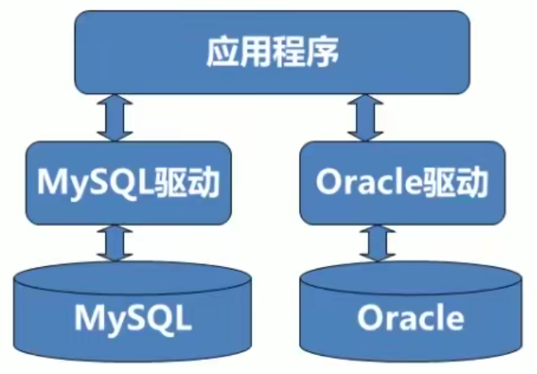
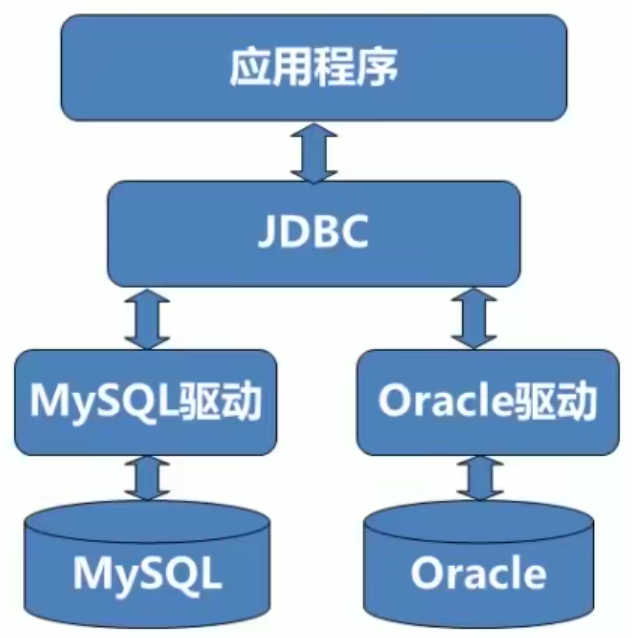

# JDBC

JDBC 全称是 Java DataBase Connectivity ，Java 数据库连接。

JDBC 是一组用于执行 sql 语句的 Java API ，可以为多种关系型数据库提供统一的访问。

在以前的开发流程中， Java 程序员需要针对不同的数据库学习其驱动语法。如下图：



而 JDBC 是一套标准，数据库都实现 JDBC 的接口规范， Java 开发者就只需要学习一种语法即可。如下图：



</br>

## 起步

开发的一套流程：

1. 搭建开发环境
2. 编写程序，在程序中**加载数据库驱动**
3. **建立连接**
4. 创建用于向数据库发送 SQL 的 **Statement** 对象
5. 从代表结果集的 ResultSet 中**取出数据**
6. **断开**与数据库**连接**，并释放相关资源

在 maven 的项目中**添加驱动**依赖：

``` xml
<dependencies>
  <dependency>
    <groupId>mysql</groupId>
    <artifactId>mysql-connector-java</artifactId>
    <version>8.0.20</version>
    <scope>runtime</scope>
  </dependency>
</dependencies>
```

</br>

## API

### DriverManager(驱动管理类)

其主要作用如下：

- 注册驱动。
  - 实际开发中，注册驱动可能会使用 `Class.forName("com.mysql.jdbc.Driver")`
  - 因为 `Driver` 类的静态代码块就包含了 `DriverManager.registerDriver(new Driver());`

- 获得连接。
  - `DriverManager.getConnection(url,username,password)` 返回 **`Connection`** 实例对象：
    - url 写法： `jdbc:mysql://localhost:3306/db_name`
      - jdbc: 协议
      - mysql: 子协议
      - localhost: 主机名
      - 3306: 端口号
      - db_name: 数据库名称
    - 若是连接本地数据库，可以省略主机名和端口号，即 `jdbc:mysql:///db_name`

### Connection

常用的方法：

- 创建用于执行 SQL 语句的对象：
  - `createStatement()` 返回 `Statement` 对象:                   执行 SQL 语句，有 SQL 注入的漏洞存在。
  - `prepareStatement(String sql)` 返回 `PrepareStatement` 对象: **`重要`**预编译 SQL 语句，解决了 SQL 注入的漏洞。
  - `prepareCall(String sql)` 返回 `CallableStatement` 对象:     执行 SQL 中存储过程。

- 进行事务的管理：
  - `setAutoCommit(boolean autoCommit)`: 设置事务是否自动提交。
  - `commit()`:                          事务提交。
  - `rollback()`:                        事务回滚。

### Statement

- 执行 SQL 语句：
  - `execute(String sql)` 返回 `boolean`:  执行 SQL 所有语句。返回值表示是否执行 `SELECT` 语句。
  - **`executeQuery()`** 返回 `ResultSet`: 执行 SQL 的 `SELECT` 语句。
  - **`executeUpdate()`** 返回 `int`:      执行 SQL 的 `INSERT`/`UPDATE`/`DELETE` 语句。返回值为被影响的行数。

- 执行批处理操作：
  - `addBatch(String sql)`:        添加到批处理。
  - `executeBatch()` 返回 `int[]`: 执行批处理。
  - `clearBatch()`:                清空批处理。

### ResultSet(结果集)

常用方法：

- `next()` 返回 `boolean`: 移动光标到下一行（光标起始位置在第一行数据之前，即必须调用一次才能获取到数据）。返回值表示是否为还有下一行。

- `get***(String field_name)`: 获取当前光标所在行的特定类型的字段数据。

</br>

## 资源释放

`Connection` 对象，它是非常稀有的资源，用完必须马上释放。

如果 `Connection` 不能即使、正确的关闭，极易导致系统宕机。

`Connection` 的使用原则是，尽量晚的创建，尽量早的释放。

``` java
// .......
Connection conn = null;
Statement stmt = null;
ResultSet resultSet = null;
try { ...}
catch (SQLException throwables) { ... }
finally {
  // 6. 释放资源
  if (resultSet != null) {
    try {
      resultSet.close();
    } catch (SQLException throwables) {
      throwables.printStackTrace();
    }
    resultSet = null; // 保证尽快回垃圾回收
  }
  if (stmt != null) {
    try {
      stmt.close();
    } catch (SQLException throwables) {
      throwables.printStackTrace();
    }
    stmt = null;
  }
  if (conn != null) {
    try {
      conn.close();
    } catch (SQLException throwables) {
      throwables.printStackTrace();
    }
    conn = null;
  }
}
```

</br>

## SQL 注入漏洞

漏洞的产生：

``` java
// 以登陆为例，后台接收 username 和 password 作为查询参数，简单的写法如下：
String username = "zhangsan";
String password = "123456";
String sql = "SELECT * FROM user_list WHERE username='" + username + "' AND password='" + password + "';";
ResultSet resultSet = stmt.executeQuery(sql);
// 当用户输入的 username 想注入 SQL 语句，可以这么写：
username = "zhangsan' or 1=1";  // 导致满足 username='zhangsan' 就可以登陆
```

解决：

``` java
// 而 prepareStatement 就是为了解决 SQL
// 首先需要创建一个 SQL "模板"。其中 "?" 表示占位符
String sql2 = "SELECT * FROM user_list WHERE username=? AND paddword=?;";
PrepareStatement pstmt = conn.prepareStatement(sql2);
// 依次给占位符填充。其中某些敏感字符会被转义。
pstmt.setString(1, username);
pstmt.setString(2, password);
// 执行
pstmt.executeQuery();
```

</br>

## 数据库连接池

连接池是创建和管理一个连接的缓冲池的技术，这些连接准备好被任何需要它们的线程使用。

C3P0

TODO:


</br>


</br>

## 数据库的基础参数提取到配置文件

TODO:

</br>


