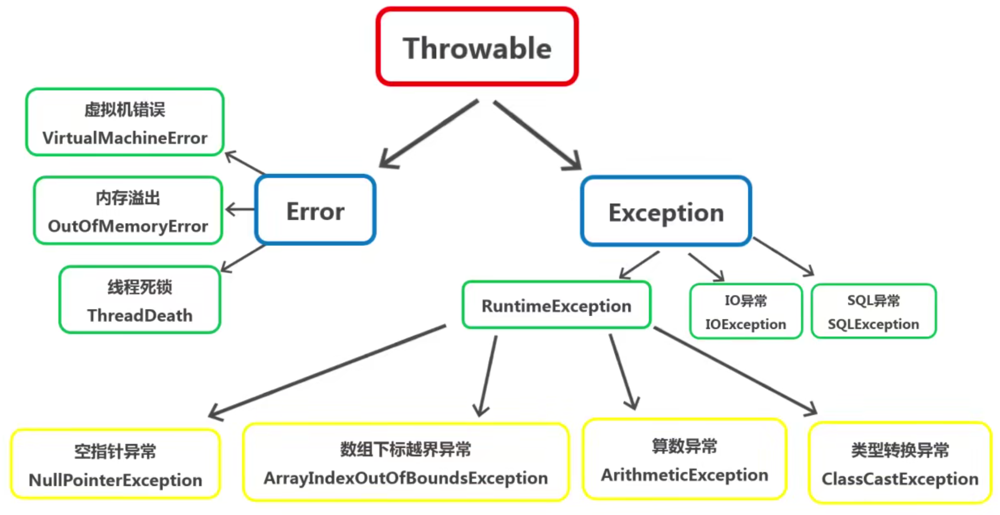
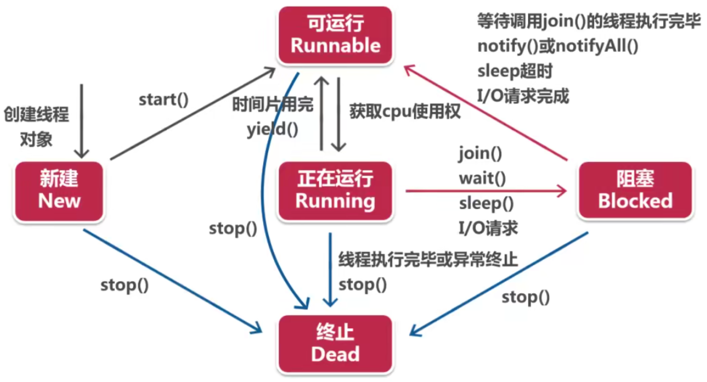

J2EE(Java2 Platform Enterprise Edition, Java 2 企业版) ，开发 Web 应用程序时 J2EE 的最核心功能。它由 13 个功能模块组成：

- **Servlet**: Web 服务器小程序
- **JSP**:     服务器页面
- **JDBC**:    数据库交互模块
- **XML**:     XML 交互模块
- EJB:         企业级 Java Bean
- RMI:         远程调用
- JNDI:        目录服务
- JMS:         消息服务
- JTA:         事务管理
- JavaMail:    发送/接收邮件
- JAF:         安全框架
- CORBA:       CORBA 集成
- JTS:        CORAB 事务监控

注意， J2EE 是一组技术规范与指南，没有具体实现，具体实现由软件厂商决定。


J2SE(Java2 Standard edition, Java 2 标准版)

J2ME(Java2 Micro Edition, Java 2 微缩版)

J2SE 包含于 J2EE 中， J2ME 包含了 J2SE 的核心类，但新添加了一些专有类。


# 起步

1. 安装 JDK(Java Development Kit, Java开发工具) ...
2. 使用 `javac` 命令把 `.java` 文件编译成 `.class` 文件。
3. 使用 `java` 命令运行 `.class` 文件。

每个文件的 `main` 方法是 Java 程序的入口。：

> JRE(Java Runtime Environment)，是 Java 的运行环境。
> JDK(Java Development Kit)，是 Java 的开开发套件，包含了 JRE ，还包含很多和开发调试相关的工具。
> JSR(Java Specification Requests)，是 Java 演进的标准。每个 Java 版本的新功能都是以 JSR 的形式推进。
> JMM(Java Memory Model)：Java 内存模型。可以简单理解为是一套 happens-before 标准，规定了内存同步和缓存失效等节点，限制了指令重排。
> 指令重排：以优化为目的，自动优化代码，即代码不一定是按我们写的顺序执行。如`int a=1;int b=1;long c=2;int d=1;`，可能被优化成`int a=b=d=1;long c=2;`。

[Stack Overflow](https://stackoverflow.com/) 网址可以寻找"问题"的答案。

## IDE

IDE(Integrated Development Environment)，集成开发环境。是用于提供程序开发环境的应用程序，一般包括代码编辑器、编译器、调试器和图形用户界面等工具。

### interliJ IDEA

调试技巧：

1. 添加断点。
2. 启动"调试"。
3. 底部可以查看 `frame` 试图和 `variable` 试图。
4. 调试技巧：
    - `Step Over`: 在断点处，往下**逐行**执行 (在顶部的`run`菜单内)；
    - `Step Out`: 继续执行，直到下一个断点或程序结束 (在顶部的`run`菜单内)；
    - `Step Into`: 进入被调用方法的内部继续调试；
    - `Evaluate Expression`: 在对话框输入执行的语句，等同于在断点的下一行执行指定语句 (右键菜单内)；
    - "条件断点": 添加断点时，右键"红点"，在`Condition`输入条件。效果是达到条件才会触发断点。

快捷键：

- 格式化代码： `Ctrl` + `Alt` + `L` 。
- 撤销： `Ctrl` + `Z` 。
- 还原： `Ctrl` + `Shift` + `Z` 。
- 类名和文件名同时(包括依赖此类的地方都同时)修改： `右键` -> `Refactor` -> `Rename` 。

插件：

- Maven Help ：为 `pom.xml` 文件提供方便的功能，如搜索、可视化等。
- Markdown support ：支持 markdown 语法。
- Grep Console ：高亮 `warning` `error` 信息的插件。

## 注解(annotation)

注解是给类、方法即成员添加元数据(metadata)的方式。即用于描述特定代码。和注释不同，注解会被 Java 编译器处理而非跳过。

如 `@Override` 告诉 IDE 方法被重写，如果没有正确重写的话， IDE 会提示错误。

`Deprecated` 表示方法可能在之后的版本中弃用，尽量别用。如果还是用了，不会报错，但 IDE 会有提示。

<!-- TODO: 还有更多的注解语法，找其他途径学习把。 -->

按照运行机制分：

- **源码注解**：如 `@Override` 是编译成 `.class` 文件后就没有了，只是给编译器看的。
- **编译时注解**：编译成 `.class` 文件依然存在。
- **运行时注解**：在程序运行阶段还起作用。

按照来源分：

- 来自 JDK 的注解：如 `@Override` 。
- 来自第三方的注解
- 自定义的注解

## 匿名函数和函数式编程

函数式编程，就是把函数作为变量传递给另一个方法调用，还能返回函数。

匿名函数，又称 λ(Lambda) 函数，顾名思义，就是没有名字的函数。

``` java
public class MyClass {
  public static void main(String[] args) {
    /* 下面几种都是等效的 */
    // 用"匿名内部类"直接实现了接口
    useLambdaFn(new Consumer<String>() {
      @Override
      public void accept(String str) {
        System.out.println(str);
      }
    });
    // "箭头函数"，若参数只有一个，参数的括号可以省略。 (与JavaScript类似)
    useLambdaFn((str) -> {
      System.out.println(str);
    });
    // 使用类的静态方法 (注意不是".",是"::")
    useLambdaFn(MyClass::myStaticFn);
    // 使用类的实例方法
    MyClass myClass = new MyClass();
    useLambdaFn(myClass::myPublicFn);
  }
  // 此函数接受一个"回调函数"作为参数
  // 参数类型必须是实现了接口"Consumer<>"的类或方法
  public static void useLambdaFn(Consumer<String> cb){
    // "Consumer"接口只包含了"accept"方法 (具体请看源码)
    // 通过".accept"方法传入若参数
    cb.accept("foo");
  }
  // 作为回调函数的静态方法
  public static void myStaticFn(String str){
    System.out.println(str);
  }
  // 作为回调函数的实例方法
  public void myPublicFn(String str){
    System.out.println(str);
  }
}
```

## 封装、继承、多态

简单说一下，

封装，对应就是 `private` 将部分成员私有，再用 `public` 暴露访问访问。

继承，对应就是 `extends` 继承类， `implements` 实现接口。需要注意，只能继承一个类，但可以同时实现多个接口。

多态，对应就是方法的重写。即，不同类的对象对同一消息做出不同的响应。

## 命名规范

- 类名必须首字母大写。
- 包名按照 域名的倒叙 + 模块名 ，全部小写，中间用 `.` 分割。也可以关于公司、团队、个人，自行了解。
- 接口名必须以 `I` 开头。

</br>

# 部分语法介绍

## `for`循环的另一种写法(增强型for循环)

``` java
String[] arr = new String[10];
// 只遍历元素，"str"就是每次遍历时数组中的元素
for (String str : arr) {
  System.out.println(str);  // null
}
```

## `...`(可变参数)

``` java
// 表示可以输入若干个(相同类型)变量
public void fn(String... args) {
  // "args"是一个数组，可以遍历
  for(String str: args){
    System.out.println(str);
  }
}
```

## TODO:

</br>

# 数据类型

## 基本数据类型

总共有 8 中基本数据类型。

|   类型    |     名称     | 内存占用(字节) |   默认值   |                     备注                     |
|:---------:|:------------:|:--------------:|:----------:|:--------------------------------------------:|
|  `byte`   |     字节     |       1        |    `0`     |                                              |
|  `short`  |    短整型    |       2        |    `0`     |                                              |
|   `int`   |     整型     |       4        |    `0`     |                数字的默认类型                |
|  `long`   |    长整形    |       8        |    `0L`    |       ‭2147483648‬L (不建议使用小写的l)        |
|  `float`  | 单精度浮点数 |       4        |   `0.0f`   |             3.1415f (可用大写F)              |
| `double`  | 双精度浮点数 |       8        |   `0.0d`   |                                              |
|  `char`   |     字符     |       2        | `'\u0000'` | 不能强转换成`short`,因为`char`是无符号的整数 |
| `boolean` |     布尔     |       1        |  `false`   |                                              |

## 引用数据类型

除了基本类型，其他都是引用类型，如数组、对象、类等。

### 数组

数组是相同类型变量的集合，所有元素都一样。

数组长度从创建开始就已经确定。

数组的每个元素所分配的内存是连续顺序的。

数组的元素的值的本质是存放内存地址，指向实际数据的"位置"。

``` java
// 创建整型数组
int[] arr = new int[10];
// 二维数组
int[][] arr2 = new int[2][3];
```

### Class(类)

创建类：(类名必须要与文件名同名,大小写敏感)

``` java
public class MyClass {
  // 必须包含一个静态的 main 方法。这是类的入口方法。
  public static void main(String[] args) {
    // ...
  }
}
```

在同级目录下，能引用其他的类。为了方便组织项目，我们通常会在 `src` 目录下创建多个文件夹用于归类，这里的文件夹称为 `package`(包)。

"包"与"包"之间可以是同级，也可以是嵌套，同一个"包"里面的类可以相互访问。

若需要访问其他"包"下的类，就需要使用 `import` 引入。

``` java
// "package"用于区别类名的命名空间。一般就是当前目录。可以理解为类放在的文件夹。
package parent.children;
// 引入其他"package"下的某个类
import parent.children.grandchild.GrandChild;
// 可以使用通配符"*"，表示引入里面的所有类
import parent.children.grandchild2.*;
public class Child {
  public static void main(String[] args) {
    // ...
    GrandChild grandchild1 = new GrandChild();
    // 也可以不使用 import 引入，直接通过包路径使用
    parent.children.grandchild3.GrandChild grandchild3 = new parent.children.grandchild3.GrandChild();
  }
}
```

## 类型转换

类型转换有两种：**隐式转换**和**显式转换**，显式转换也成为强制转换。

### 隐式转换

隐式转换发生在计算或者赋值时，只能是"低精度"向"高精度"转换。

``` java
// 赋值时的类型转换
int myInt;
byte myByte = 10;
myInt = myByte;
// 计算时发生的类型转换
System.out.println(100 / 2.0);
```

可发生自动转换的顺序： `byte -> short -> int -> long -> float -> double` 。

还有 `char` 可以自动转化成 `int` 及更高精度，但不会自动转换成 `short` ，虽然两者占用内存相同，但 `char` 是无符号的整数，理论最大值要比带符号的 `short` 要大。

### 显式转换

显式转换就是把"高精度"的值，强行转换成"低精度"，代价是精度丢失，可能会使数据失去意义。语法如下：

``` java
// 浮点数转整型
int a = (int) 3.1415;
```

</br>

# 方法重载

方法重载就是定义多个同名方法，但参数个数或类型不同，执行不同的逻辑。

``` java
// MyClass.java
public class MyClass {
  static void myFn() {
    System.out.println(1);
  }
  static void myFn(int arg) {
    System.out.println(2);
  }
  static void myFn(int arg1, String arg2) {
    System.out.println(3);
  }
}
// Main.java
public class Main {
  public static void main(String[] arg) {
    MyClass.myFn();         // 1
    MyClass.myFn(1);        // 2
    MyClass.myFn(1, "foo"); // 3
    // 重载方法符合"隐式转换"
    byte myByte = 1;
    MyClass.myFn(myByte);   // 2
  }
}
```

</br>

# 修饰符

## static

表示方法或属性是"静态的"，无需实例化类就可以使用。静态成员也**能被子类继承**。

``` java
// MyClass.java
public class MyClass {
  static int myValue = 100;
}
// Main.java
public class Main {
  public static void main(String[] args) {
    System.out.println(MyClass.myValue);  // 100
  }
}
```

其他类文件中也可以单独引用静态成员。

``` java
// 可以引入特定的成员，也可以使用通配符引入所有
import static parent.children.MY_VAVLE;
import static parent.children2.*;
```

静态代码块，一般用于复杂计算后给静态成员赋值。

``` java
public class MyClass {
  public static void main(String[] args) { }
  static int myValue;
  static {
    // ....
    myValue = 1;
  }
}
```

## public、protected、(缺省)、private

四者的作用是改变类或成员的可见性：

| 访问修饰符 | 当前类 | 同包 | 子类 | 其他 |
|:----------:|:------:|:----:|:----:|:----:|
|  private   |   √    |      |      |      |
|   (缺省)   |   √    |  √   |      |      |
| protected  |   √    |  √   |  √   |      |
|   public   |   √    |  √   |  √   |  √   |

在子类重写方法时要注意，可以把方法改成"更高权限"的，不能反过来。如父类的方法修饰是 `protected` ，子类可以改为 `public` ，但不能改为 (省却) 或 `private` 。

## final

`final` 可以与上面介绍的 `public`、`protected`、`private`、`static` 组合使用。

`final` 用于修饰**类**时，表示该类**不能被继承**。

`final` 用于修饰**变量**时，表示该变量必须初始化赋值，且**不能被修改**。包括类的成员、方法的形参、方法内的变量等。有几点需要注意：

- 修饰类的成员，可以在构造函数内初始化赋值，也可以在声明的时候初始化赋值，但不能两者都操作。
- 对于引用类型，修改其内部成员是可以被修改的。

`final` 用于修饰**方法**时，表示该方法**不能被**子类**重写**。

## synchronized

用来修饰成员方法或代码块，表示同一时间只允许一个线程使用它，前面的线程调用完毕才能给另一个线程使用。

修饰方式时，跟上面的关键字用法类似，如 `public synchronized void fn(){}` 。

还能修饰代码块：

``` java
// 表示在"this"上对下面代码块"锁定"
// 也可以针对"类"，如"Myclass"
synchronized (this) {
  // ...
}
```

### `wait`和`notify`

两个方法都是 `Object` 类的 `public` 方法。 `.wait()` 方法用于使对象所在的线程暂停等待； `.notify()` 则为了取消等待，使线程继续。看下面代码介绍：

``` java
public class ThreadWaitNotify {
  public static void main(String[] args) throws InterruptedException {
    Object locker = new Object();
    System.out.println("------ 开始生成线程 ------");
    for (int i = 0; i < 5; i++) {
      new Thread(() -> {
        try {
          synchronized (locker) {
            Thread.sleep(1000);
            System.out.println(Thread.currentThread().getName() + " 进入等待");
            // wait 方法必须在进去相应对象的 synchronized 块中才调用。
            // 执行 wait 方法之后，自动失去对象的 monitor 。也就是说别的进程能进入此代码块。
            locker.wait();
            // wait 方法后的代码直到 notify 方法被调用才会继续
            System.out.println(Thread.currentThread().getName() + " 线程继续__");
            Thread.sleep(2000);
            System.out.println(Thread.currentThread().getName() + " 结束");
          }
        } catch (Exception ex) {
          ex.printStackTrace();
        }
      }, "工作线程_" + i).start();
    }
    System.out.println("------ 线程生成结束 ------");
    // 此处等待的时间必须大于 1000 ，即在 wait 方法被调用后才能执行下面的 notify 方法，否则线程会永远"等待"
    Thread.sleep(1500); // (试试改成 2500)
    System.out.println("------ 开始唤醒所有线程 ------");
    synchronized (locker) {
      locker.notifyAll();
    }
    System.out.println("------ 结束 ------");
  }
}
```

## volatile

使代码不受"指令重排"的影响，被 `volatile` 标记的后，会强制从主内存取变量数据。牺牲了一点速度，但提高了准确性。

`volatile` 可以作用于任何成员变量。如 `volatile int val;`

</br>

# Class(类)的详介

## 构造方法

每次使用 `new` 方法创建实例时，都会调用构造方法。构造方法可以重载；无返回值

``` java
// MyClass.java
public class MyClass {
  // 构造方法也能重载
  public MyClass(int val) {
    // ...
  }
  // 构造方法与类名同名
  public MyClass() {
    // 构造方法可以调用其他重载的构造方法，使用 this() ，且必须是此方法的第一行
    this(int myInt);
  }
}
```

## 继承

使用 `extends` 关键字可以继承父类，但只能继承自一个父类。

子类也不能使用父类的 `private` 成员。

子类的构造函数第一行必须是 `super()` 调用父类的构造函数，除非你不定义构造函数。

通过 `super.` 可以访问除了 `private` 以外的成员。

子类中通过定义同名的方法，可以**重写(override)**父类的方法。需要注意，重写的方法与父类的方法的返回值类型必须相同。

``` java
// 只能继承于一个父类
public class Child extends Parent {
  Child() {
    // 调用父类的构造函数 (必须是方法的第一行代码)
    super();
  }
  // 调用父类的方法，并重写 (重写的方法必须与父类的方法的返回值类型相同)
  public void fn2(){
    super.fn2();
  }
}
```

## 兼容性赋值

假设有 `Parent.java` 和 `Child.java` ，后者继承于前者。`Parent` 类中有 `fn1` 公共方法；`Child` 类中有继承的 `fn1` 方法和自身定义的 `fn2` 方法。请看下面例子：

``` java
// "child"只有"fn1"方法。若"fn1"方法被子类重写，那"child.fn1()"执行的就是被重写后的方法。
// 当前"child"的类型就是"Parent"。
Parent child = new Child();
// 可以通过"强制类型转换"，把类型转换
Child child2 = (Child) child;
```

## 抽象类

抽象类不能被实例化，只能被继承，用 `abstract` 修饰符。

注意，抽象类不一定要有抽象方法，但抽象方法必须在抽象类中。

``` java
// 只能继承于一个父类
public abstract class MyClass {
  // 抽象方法 (不能有方法体) (不能与"private"组合)
  public abstract void fn();
  // ...
  // 其他和普通类相同，有自己的成员
}
```

还有， `abstract` 修饰符不能与 `static` 、 `final` 、 `private` 共存。

## 静态内部类

**"静态内部类"**就是在一个类的内部，使用 `public static class` 声明的类。这种关系是可以嵌套的，但不建议这样使用。

静态内部类同样是一个类，同样能继承接口和其他类。

``` java
public class MyMainClass {
  // 外层的类中的一个方法
  public void func() {
    // 外层的类中能访问到"静态内部类"
    MyClass myClass = new MyClass();
    // 外层的类能访问到的类...
    OtherClass otherClass = new OtherClass();
  }
  // 静态内部类
  public static class MyClass {
    // 在"静态内部类"享有与外层的类相同的访问权限
    OtherClass otherClass = new OtherClass();
    // "静态内部类"可以包含静态成员
    private static String str = "foo";
  }
}
```

在其他类中的访问方式：

``` java
MyMainClass.MyClass myClass2 =  new MyMainClass.MyClass();
```

## 成员内部类

在声明上，**"成员内部类"**与"静态内部类"唯一的区别是没有 `static` 修饰符。

在"成员内部类"中，不可以包含静态成员，但可以有 `final static` 定义的变量。

``` java
public class MyMainClass {
  // 外层的类中的一个方法
  public void func() {
    // 外层的类中能访问到"成员内部类"
    MyClass2 myClass2 = new MyClass2();
    // 外层的类能访问到的类...
    OtherClass otherClass = new OtherClass();
  }
  // 成员内部类
  public static class MyClass2 {
    // 在"成员内部类"享有与外层的类相同的访问权限
    OtherClass otherClass = new OtherClass();
  }
}
```

在其他类中使用"成员内部类"的语法就有点特别：

``` java
MyMainClass myMainClass = new MyMainClass();
// 注意".new"语法
myMainClass.MyClass myClass = myMainClass.new MyClass();
```

## 方法内部类

在方法内部定义的类，就是"方法内部类"。其不能包含静态成员。访问权限与外层的类相同。

``` java
public class MyMainClass {
  // 外层的类中的一个方法
  public void func() {
    // 外层的类中能访问到"方法内部类"
    MyClass2 myClass2 = new MyClass2();
    // 外层的类能访问到的类...
    OtherClass otherClass = new OtherClass();

    // 方法内部类
    public static class MyClass2 {
      // 在"方法内部类"享有与外层的类相同的访问权限
      OtherClass otherClass = new OtherClass();
    }
  }
}
```

## 匿名类

匿名类是用来创建接口或抽象类的实例的。即通过单例匿名继承接口(或抽象类)，实现快速创建类的效果。

匿名类可以出现在任何有代码的地方。

建议使用匿名类的情况是，类只使用一次，若使用次数较多的，建议还是生命类，然后重复调用。

``` java
public class MyMainClass {
  public void fn() {
    // 可以是接口或抽象类
    MyInterface myInterface = new MyInterface() {
      // ...
    };
  }
}
```

注意，此方法的局限性是，只能**单继承**(单实现)。

</br>

# Reflection(反射)

在运行状态中，对于任意一个实体类，都能够知道这个类的所有属性和方法；对于任意一个对象，都能够调用它的任意方法和属性；这种动态获取信息以及动态调用对象方法的功能称为 Java 语言的**反射机制**。

Java 的反射机制的作用是，用来编写一些通用性较高的代或者或框架的时候使用。

注意，反射的首次访问要比"点运算符"要慢。

TODO: 2-2

## Class 类

Java 中 `java.lang.Class` 类用于表示一个类的字节码文件(`.class`)。

获得 Class 是使用反射的首要一步，可以通过如下方式获得：

- 已知类和对象的情况下：
  - `类名.class`
  - `对象.getClass()` (由`Object`类提供)
- 未知类和对象的情况下
  - `Class.forName("包名.类名")` (用于加载类字节码到内存中,并封装成一个 Class 对象)

## Constructor 类

``` java
// 这一步是必须的
Class clazz = Class.forName("com.xxx.yyy.Person");
// 获取无参的构造方法
Constructor cons = clazz.getConstructor();
// 获取两个参数都是字符串的构造方法
Constructor cons2 = clazz.getConstructor(String.class, String.class);
// 获取所有构造函数
Constructor[] consList = clazz.getConstructors();
// 使用构造函数（默认是返回Object类型,需要强转）
Person person = (Person) cons.newInstance();
```

## Field 类

使用 Field 类的场景，一般是针对类的**私有属性**，因为公有属性可以直接通过 `.` 访问。

常用方法：

- 得到所有的成员变量：
  - `Field[] fields = c.getFields();` 得到所有 `public` 属性（包括父类继承）
  - `Field[] fields = c.getDeclaredFields();` 得到所有声明的属性（包括私有属性）
- 得到指定的成员变量：
  - `Field name = c.getField("name");` 得到指定的 `public` 属性
  - **`Field name = c.getDeclaredField("name");`** 得到指定的属性
- 设置 Field 变量是否可以访问：
  - `field.setAccessible(boolean);`

示例 代码：

``` java
// 同样的，这一步是必须的
Class clazz = Class.forName("com.xxx.yyy.Person");
// 获取私有属性
Field field = clazz.getDeclaredField("sex");
// 操作属性，是针对实例对象操作的，需要创建一个实例对象
Person person = (Person) clazz.newInstance();
// 对于私有属性，必须改变它的可访问权限 （公有属性省略此步）
field.setAccessible(true);
// 设置属性值。传入两个参数，第一个是实例对象，第二个是属性值
field.set(person, "男");
// 获取值（类型是Object，需要强转）
String sex = (String) field.get(person);
```

## Methods 类

与 Field 类似，使用 Methods 类的场景，一般是针对类的**私有方法**，因为公有属性可以直接通过 `.` 访问。

常用方法：

- 获得所有的方法：
  - `.getDeclaredMethods();` 包括私有
  - `.getMethods();` 只包括`public`
- 获得指定的方法：
  - `.getDeclraedMethod(String methodName, Class<?>... parameterTypes);`
  - `.getMethod(String methodName, Class<?>... parameterTypes);`
- 通过反射执行方法：
  - `.invoke(Object obj, Object... args);`

示例代码：

``` java
// 继续强调，这一步是必须的
Class clazz = Class.forName("com.xxx.yyy.Person");
// 获取私有方法 （获取 run 方法中，带一个字符串参数的重载方法）
Method method = clazz.getDeclaredMethod("sayHello", String.class);
// 操作方法，是针对实例对象操作的，需要创建一个实例对象
Person person = (Person) clazz.newInstance();
// 对于私有方法，必须改变它的可访问权限 （公有方法省略此步）
method.setAccessible(true);
// 执行该方法。传入两个参数，第一个是实例对象，第二个(或更多)是方法的参数。如果方法默认返回是Object。
Object res = method.invoke(person, "Tom");
```

## 示例代码

``` java
// 引入反射需要的类
import java.lang.reflect.Field;
import java.lang.reflect.InvocationTargetException;
import java.lang.reflect.Method;

public class MyMainClass {
  // "throws"的内容请看下面的"异常处理"一章
  public static void main(String[] arg) throws NoSuchFieldException, IllegalAccessException, NoSuchMethodException, InvocationTargetException {
    // 假设你有一个被实例化的对象
    TestReflection myObj = new TestReflection();
    // 获取实例的Class实例 (用"class"关键字创建的类都都继承自"Class"类)
    Class clazz = myObj.getClass();
    Class clazz2 = TestReflection.class;  // 与上面等效
    // 获取公有字段 (即使是"private"关键字定义的成员,也可以获取)
    Field field = clazz.getField("val");
    // 获取字段的各种属性
    System.out.println(field.getType());  // int
    System.out.println(field.get(myObj));  // 666
    // 获取公有方法
    Method method = clazz.getMethod("fn");
    // 通过".invoke()"可以调用方法
    int myInt = (int) method.invoke(myObj);
    System.out.println(myInt);  // 666
    // 获取私有成员 (使用方法与公有方法相同)
    Field field2 = clazz.getDeclaredField("_val");
    field2.setAccessible(true); // 设为"可修改"
    field2.set(myObj, 1024);  // 修改属性的值
    Method method2 = clazz.getDeclaredMethod("_fn");
  }
}
```

</br>

# Enum(枚举)

与 `class` 关键字创建的类不同，枚举继承于 `enum` 的类。

创建枚举类：

``` java
public enum MyEnum {
  // 定义枚举成员 (必须是顶部代码)
  APPLE(1),
  BANANA(3),
  ORANGE(5);
  // 属性
  private int id;
  // 构造函数 (必须是private,缺省也是private)
  MyEnum(int id) {
    this.id = id;
  }
  // 通过枚举成员名获取id
  public int getId() {
    return id;
  }
}
```

使用枚举类：

``` java
public class UseEnum {
  public static void main(String[] arg) {
    // 遍历枚举成员 (.values()获取所有枚举成员)
    for (MyEnum item : MyEnum.values()) {
      // .getId()获取枚举成员的id
      System.out.println(item.getId());
      // .name()获取枚举成员的名字
      System.out.println(item.name());
      // .ordinal()获取枚举成员的序号
      System.out.println(item.ordinal());
      // .toString()获取枚举成员的字符串描述
      System.out.println(item.toString());
    }
    // 根据名字获取枚举成员
    System.out.println(MyEnum.valueOf("APPLE"));
  }
}
```

除了在单独的类文件中创建枚举，还可以在某个类中创建**枚举成员**：

``` java
public class HelloWorld {
  public static void main(String[] arg) {
    useEnumFn();  // MOON
  }
  // 在类的成员中定义枚举
  enum myEnum2 {
    SUN,
    MOON
  }
  public static void useEnumFn(){
    System.out.println(myEnum2.MOON);
  }
}
```

</br>

# interface(接口)

接口的创建：

``` java
// 接口也可以继承，且能多继承
public interface MyInterface extends MyInterface2, MyInterface3 {
  // 默认的修饰符是"public"，所以可以省略
  // 接口的方法可以没有实现，只指定名字、参数、返回类型
  public void fn(int i);
  // 私有方法必须提供具体实现
  private void fn2() {
    System.out.println(222);
  }
  // 静态方法可以提供具体实现，但无法被继承，只能通过接口调用
  public static void fn3(String str) {
    System.out.println(str);
  }
  // 私有方法不用"default"修饰符 (不会被继承,只能在接口中使用)
  private void fn4(){
    System.out.println(444);
  }
  // 接口内不能定义局部变量，变量默认都是 "public static final"的
  int MY_VALUE = 666;

  // 在 Java8 后，可以使用"default"给方法提供默认的方法体
  // 需要注意，继承自本接口的类，可以把此方法定义为"抽象方法"
  default public void fn5(){
    System.out.println(555);
  }
}
```

接口的使用：(使用`implements`关键字)

``` java
// 继承类的同时可以继承(多个)接口
public class Child extends Parent implements MyInterface, MyInterface4 {
  // 接口中的方法，必须在类中定义
  public void fn(int i) {
    System.out.println(i);
  }
  // ...
}
```

`instanceof` 能作用于接口：

``` java
Child child = new Child();
System.out.println(child instanceof MyInterface); // true
```

注意事项：

- 被实现的**多个接口**如果有**同名方法**，同时，本类没有定义该同名方法，且，没有继承其他类，则会导致报错。除非本类重写该方法，或被继承类含有同名方法，则以类中的同名方法为准。

- 被实现的**多个接口**如果有**同名属性**，同时，被继承类含有同名属性，则会导致报错，这点与方法不同。解决办法是本类声明同名变量，则以本类的变量为准。

</br>

# 包装类

包装类，使基本数据类型拥有属性和方法，可以像对象一样，但包装类都是**不能被继承**的。

注意，包装类的默认值是 `null` ，这点与对应的基本类型不同。

包装类与基本数据类型：

| 基本类型 | 对应的包装类  |
|:--------:|:-------------:|
|   byte   |     Byte      |
|  short   |     Short     |
|   int    |  **Integer**  |
|   long   |     Long      |
|  float   |     Float     |
|  double  |    Double     |
|   char   | **Character** |
| boolean  |    Boolean    |

装箱和拆箱：

``` java
public static void main(String[] args) {
  int num = 1;
  // 手动装箱
  Integer num2 = new Integer(num);
  // 自动装箱
  Integer num3 = 2;
  // 自动拆箱
  int num4 = num3;
  // 手动拆箱 (也可以转换类型)
  int num5 = num3.intValue();
}
```

思考题：（重点是**缓存区**/**对象常量池**的概念）

``` java
public static void main(String[] args) {
  // ------------------ 1 ------------------
  Integer one = new Integer(100);
  Integer two = new Integer(100);
  System.out.printIn(one == two);  // false
  // 解析：两个用 new 实例化的类，在内存中地址不同，对比的结果肯定不同

  // ------------------ 2 ------------------
  Integer three = 100;  // 自动装箱
  System.out.printIn(three == 100);  // true
  // 解析：包装类与基本数据类型比对时，会 自动拆箱 ，然后再比对

  // ------------------ 3 ------------------
  Integer four = 100;   // 核心操作是 Integer four =  Integer.valueOf(100);
  System.out.printIn(three == four);  // true
  // 解析：
  // 有这样的一个缓存区(对象常量池)，
  // 如果自动装箱的值范围在 -128~127 之间，且之前自动装箱，
  // 那么，对于相同值的自动装箱会指向同一个对象

  // ------------------ 4 ------------------
  Integer five = 200;
  System.out.printIn(five == 200);  // true
  // 解析：与 2 相同 （同时也验证了"=="的一边不是自动装箱，而是另一边的自动拆箱）

  // ------------------ 5 ------------------
  Integer six = 200;
  System.out.printIn(five == six);  // false
  // 解析：验证 3 的另一种情况
}
```

还有，除了 `float`|`Float` 和 `double`|`Double` ，其他的都可以应用**对象常量池**的概念。

</br>

# 字符串(String)

`String` 具有**不可变性**，具体就不多介绍了。

需要注意的是 `StringBuilder` 和 `StringBuffer` ，两者都是针对**频繁操作某个字符串**所设计的。

一般情况下，建议使用 `StringBuilder` ，因为它是**非线程安全**的，**性能略高**于 `StringBuffer` 。

</br>

# 异常处理

## 异常的分类



- `Error` 是**程序无法处理**的错误，表示运行应用程序中比较严重的问题，一般是 Java 虚拟机的错误。
- **`Exception`** 是程序本身可以处理的异常。异常处理通常针对这种类型异常的处理。
  - Unchecked Exception **非检查异常**，是编译器不强制要求处理的异常。常见的是 `RuntimeException`。
  - Check Exception **检查异常**，是编译器要求必须处理的异常。如 `IOException` 、 `SQLException` 。

上面说的"必须处理"指的是使用 `try...catch...finally` 或 `throws` 捕获处理错误。

## 捕获异常

### try...catch...finally 的使用

有几点内容需要注意的：

- `try` 不能单独使用，必须有 `catch` 或 `finally` 或两者都有。
- `catch` 可以有多个，用于针对不用类型的异常进行捕获，建议最后的 `catch` 捕获前面异常类型的共同父类，如 `Exception` 。

下面以一个简单的"除法计算器"为例：

``` java
public static foo() {
  Scanner input = new Scanner(System.in);
  System.out.print("====运算开始====");
  try {
    System.out.print("请输入第一个整数：");
    int one = input.nextInt();
    System.out.print("请输入第二个整数：");
    int two = input.nextInt();
    System.out.print("两数相除：" + (one / two));
  }
  // 针对第二次输入为 0 的情况
  catch(ArithmeticExpetion e) {
    System.out.print("除数不能为零");
    // 打印错误
    e.printStackTrace();
  }
  // 针对第二次输入为 字符 的情况
  catch(InputMismatchException e) {
    System.out.print("除数只允许是整数");
    e.printStackTrace();
  }
  // 捕获上面的父类，避免出现意外情况
  catch(Exception e) {
    System.out.print("出现意料以外的错误");
    e.printStackTrace();
  }
  // 肯定会被执行的语句
  finally {
    System.out.print("====运算结束====");
  }
}
```

### 关于 try...catch...finally 内的 return

``` java
public static int fn() {
  int val;
  try {
    val = 666;
    return val;
  } catch (Exception ex) {
    return 999;
  } finally {
    // 若"try...catch"有"return"，"finally"就不应该有"return"，否则会无视"try"和"catch"的"return"
    // return 111;
  }
}
```

## throws

`throws` 的作用是，表示该方法或该类可能会抛出某个类型的异常，但它本身并不处理，由调用放对异常进行捕获处理，也可以继续往上抛：

``` java
// 可能会抛出异常的方法 （当有多个异常时，可以用逗号分隔）
public static one() throws InputMismatchException {
  // ....
  // 注意，内部不需要 try...catch
}
public static two() {
  // 当然了，这里不处理也可以继续往上抛
  try {
    one();
  } catch(Exception e) {
    // ....
  }
}
```

## 主动抛出异常

``` java
public static void fn() {
  // 抛出异常
  throw new Exception("err");
}
```

方法本身可以抛出错误，让调用此方法的地方处理：

``` java
public class HelloWorld {
  public static void main(String[] args) {
    // 调用此方法的地方必须处理可能发生的错误
    try {
      fn();
    } catch (Exception ex) {
      // 处理错误...
    }
  }
  // "throws"后面表明方法可能会发生的异常，指示调用方必须处理
  // "throws"抛出的异常类型，必须是异常类型或其父类
  // "throws"后可以抛出多个异常，用","(逗号)分隔
  public static void fn() throws Exception {
    throw new Exception("err");
  }
}
```

接口或抽象类中可以限定方法抛出的错误：

``` java
void myFn() throws NullPointerException;
```

## 自定义异常类

``` java
// 继承指定异常类型
public class MyException extends Exception {
  // 下面的构造函数可以通过： "右键"->"Generator"->"Constructor"->(选择需要的构造函数)
  public MyException() {
  }
  public MyException(String message) {
    super(message);
  }
}
```

## 异常链

异常链就是，处理调用方法的错误，再抛出新的错误，如此类推。有时候我们希望能看到整个链路的错误，示例代码如下：

``` java
public static void main(String[] args) {
  try {
    two();
  } catch (Exception e) {
    // 打印异常信息
    e.printStackTrace();
  }
}
public static one() throws Exception {
  throw new Exception("1");
}
public static two() throws Exception {
  try {
    one();
  } catch (Exception e) {
    // 抛出新的错误
    // 假如不传入第二个参数，这里捕获的错误信息会丢失
    throw new Exception("2", e);
  }
}
```

</br>

# 集合

Java 中的集合是工具类，可以存储任意数据的具有共同属性的对象。与数组不同，集合的**长度可变的**。

主要分成两大**接口**：

- `Collection`: 存储类的对象。接口有如下几个：
  - `List`: **有**序的、**可**重复的。常用的实现类有 `ArrayList` 。
  - `Queue`: **有**序的、**可**重复的。常用的实现类有 `LinkedList`(同时实现了`List`接口) 。
  - `Set`: **无**序的、**不可**重复的。常用的实现类有 `HashSet` 。

- `Map`: 以键值对的形式存储。
  - 常用的实现类有 `HashMap` 。

使用时需要注意的是，与 `java.lang` 不同， `java.util` 不会自动引入，需要使用 `import` 引入。

## List

代表有顺序的一组元素，大小可变，也称之为**链表**，也被称为序列。继承于 `Collection` 类。

`List` 是一个接口，需要自己创建一个类继承于它。

`List` 的实现可以有两种，一个是基于数组；另一种是基于链表。

- 前者的重点，在于添加元素时判断数组长度，若不足，则创建一个新的数组，长度为原来的 2 倍，把原来的元素放进去。
- 后者的重点，定义一个节点类，每添加元素则创建一个新的节点对象，节点对象有两个指针分别指向前后的元素。

> **使用"成熟的"类**：
>
> 上面提到的两种， JDK 已经提供了具体实现，分别是 **`ArrayList`** 和 **`LinkedList`** 。

`ArrayList` 底层是有数组实现的，在内存中占用了一片连续的空间。当我们在列表尾部插入或删除数据时，效率是很高的，更**适合查找和更新**元素。

还有 `ArrayList` 中的元素可以为 `null` 。

## Set

代表元素**不重复**的集合，且不要求顺序。同样继承于 `Collection` 类。

`Set` 同样是一个接口。常用的实现是 `HashSet` 类，称为哈希集，其原理是利用 `.hashCode` 比较新加入的元素与内部元素是否相同。

其带来一个问题，当我们把 Set 中的一个元素改成与另一个元素相同，"Set"是不会帮我们自动移除，所以，我们约定 `Set` 里面的数据是不可变的。

`HashSet` 的元素允许有 `null` ，由于元素的唯一性，只能有一个。

`HashSet` 具有良好的**存取和查找**性能。

**重点**：

- 如果需要用 `HashSet` 存放对象，一般是需要重写存放对象的类的 `hashCode` 和 `equals` 方法。
- 对象的 `hashCode` 和 `equals` 方法都会被 `HashSet` 隐式调用。
- `hashCode` 方法返回 `int` 类型，用于生成 hash code ，而 hash code 的作用是快速找到对应的值。
- 可以将 hash code 看成一个"桶"，"桶"放入"同类型"的数据。所以被存入 `HashSet` 的对象的 hash code 是可以相同的。
- `equels` 方法返回 `boolean` 类型，用于比对两个对象是否相等，相等的对象不会被重复存入 `HashSet` 。
- `equels` 方法默认只是用 `==` 比对，需要"个性化"就必须重写此方法。

## Map

描述 "key-value" 的数据结构，且 Map 集合内 "key" 不能重复。最常用的是 `HashMap` 类。

## 集合排序

可以使用 `Collection.sort()` 方法对集合进行排序，第一个参数传入一个 `List` 对象，对象顺序会被修改。

`Collection.sort()` 方法的另一个重载，除了第一个参数传入 `List` 对象，第二个参数还能传入一个 "Comparator"(比较器) 的实例对象。

**`Comparator`** 是一个接口。接口中含有 `int compare(T o1, T o2)` 方法：

- 若返回值为**负**整数，表示 `o1` < `o2` 。
- 若返回值为**零**，表示 `o1` = `o2`。
- 若返回值为**正**整数，表示 `o1` > `o2` 。

`Comparator` 示例代码：

``` java
import java.util.Comparator;
// 针对 Student 类的 name 属性的 比较器
public class NameComparator implements Comparator<Student> {
  @Override
  public int compare(Student o1, Student o2) {
    // getName 是 Student 中获取名字的方法
    String name1 = o1.getName();
    String name2 = o2.getName();
    // 刚好字符串的 compareTo 返回的也是 int 类型
    return name1.compareTo(name2);
  }
}

// 其他文件中使用
List<Student> studentList = new ArrayList<Student>();
// .....省略添加数据
// 使用比较器
Collections.sort(studentList, NameComparator);
```

**`Comparable`** 是 `java.lang` 包下接口：

- 接口中只有一个 `int compareTo(T o)` 方法。
- 此接口强行对实现它的每个类的对象进行整体排序。
- 这种排序被称为类的**自然排序**，类的 `compareTo` 方法被称为他的**自然比较方法**。
- 对于集合的 `Collections.sort` 方法和对于数组的 `Arrays.sort` 方法，若不传入"比较器"，默认就会调用集合(数组)中的 `compareTo` 方法进行比对排序。
- `compareTo` 方法返回值的含义与上面的 `compare` 方法类似。

`Comparable` 示例代码：

``` java
public class Student implements Comparable {
  public int age;
  // ....类中的属性方法
  // 重写 compareTo
  @Override
  public int compareTo(Student o) {
    return this.age - o.age;
  }
}
```

</br>

# 泛型(generic)

在泛型创建类的实例时，实际并没有把类型的信息记录到实例对象上，而是在类里面使用的泛型的地方，使用了强类型转换的操作。

声明时**使用泛型**：

``` java
// "<E>"就是代表泛型。"E"可以换成任意字符或字符串。
public class MyGenericClass <E> {
  // 方法中使用泛型。需要的泛型也可以指定多个，用逗号分隔。
  public <Baz, Foo> Foo fn(Foo arg, Baz arg2) {
    return arg;
  }
  // ...
}
```

**泛型的使用**：

``` java
// "<String>"就是对泛型指定类型。后面的"<>"表示与前面的相同，若不同则需要指定具体类型。
MyGenericClass<String> myGenericClass = new MyGenericClass<>();
// 方法中使用泛型
String str = myGenericClass.fn("1", 2);
```

使用**泛型方法**时，会自动检测类型：

``` java
public class Test {
  public static <T> void print(T t){
    System.out.printIn(t);
  }
}

// 任意类型的值都能传入
Test.print("hello");
Test.print(123);
Test.print(1.2f);
```

**限定泛型的范围**：

``` java
// 限制泛型必须继承自某个类
public class MyClass <E extends MySuperClass> {
  // ...
}

// 限制泛型必须是某个类的父类
public class MyClass2 <E super MySubClass> {
  // ...
}

// 限制传入"集合"的元素的类型
public class MyClass3 {
  public static void foo(List<? extends MyItem> MyList) {
    for(MyItem item: MyList) {
      item.baz(); // baz是MyItem特有的方法
    }
  }
}
```

注意，泛型方法不一定要在泛型类里面。

泛型的**协变**和**逆变**。TODO:

</br>

# 文件读写

话不多说，直接上代码：

``` java
import java.io.*;
import java.nio.charset.StandardCharsets;
import java.util.Scanner;

public class MyClass {
  public static void main(String[] args) {
    // 获取分隔符 (不同系统得到的值可能不一样)
    String separator = File.separator;  // 环境变量的分隔符
    String pathSeparator = File.pathSeparator;  // 文件路径的分隔符

    // 目标路径
    String dirPath = "C:\\Users\\asus\\Desktop\\test";
    dirPath += separator + "myDir" + separator + "mySubDir";
    File dir = new File(dirPath);
    // 判断文件夹或文件是否存在
    if (dir.exists() && dir.isDirectory()) {
      System.out.println("文件夹已存在");
    }
    // 创建多个文件夹 (路径上需要的文件夹都会自动创建) (".mkdir()"只创建最后的)
    boolean isMkdirsSuccess = dir.mkdirs();
    if (isMkdirsSuccess) {
      System.out.println("创建文件夹路径成功");
    }
    String filename = "myLog.txt";

    // 写入文件
    try (
            // 建立从文件到程序的二进制数据传输流
            FileOutputStream fos = new FileOutputStream(dirPath + separator + filename);
            // 对传输流指定编码格式
            OutputStreamWriter osw = new OutputStreamWriter(fos, StandardCharsets.UTF_8);
            // 写入操作
            PrintWriter pw = new PrintWriter(osw);
    ) {
      System.out.println("输入多行内容，空行回车结束输入");
      boolean isInputOver = false;
      while (!isInputOver) {
        // 封装控制台输入
        Scanner scan = new Scanner(System.in);
        String lineToWrite = scan.nextLine();
        System.out.println(lineToWrite);
        // 判断是否为空行，是则退出循环
        if (lineToWrite.isBlank()) {
          isInputOver = true;
        }
        // 写入文件
        pw.println(lineToWrite);  // 写入一行
        pw.flush(); // 更新文件
      }
      System.out.println("写入结束");
    } catch (Exception ex) {
      ex.printStackTrace();
    }

    // 读取文件
    try (
            // 建立从文件到程序的数据流
            FileInputStream fis = new FileInputStream(dirPath + separator + filename);
            // 对数据流指定编码格式
            InputStreamReader isr = new InputStreamReader(fis, StandardCharsets.UTF_8);
            // 增加缓存功能 (实际把整个文件缓存,提供了逐行读取的功能)
            BufferedReader reader = new BufferedReader(isr);
    ) {
      System.out.println("------ 文件内容如下： ------");
      String line = null;
      // 逐行读取，直到为空
      while ((line = reader.readLine()) != null) {
        System.out.println(line);
      }
      // System.out.println("------ 另一种读取方式： ------");
      // reader.lines().forEach(str-> {
      //   System.out.println(str);
      // });
    } catch (Exception ex) {
      ex.printStackTrace();
    }
  }
}

```

# 简单的网络通信

## socket

下面两组代码，分别是 服务端 和 客户端 。实现一个简陋的聊天室。

用下面两组代码创建两个类文件，然后都编译成 `.class` 文件，然后打开两个控制台，分别用 `java` 命令去执行两个文件。

``` java
public class MyServer {
  public static void main(String[] args) {
    Charset CHARSET = StandardCharsets.UTF_8;
    int PORT = 54321;  // 监听的端口
    System.out.println("ServerSocket服务端启动，在端口" + PORT + "监听__");
    try (
            // 挂载到指定端口上
            ServerSocket ss = new ServerSocket(PORT);
            Socket socket = ss.accept();
            // 处理输入的信息
            BufferedReader br = new BufferedReader(new InputStreamReader(socket.getInputStream(), CHARSET));
            // 处理输出的信息
            PrintWriter pw = new PrintWriter(new OutputStreamWriter(socket.getOutputStream(), CHARSET));
    ) {
      Scanner in = new Scanner(System.in);
      // 首条(提示)消息
      pw.println("我是服务端，成功连接...");
      pw.flush();
      while (true) {
        // 显示接受到的信息
        String inputLine = br.readLine();
        // 输入"bye"结束聊天
        if (inputLine.trim().equalsIgnoreCase("bye")) break;
        System.out.println("来自\"客户端\"的消息:" + inputLine);
        // 控制台输入要发送的内容
        String line = in.nextLine();
        pw.println(line);
        pw.flush();
      }
    } catch (Exception ex) {
      ex.printStackTrace();
    } finally {
      System.out.println("ServerSocket聊天室关闭");
    }
  }
}
```

``` java
public class MyClient {
  public static void main(String[] args) {
    Charset CHARSET = StandardCharsets.UTF_8;
    int PORT = 54321;  // 服务器的端口
    try (
            Socket socket = new Socket("localhost", PORT);
            // 处理输入的信息
            BufferedReader br = new BufferedReader(new InputStreamReader(socket.getInputStream(), CHARSET));
            // 处理输出的信息
            PrintWriter pw = new PrintWriter(new OutputStreamWriter(socket.getOutputStream(), CHARSET));
    ) {
      Scanner in = new Scanner(System.in);
      // 首条消息
      pw.println("我是客户端，现在已经连接上服务器...");
      pw.flush();
      while (true) {
        // 显示接受到的信息
        String inputLine = br.readLine();
        // 输入"bye"结束聊天
        if (inputLine.trim().equalsIgnoreCase("bye")) break;
        System.out.println("来自\"服务端\"的消息:" + inputLine);
        // 控制台输入发送的内容
        String outputLine = in.nextLine();
        pw.println(outputLine);
        pw.flush();
      }
    } catch (Exception ex) {
      ex.printStackTrace();
    } finally {
      System.out.println("ServerSocket聊天室关闭");
    }
  }
}
```

其实两者有部分代码是重复的，可以抽离到一个单独的类中。

</br>

# 线程(Thread)

一个程序就是操作系统的一个**进程(Process)**，一个进程里面有若干个**线程**。

进程是指，可执行程序，并存放在计算机存储器的一个指令序列，他是一个动态的执行的过程。

线程就是执行我们写的代码，执行完就结束了。

## Thread 类与 Runnable 接口

Thread 类是一个线程类，位于 `java.lang` 包下。

| 构造方法                               | 说明                                             |
|:---------------------------------------|:-------------------------------------------------|
| `Thread()`                             | 创建线程，线程名自动生成                         |
| `Thread(String name)`                  | 创建指定具体名字的线程                           |
| `Thread(Runnable target)`              | 创建基于 Runnable 接口实现类的线程               |
| `Thread(Runnable target, String name)` | 创建基于 Runnable 接口实现类的线程，并指定线程名 |

| Thread 类常用方法                  | 说明                                                           | 备注     |
|:-----------------------------------|:---------------------------------------------------------------|:---------|
| `public void run()`                | 线程相关的代码都写在该方法中，一般需要重写。俗称"**线程体**"。 | 非常重要 |
| `public void start()`              | 启动线程                                                       |          |
| `public static void sleep(long n)` | 线程休眠`n`毫秒                                                |          |
| `public void join()`               | 优先执行本线程                                                 | "插队"   |

`Runnable` 接口只有一个方法，就是最重要的 `run` 方法。`Thread` 类也是实现了 `Runnable` 接口。

`Runnable` 接口是 Java 中用以实现线程的接口，任何实现线程功能的类都必须实现该接口。

## 实现线程类的示例

### 通过继承 Thread 类

``` java
class MyThread extends Thread {
  // 重写 run 方法
  public void run() {
    // getName() 获取线程名字
    System.out.printIn(getName() + "线程正在执行！");
  }
}
public class ThreadTest {
  public static void main(String[] args) {
    System.out.printIn("主线程的打印——1");
    MyThread mt = new MyThread("mt");
    // start 方法启动线程
    my.start(); // 同一个线程对象只能调用一次，若重复启用会报错
    System.out.printIn("主线程的打印——1");
    // 需要注意的是，三条打印未必按顺序，取决于 CPU 什么时候执行 mt 线程。
  }
}
```

### 通过实现 Runnable 接口

为什么需要实现 Runnable 接口来创建线程？

- Java 不支持多继承；
- 不打算重写 Thread 类的其他方法

重点关注，使用同一个 "Runnable" 实现对象创建多个线程对象，它们会共享 "Runnable" 内的状态。适用的场景是，多个线程处理同一个资源的情况。

``` java
class MyRunnable implements Runnable {
  @Override
  public void run() {
    int i = 1;
    while(i <= 10) {
      // Thread.currentThread() 获取当前线程对象
      System.out.printIn(Thread.currentThread().getName() + "线程正在执行！" + (i++));
    }
  }
}
public class TestRunnable {
  public static void main(String[] args) {
    MyRunnable mr = new MyRunnable();
    Thread mt = new Thread(mr); // 使用指定的Runnable创建线程对象
    mt.start(); // 启动
    // 若新建一个线程，使用同一个Runnable创建，结果是两个线程共享代码
    Thread mt2 = new Thread(mr);
    mt2.start();
    // 线程打印的就只有10条
  }
}
```

### 线程状态

线程的声明周期：



- 新建(`New`)：当使用 `new` 创建实例时的状态。
- 可运行(`Runnable`)：当线程对象调用 `start` 方法后，就是可运行状态。
- 正在运行(`Running`)：当线程对象在可运行状态后，获取了 CPU 使用权，就是此状态。
- 阻塞(`Blocked`)：当线程对象失去 CPU 使用权后，就处于此状态。处于此状态的线程对象不能主动变成"正在运行"状态，需要先到"可运行"状态。
- 终止(`Dead`)：当线程对象主动调用 `stop` 方法或线程对象已经执行完毕，就会到达此状态。但现在已经不建议使用 `stop` 方法。

- `public static void sleep(long millis)`：

  在指定的毫秒数内，让正在执行的线程休眠(暂停执行)。

  ``` java
  class MyRunnable implements Runnable {
    @Override
    public void run() {
      for(int i = 0; i <= 30; i++){
        System.out.printIn("执行第" + i + "次");
        // 这里必须捕获异常，因为中断线程执行可能会发生不可预料的错误
        try {
          Thread.sleep(1000); // 休眠1秒
        } catch(InterupdateException e) {
          e.printStackTrace();
        }
      }
    }
  }
  // ......
  ```

- `public final void join()`：

  作用是，立即将该方法插入到调用栈。

  ``` java
  class MyThread extends Thread {
    public void run() {
      for(int i = 1; i <= 10; i++) {
        System.out.printIn("正在执行" + i + "次");
      }
    }
  }
  public class TestJoin {
    public static void main(String[] args) {
      MyThread mt = new MyThread();
      mt.start();
      // 需要捕获可能的错误
      try {
        mt.join();  // 因为调用了join方法，mt线程必须比主线程的输出要早
      } catch (InteruptedException e) {
        e.printStackTrace();
      }
      System.out.printIn("主线程的输出");
    }
  }
  ```

  `join` 除了不带参数的，还有另一个重载 `public final void join(long millis)` ，它可以传入一个毫秒数，表示等待多长时间后插入到调用栈中。

## 线程优先级

Java 为线程提供了 **10 个优先级**。

优先级可以用整数 1-10 表示，数值**越大**，**优先级越高**，超过范围会抛出异常。

**主线程**默认优先级为 5 。

优先级**常量**：

- `MAX_PRIORITY`: 线程的最高优先级 10 ；
- `MIN_PRIORITY`: 线程的最低优先级 1 ；
- `NORM_RPIORITY`: 线程的默认优先级 5 。

优先级相关**方法**：

- `public int getPriority()`: 获取线程优先级。
- `public void setPriority(int new Priority)`: 设置线程优先级的方法。

## 线程同步

假如多个线程对同一个对象操作，或调用同一个方法，可能会导致意料之外的情况。

例如存取款，假如调用存款操作方法一半的时候被其他线程"抢占资源"，同时抢占资源的线程在取款，可能会导致银行总金额的异常。

解决办法是给特定方法或代码块加上 `synchronized` 修饰符。被 `synchronized` 修饰的代码，是不会被多个线程同时使用。

`synchronized` 可以用在：

- 成员方法: `public sychronized void foo(){}`
- 静态方法: `public static synchronized void baz(){}`
- 语句块: `synchronized (obj){....}`

## 线程间通信

可能用到的方法：

- `wait()`: 中断方法的执行，是线程进入等待状态。
- `notify()`: 唤醒某个处于等待状态的线程，使其结束等待。
- `notifyAll()`: 唤醒所有处于等待的线程，使它们都结束等待。

当对各线程对同一个实例对象操作，该对象可以创建一个变量，如 `boolean flag` ，用它的状态来判断线程是否应该继续执行，不应该执行的让线程进入等待状态，同时唤醒其他所有线程。

## 守护线程

"守护线程"，就是没有服务对象的线程。当进程只有守护线程或没有线程，那么进程会被结束。

``` java
public class MyClass {
  public static void main(String[] args) throws InterruptedException {
    // 获取当前线程的名字 (Thread.currentThread()获取当前线程)
    System.out.println("当前线程是：" + Thread.currentThread().getName()); // main
    printString();
    System.out.println();
    // 创建自己的线程(可以创建多个) (第二个参数是线程名,可省略)
    for (int i = 0; i <= 1 /* 改成2试试 */ ; i++) {
      Thread thread = new Thread(new PrintRunnable(), "myThread_" + i);
      // 启动线程
      thread.start();
    }
  }
  // "Runnable"是一个接口，启动一个线程之后会自动执行"run"方法
  static class PrintRunnable implements Runnable {
    public void run() {
      try {
        System.out.println("当前线程是：" + Thread.currentThread().getName());
        printString();
      } catch (Exception ex) {
        ex.printStackTrace();
      }
    }
  }
  static void printString() throws InterruptedException {
    String str = "今天的天气真好啊，好想出去玩...";
    for (char c : str.toCharArray()) {
      System.out.print(c);
      // 线程等待 800 毫秒
      Thread.sleep(500);
    }
  }
}
```

</br>

# 输入输出流

在 Java 中，使用 `java.io.File` 类对**文件**进行操作。

需要注意的是，经常会遇到 `IOException` 的异常类。

常用类：

- `FileInputStream`：

| 常用方法                                         | 描述                                                                 |
|:-------------------------------------------------|:---------------------------------------------------------------------|
| `public int read()`                              | 读取一个字节的数据。重复调用此方法，会读取带到下一个字节的数据。     |
| `public int read(byte[] b)`                      | 传入 `byte` 数组，将读取到的数据存入其中                             |
| `public int read(byte[] b, int offset, int len)` | 与上面类似，但可以指定数组的偏移量 `offset` ，和需要读取的长度 `len` |
| `public void close()`                            | 关闭此文件输入流，释放资源                                           |

  `read` 方法返回的整数，如果是 `-1` ，表示已经到达文件流的末尾。

  一般需要捕获 `FileNotFoundException` 异常。

- `FileOutputStream`：

| 常用方法                                         | 描述                                                                 |
|:-------------------------------------------------|:---------------------------------------------------------------------|
| public void write(int b)                         | 将自定字节写入此文件输入流                                           |
| public void write(byte[] b)                      | 将 `byte` 数组的字节写入此文件输入流                                 |
| public void write(byte[] b, int offset, int len) | 与上面类似，但可以指定数组的偏移量 `offset` ，和需要写入的长度 `len` |
| public void close()                              | 关闭此文件输出流，释放资源                                           |

  `FileOutputStream` 的构造函数还可以传入第二个参数 `boolean append` ，表示是否末尾写入，默认情况是覆盖写入。

- `BufferedOutputStream`: 需要注意的是，它会有一个缓冲区，缓冲区每次满了以后，会自动写入文件，若未满，需要手动调用 `flush` 方法手动写入文件，或者 `close` 会把缓冲区的输入写入。

- 如果针对特定编码的字符读写，请使用 `InputStreamReader` 和 `OutputStreamWriter` 。

- `FileReader` 实际就是 `FileInputStream` 和 `InputStreamReader` 的结合；输出流同理。

</br>

# concurrent 包

- CAS
  - 使用了 CAS(Compare And Swap)，避免了内核调用。需要三个操作数：内存里的值的地址，旧的值，新的值。只有当`内存里的值==旧的值`，内存里的值才会被设为`新的值`。
  - CAS 实现**锁**的功能： 就是上面说的，通过比较**内存中的值**与**旧的值**是否相同，只有相同时才会把新的值设置到内存。
  - CAS 的**自旋**： 自旋的意思是，当变量被锁时，自己循环重试，可能就刚好遇到没锁的情况。

- Atomic 类族
  - 每种基本的数据类型都有对应的 Atomic 类，以及引用类型的 Atomic 类。提供了高效的同步操作。

- 锁
  - `Lock` 对标 `synchronized` 。通过 `lock.lock()` 和 `lock.unlock()` 实现。
  - `Lock` 对标 `wait/notify` 。通过 `Condition condition = new ReentrantLock().newCondition();` 创建 `condition` ， `condition` 有方法 `await()` 和 `signalAll()` 与 `wait/notify` 对标。
  - `CountdownLatch` 替换 `Thread` 的 `join` ，且不要求线程完成。通过 `CountDownLatch countdownlatch = new CountDownLatch(threadCount);` 实现。

- `LinkedBlockingQueue`：
  - `.peek()` 获取队列最前的副本
  - `.poll()` 拿一个，元素会从队列中删除(没有就返回空)
  - `.offer()` 放入队列(返回是否成功)
  - `.put()` 加入队列(满了就等待)
  - `.take()` 拿一个(没有就无线等待)

- `ConcurrentHashMap`：...

- 线程池：因为创建/销毁线程是很耗资源的。所以开始就创建特定数量的线程，循环的提供给需要的资源调用。
  - `ExecutorService es = Executors.newFixedThreadPool(10);` 创建容量为 10 的线程池。
  - `es.submit();`

</br>

# Maven

maven repo 是 maven 的服务器端，又称 nexus server ，它将所有的 jar 包都放在一个仓库里。

其他开发者需要用到 jar 包，就可以去仓库下载。

下载过的 jar 包都存放在本地的目录下，这就是 local repo 。

安装使用：

- 在 [http://maven.apache.org/download.cgi](http://maven.apache.org/download.cgi) 可以下载 Maven 。
- 下载 `Binary zip archive` 后，在本地解压，然后把 `.bin` 目录添加到环境变量。之后就可以使用 `mvn` 命令
- 使用阿里云镜像：把项目下的 `settings.xml` 文件拷贝到 "home" 目录下的 `.m2` 文件夹下。
  - `settings.xml` 文件在 maven 解压包的 `conf` 目录下。
  - window 的 "home" 目录在 `C:\Users\<username>\.m2` ； mac 就在根目录下。
- 在 `settings.xml` 下找到 `<mirrors>` 节点，并在节点下增加镜像配置:

    ``` xml
    <mirror>
      <id>alimaven</id>
      <name>aliyun maven</name>
      <url>http://maven.aliyun.com/nexus/content/groups/public/</url>
      <mirrorOf>central</mirrorOf>
    </mirror>
    ```

- 在 InterliJ 配置 maven ：打开设置面板->搜索"maven"->指定"User setting file"(一般默认就可以)->勾选"override"。

使用 maven 创建项目：

- 在 InterliJ 创建或导入项目时，都可以选择 maven ，会自动按照默认的项目结构创建项目。
- 包依赖都在 `pom.xml` 文件中描述。
- 项目的文件都放在 `java` 目录下。
- 使用 `mvn install -U` 可以强制更新 jar 包。

`pom.xml` 内容简单介绍：

- `<dependency>`： 在 `<dependencies>` 标签内，用于描述依赖的包，包括三个子标签：`<groupId>`、`<artifactId>`、`<version>`，都是用于描述包的唯一信息。
  - `groupId`：组织名。
  - `artifactId`： jar 包的名称。
  - `version`：版本号。
  - 某些包只用于测试阶段，用 `<scope>test</scope>` 描述。该包不会被"链式"依赖。
- `<>`： ... TODO:

常用命令：

- `mvn clean install -U`： `-U`表示强制更新；`clean`表示清除本地包；`install`表示下载安装。
- `mvn test`： 执行测试。
- `mvn dependency:tree`： 在控制台以"树"的形式打印包依赖关系。
- `mvn ...`： ... TODO:

</br>

# 常用设计模式

## 单例模式

饿汉式：（一开始就已经创建好了实例对象，调用获取即可）

``` java
public class SingletonHungry {
  // 1. 私有构造方法
  private Single() {}
  // 2. 创建该类的静态私有静态实例对象
  private static Singleton instance = new Singleton();
  // 3. 创建公有静态方法，返回静态实例对象
  public static Singleton getInstance() {
    return instance;
  }
}
```

懒汉式：（需要手动创建实例对象）

``` java
public class SingletonLazy {
  // 1. 创建私有构造方法
  private SingletonLazy() {}
  // 2. 这里不会创建静态私有实例对象
  private static SingletonLazy instance = null;
  // 3. 创建公有静态方法，返回静态实例对象
  public static SingletonLazy getInstance() {
    if(instance == null)
      instance = new SingletonLazy();
    return instance;
  }
}
```

优点：

- 在内存中只有一个对象，节省内存空间
- 避免频繁的创建销毁对象，提高性能
- 避免对共享资源的多重占用

缺点：

- 扩展比较困难
- 如果实例化后的对象长期没有被使用，会被系统垃圾回收，造成对象状态丢失

适用场景：

- 创建对象时占用资源过多，但同时又需要用到该类对象
- 对系统内资源要求统一读写，如读写配置信心、日志信息等
- 当多个实例存在可能引起程序逻辑错误，如号码生成器

## 其他 TODO:

。。。。


</br>

# 内置类

TODO:

Class 类的方法 TODO:
如 .getClass .hashCode .equals
.hashCode 相等可以得出 .equals 相等，反过来不可以
String.equals 做了优化，短字符串是相等，但长的不行


</br>

# 优秀的类库

工具型类库，即 util 型类库，用来完成 JDK 自带的类库没有提供的方法的通用功能。如下：

- 纯工具：
  - `guava` 后起之秀
  - `apache common` 老牌 (https://commons.apache.org/)
    - `lang`
    - `io`
    - `common`
- 测试：
  - `junit`
  - `testng`
- 日志：(提供输出到日志文件)
  - `slf4j` + `logback`
- 序列化：(内存的数据存到指定的位置，如文件、数据库等)
  - `avro`
  - `protobuf`
- JSON处理：
  - `Jackson`
  - `Gson`
- http：
  - `apache http component` (http://hc.apache.org/httpclient-3.x/index.html)

框架型类库，解决的是一个系统的复杂问题。框架型类库一般都有一套标准(如接口,配置等)需要遵守。

- 应用开发框架：
  - `Sping` + `Spring Boot`
- REST API 开发：
  - `Swagger Codegen` + `Swagger UI` (http://editor.swagger.io/)
- 网络框架：
  - `Netty`
- ORM 框架：
  - `Hibernate`
  - `MyBatis` / `iBatis`
